# CDC Data Preservation Framework
## Customer Presentation & Technical Documentation

---

# Executive Summary

## The Challenge

Organizations face critical data synchronization challenges with IDMC job redeployment:

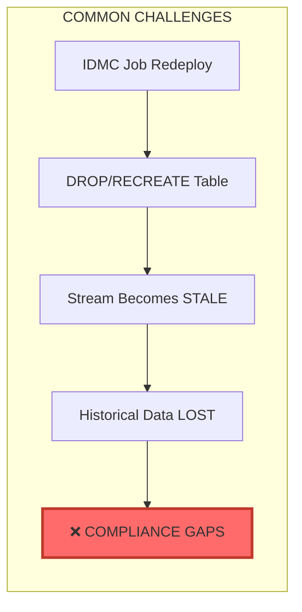

**Business Impact:**
- Historical data permanently lost during IDMC redeployment
- Compliance gaps - unable to prove historical state
- Audit failures - missing records for regulatory reporting
- Downstream system failures - broken data lineage

---

## Our Solution: Metadata-Driven CDC Framework

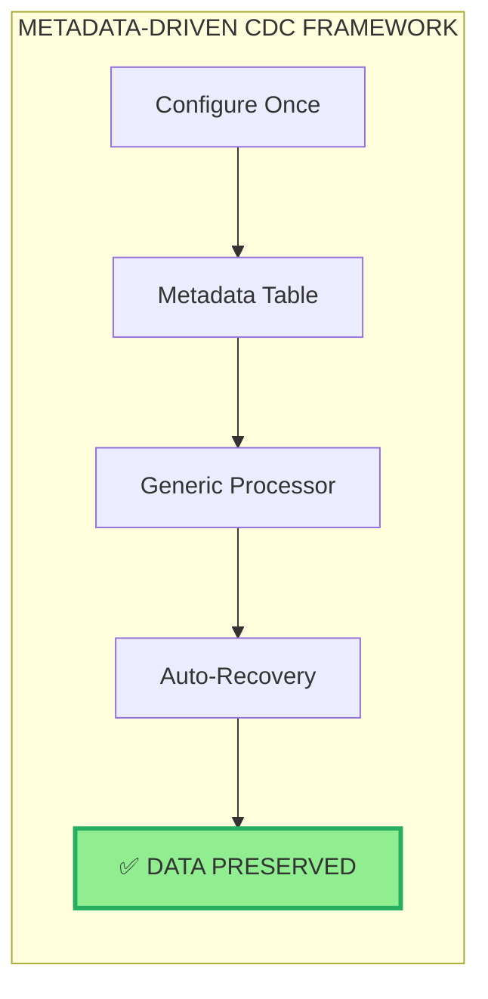

**Key Benefits:**
- **Zero Code Changes** - Add tables via metadata configuration
- **Auto-Recovery** - Handles IDMC redeployment automatically
- **Soft Deletes** - Historical records never lost
- **One Task per Table** - Efficient stream-triggered execution

---

# Architecture Overview

## High-Level Architecture

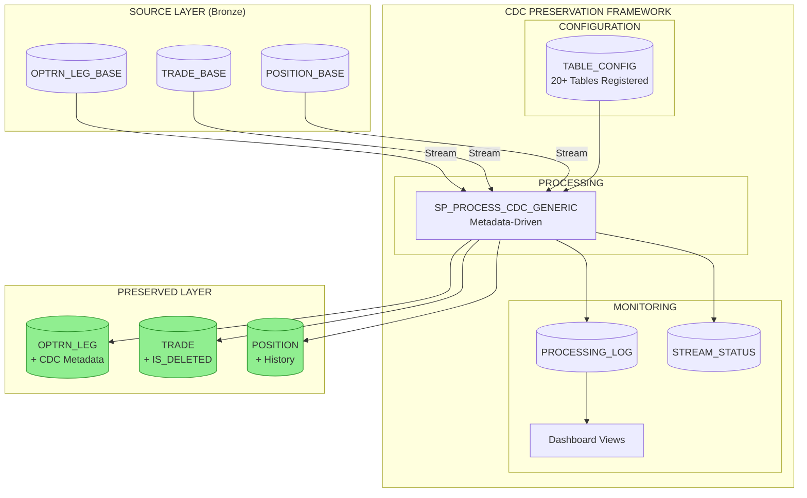

---

## Component Architecture

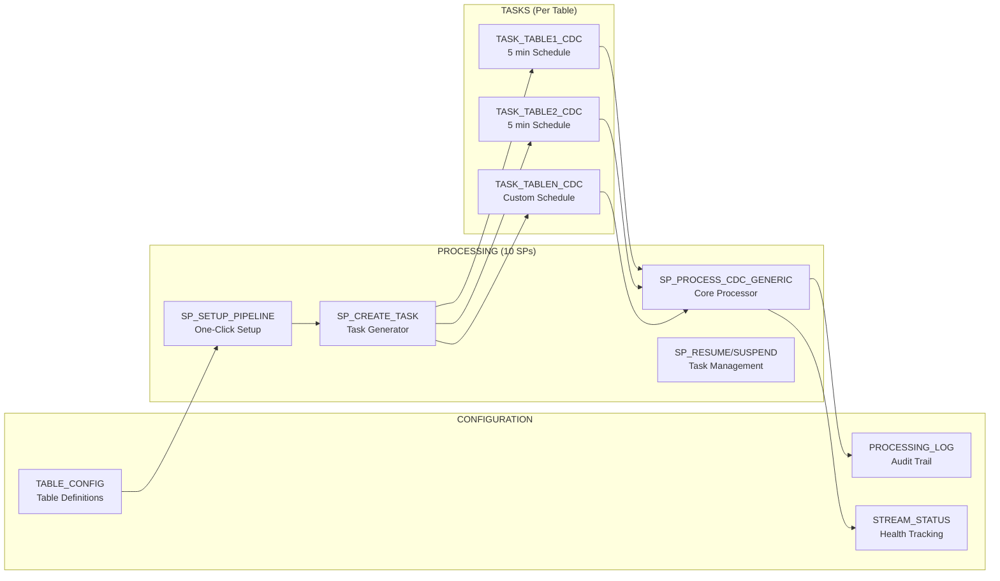

---

## Task Architecture (One Task per Table)

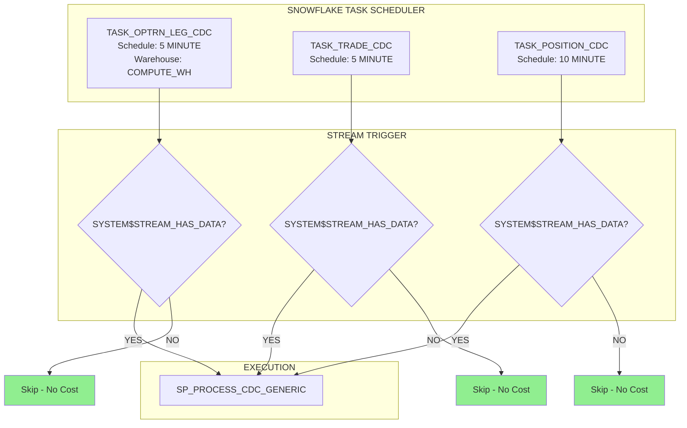

**Key Benefit:** Tasks only run when `SYSTEM$STREAM_HAS_DATA()` returns TRUE = **Zero wasted compute**

---

# Data Flow Diagrams

## Normal CDC Flow

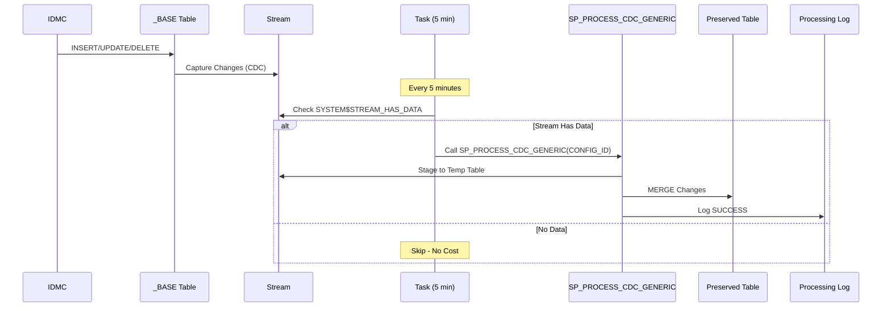

---

## IDMC Redeployment Recovery Flow

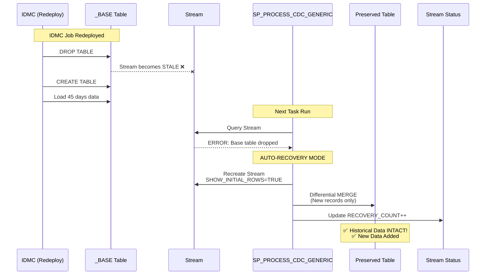

---

## Stream Metadata Interpretation

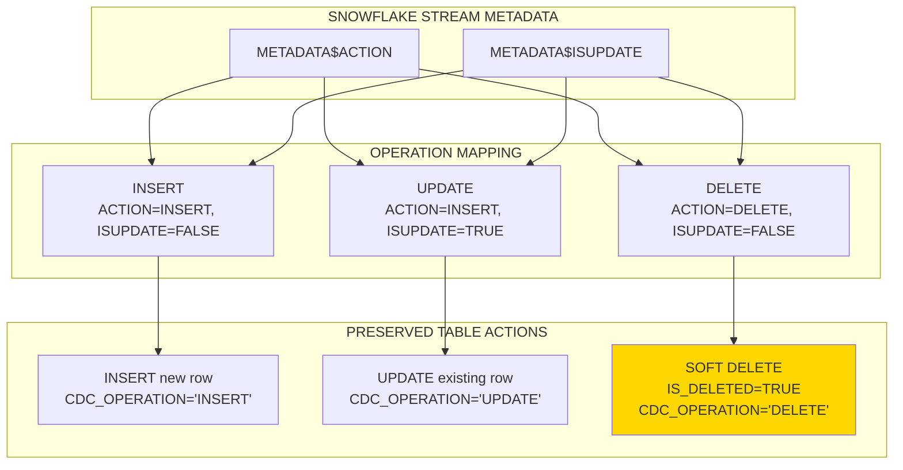

---

# Stored Procedure Logic

## SP_PROCESS_CDC_GENERIC Flow

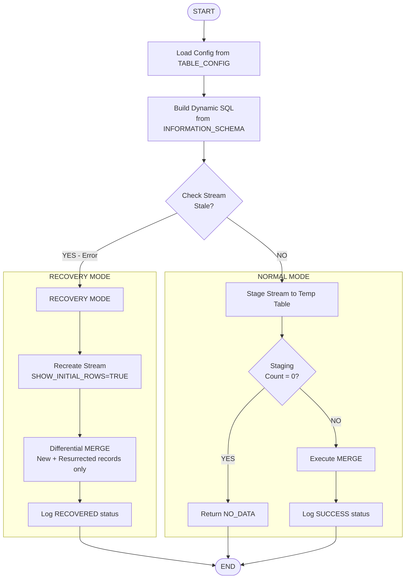

---

## MERGE Statement Logic

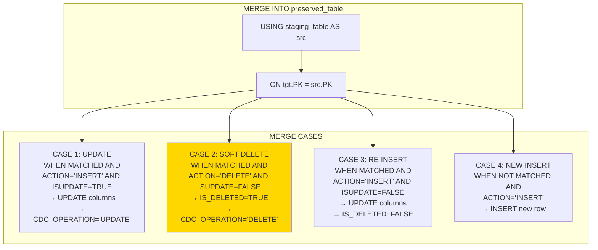

---

# Database Schema

## Entity Relationship Diagram

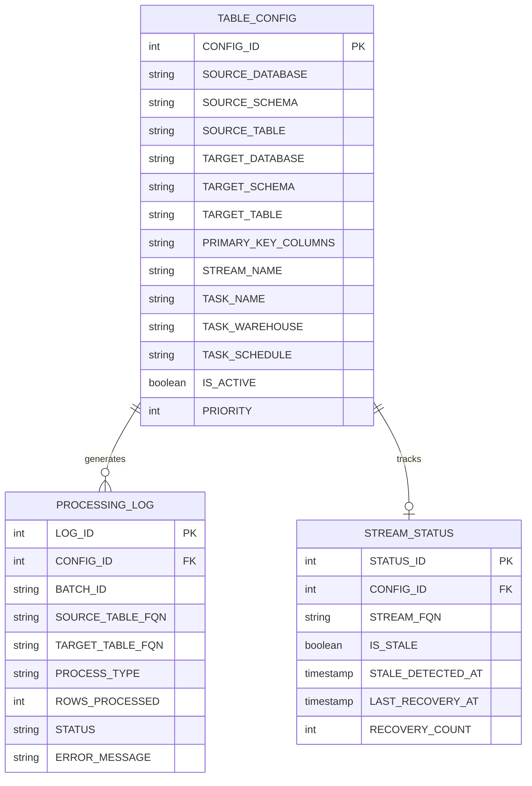

---

## Preserved Table Structure

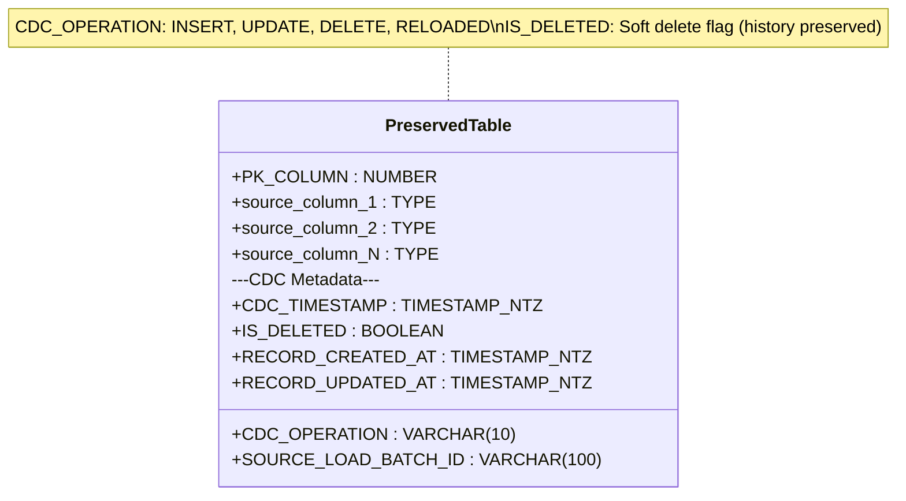

---

# Task Configuration & Scheduling

## How Tasks are Scheduled (5-Minute Example)

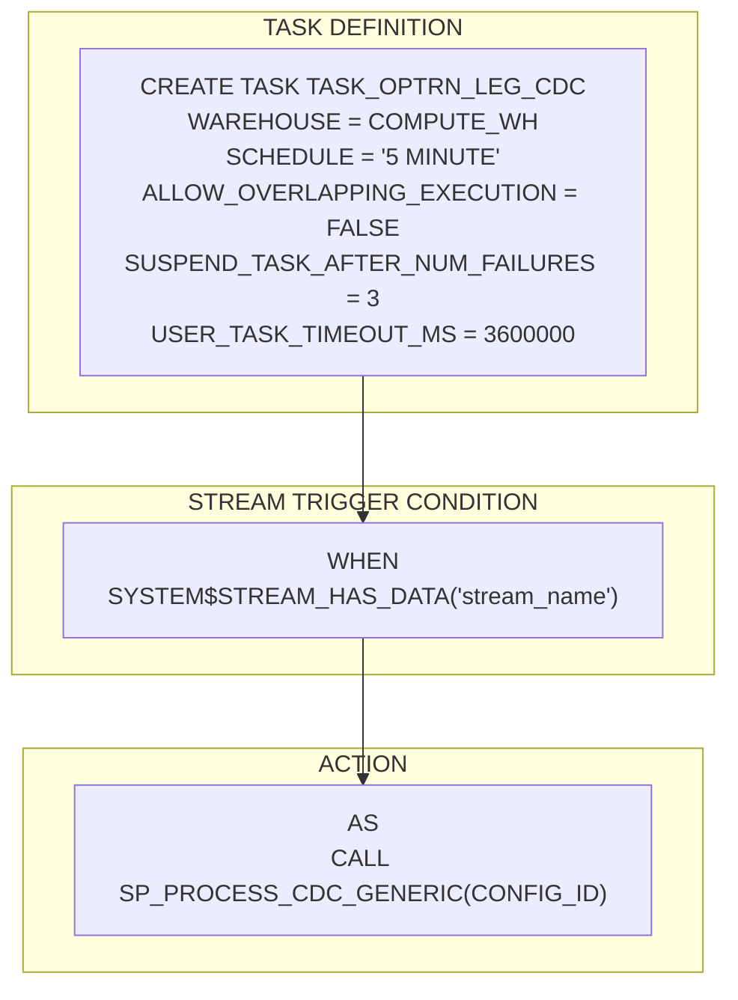

## Task Parameters Explained

| Parameter | Value | Purpose |
|-----------|-------|---------|
| `WAREHOUSE` | `COMPUTE_WH` | Compute resource for execution |
| `SCHEDULE` | `'5 MINUTE'` | Check frequency (configurable per table) |
| `ALLOW_OVERLAPPING_EXECUTION` | `FALSE` | Prevent duplicate runs |
| `SUSPEND_TASK_AFTER_NUM_FAILURES` | `3` | Auto-suspend on repeated errors |
| `USER_TASK_TIMEOUT_MS` | `3600000` | 1 hour max runtime |
| `WHEN SYSTEM$STREAM_HAS_DATA()` | Stream check | **Only runs when data exists** |

## How to Start the 5-Minute Scheduler

```sql
-- Option 1: Start ALL tasks at once
CALL CDC_PRESERVATION.PROCESSING.SP_RESUME_ALL_TASKS();

-- Option 2: Start individual table task
CALL CDC_PRESERVATION.PROCESSING.SP_RESUME_TASK(1);  -- CONFIG_ID = 1

-- Option 3: Direct SQL
ALTER TASK D_BRONZE.SADB.TASK_OPTRN_LEG_CDC RESUME;

-- Verify tasks are running
SHOW TASKS LIKE 'TASK_%_CDC' IN DATABASE D_BRONZE;
-- Look for state = 'started'
```

---

# Monitoring Dashboard

## Key Metrics Views

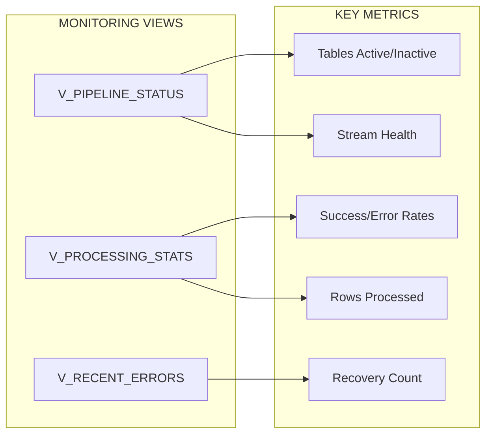

## Sample Dashboard Queries

```sql
-- Overall Health Check
SELECT * FROM CDC_PRESERVATION.MONITORING.V_PIPELINE_STATUS;

-- Processing Statistics
SELECT * FROM CDC_PRESERVATION.MONITORING.V_PROCESSING_STATS;

-- Recent Errors
SELECT * FROM CDC_PRESERVATION.MONITORING.V_RECENT_ERRORS;

-- Task Execution History
SELECT * FROM TABLE(INFORMATION_SCHEMA.TASK_HISTORY(
    SCHEDULED_TIME_RANGE_START => DATEADD('day', -1, CURRENT_TIMESTAMP())
)) WHERE NAME LIKE 'TASK_%_CDC' ORDER BY SCHEDULED_TIME DESC;
```

---

# Test Results Summary

## Test Scenarios Executed

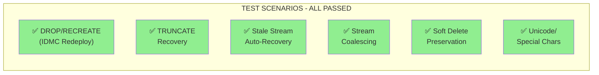

| Test | Description | Result |
|------|-------------|--------|
| **Test 1** | DROP/RECREATE table (IDMC redeployment) | ✅ PASSED - Auto-recovery |
| **Test 2** | TRUNCATE + Reload recovery | ✅ PASSED - History preserved |
| **Test 3** | Stale stream detection & recreation | ✅ PASSED - Automatic |
| **Test 4** | Multiple rapid updates (coalescing) | ✅ PASSED - Final state captured |
| **Test 5** | Soft delete preservation | ✅ PASSED - IS_DELETED=TRUE |
| **Test 6** | Unicode/special characters | ✅ PASSED - All preserved |

---

# Deployment Guide

## Deployment Steps

```mermaid
flowchart TD
    subgraph Step1["STEP 1: Deploy Framework"]
        A1[Create Database & Schemas]
        A2[Create Config Tables]
        A3[Deploy 10 Stored Procedures]
        A4[Create Monitoring Views]
    end
    
    subgraph Step2["STEP 2: Register Tables"]
        B1[INSERT into TABLE_CONFIG]
        B2[Define PKs, Schedule, Warehouse]
    end
    
    subgraph Step3["STEP 3: Setup Pipelines"]
        C1["CALL SP_SETUP_ALL_PIPELINES(FALSE)"]
        C2[Creates Target Tables]
        C3[Creates Streams]
        C4[Creates Tasks (SUSPENDED)]
    end
    
    subgraph Step4["STEP 4: Go Live"]
        D1["CALL SP_RESUME_ALL_TASKS()"]
        D2[Monitor Dashboard]
    end
    
    Step1 --> Step2 --> Step3 --> Step4
```

## Adding New Tables

```sql
-- STEP 1: Register new table in config
INSERT INTO CDC_PRESERVATION.CONFIG.TABLE_CONFIG 
(SOURCE_DATABASE, SOURCE_SCHEMA, SOURCE_TABLE, 
 TARGET_DATABASE, TARGET_SCHEMA, TARGET_TABLE, 
 PRIMARY_KEY_COLUMNS, TASK_SCHEDULE, NOTES)
VALUES
('D_BRONZE', 'SADB', 'NEW_TABLE_BASE', 
 'D_BRONZE', 'SADB', 'NEW_TABLE',
 'NEW_TABLE_ID', '5 MINUTE', 'New table for preservation');

-- STEP 2: Get CONFIG_ID
SELECT CONFIG_ID FROM CDC_PRESERVATION.CONFIG.TABLE_CONFIG 
WHERE SOURCE_TABLE = 'NEW_TABLE_BASE';

-- STEP 3: Setup pipeline (creates target, stream, task)
CALL CDC_PRESERVATION.PROCESSING.SP_SETUP_PIPELINE(<CONFIG_ID>, TRUE);

-- Done! Task is now running on 5-minute schedule
```

---

# Summary

## Key Benefits

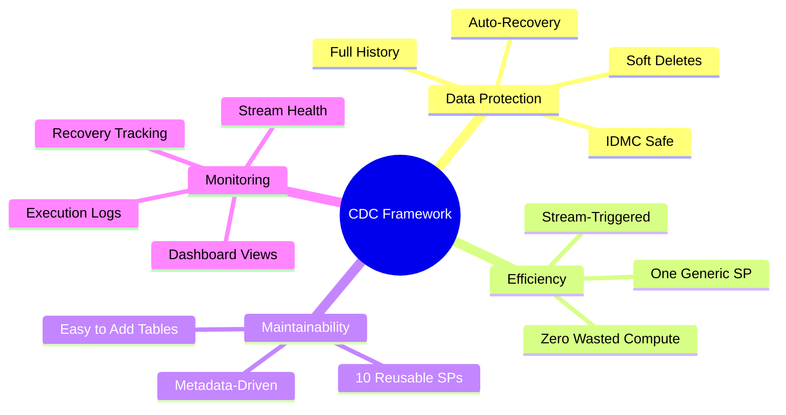

## Framework Comparison

| Feature | Without Framework | With Framework |
|---------|-------------------|----------------|
| Data Loss on IDMC Redeploy | ❌ Yes | ✅ No - Auto-Recovery |
| Historical Records | ❌ Lost on DELETE | ✅ Preserved (IS_DELETED) |
| Recovery | ❌ Manual | ✅ Automatic |
| Maintenance | 20+ individual SPs | 1 generic SP |
| Adding Tables | Complex code changes | Simple INSERT |
| Monitoring | None | Complete dashboard |

---

# Files Delivered

| File | Purpose |
|------|---------|
| `CDC_Data_Preservation_Framework.sql` | Complete framework with all 10 SPs |
| `CDC_Framework_Production_Runbook.md` | Step-by-step deployment guide |
| `CDC_Framework_Customer_Presentation_v2.md` | This documentation |
| `CDC_Framework_Test_Results.md` | Comprehensive test results |
| `CDC_Framework_Best_Practices_Review.md` | Snowflake best practices assessment |

---

# Contact & Support

For questions or issues:
1. Check monitoring views for status: `V_PIPELINE_STATUS`
2. Review execution logs: `V_PROCESSING_STATS`
3. Check recent errors: `V_RECENT_ERRORS`
4. Contact Data Engineering team

---

*Document Version: 2.0*  
*Framework: CDC Data Preservation*  
*Status: Production Ready*  
*Last Updated: February 2026*
