# BASE Table Data Cleanup Framework
## Customer Presentation & Technical Documentation

---

# Executive Summary

## The Challenge

Organizations face critical storage and performance challenges with growing staging tables:

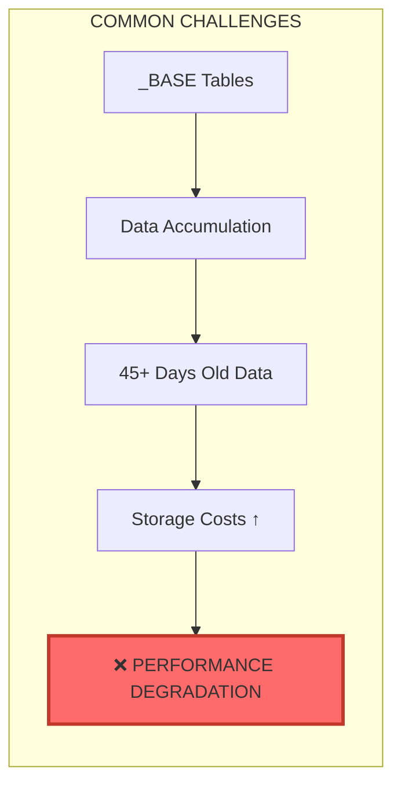

**Business Impact:**
- Storage costs grow unbounded as staging data accumulates
- Query performance degrades with large table scans
- Manual cleanup processes are error-prone and inconsistent
- No audit trail of cleanup operations

---

## Our Solution: Automated Cleanup Framework

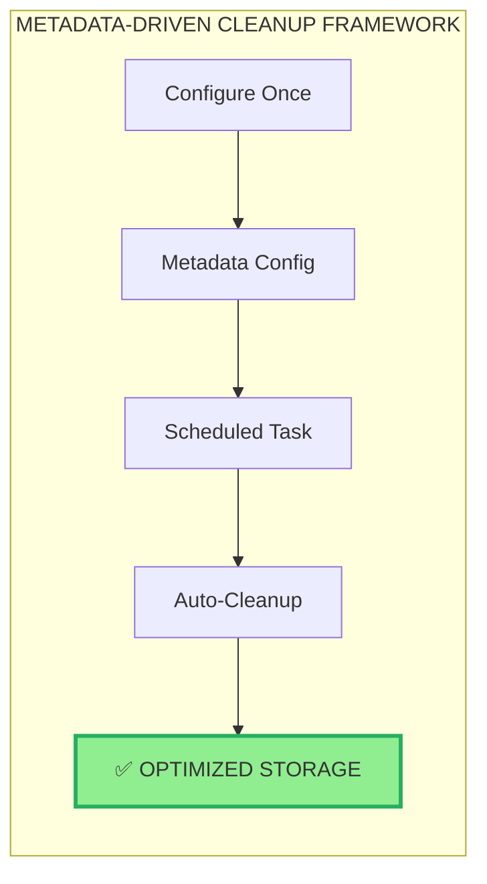

**Key Benefits:**
- **Zero Manual Intervention** - Fully automated scheduled cleanup
- **Configurable Retention** - 45 days default, adjustable per schema
- **Safe Operations** - Dry-run preview, exclusion lists, audit logs
- **Complete Visibility** - Monitoring views and execution history

---

# Architecture Overview

## High-Level Architecture

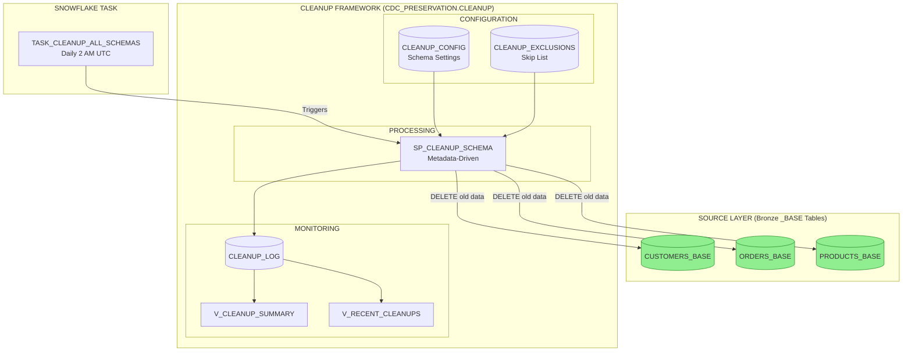

---

## Component Architecture

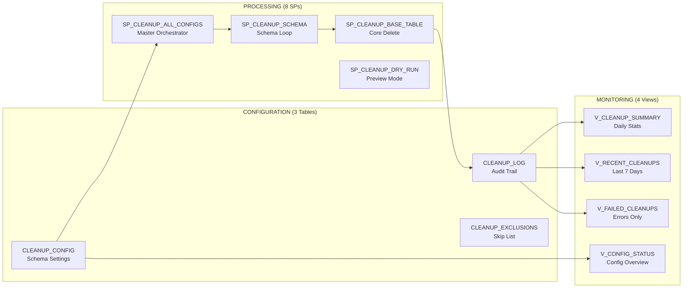

---

## Task Architecture (Daily Scheduled Execution)

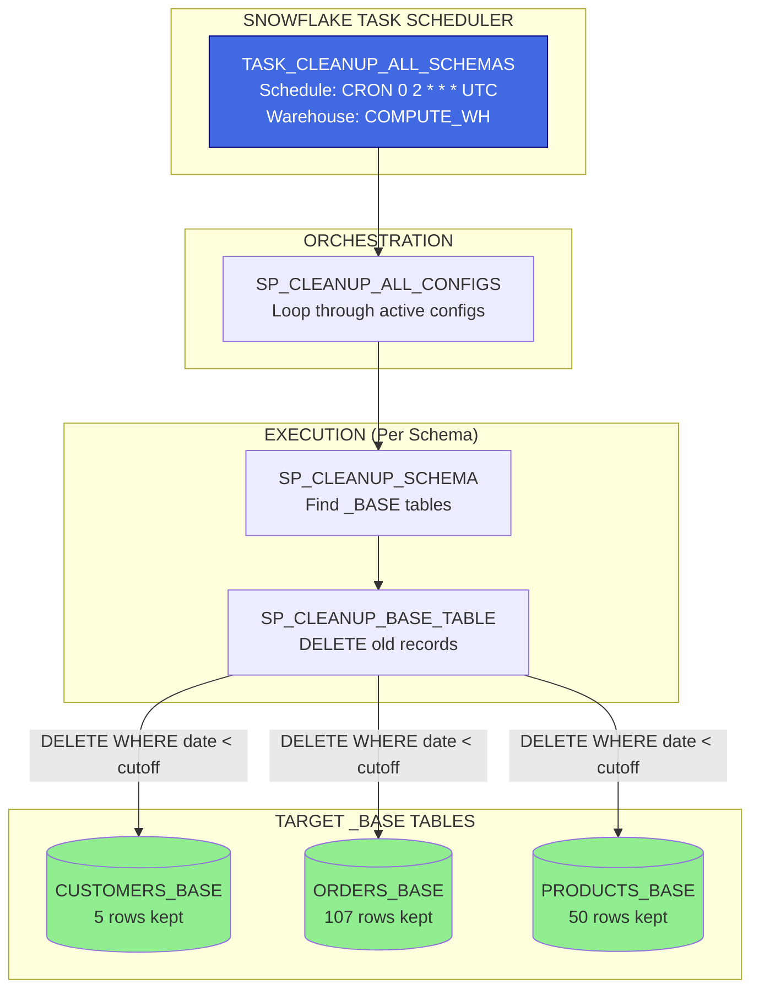

**Key Benefit:** Task runs daily at 2 AM UTC during low-activity window = **Minimal impact on operations**

---

# Data Flow Diagrams

## Daily Cleanup Flow

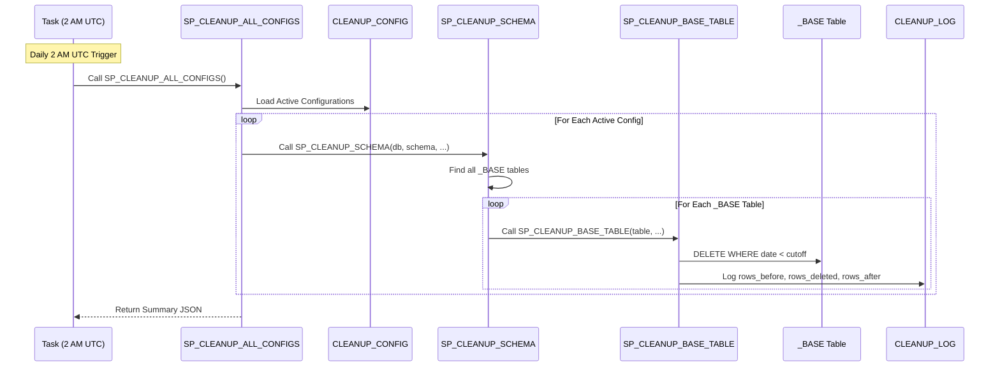

---

## Single Table Cleanup Flow

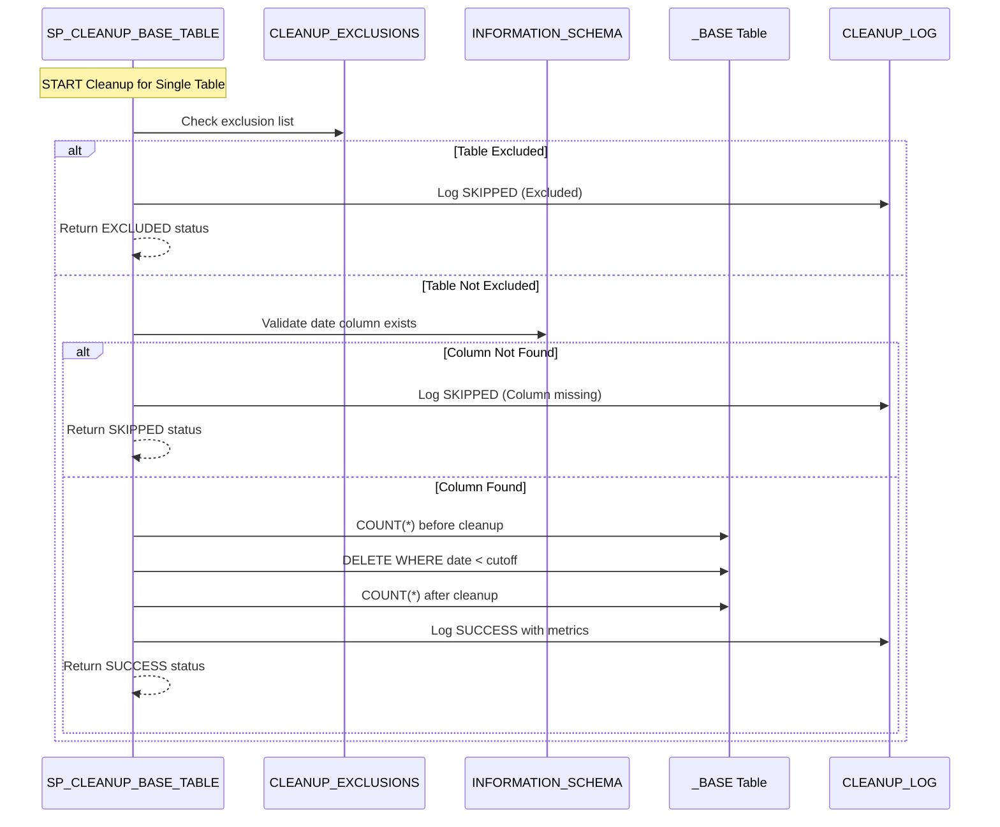

---

## Cutoff Date Calculation

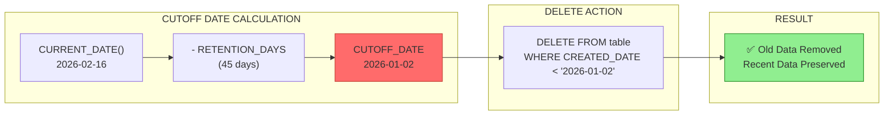

---

## Dry Run vs Execute Decision Flow

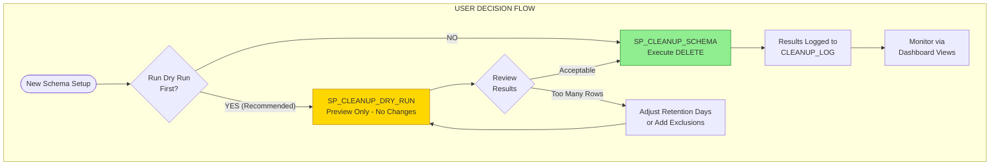

---

# Stored Procedure Logic

## SP_CLEANUP_BASE_TABLE Flow

```mermaid
flowchart TD
    START([START]) --> LOAD[Load Parameters<br/>Database, Schema, Table, DateColumn]
    LOAD --> FQN[Build Fully Qualified Name<br/>DB.SCHEMA.TABLE]
    FQN --> CUTOFF[Calculate Cutoff Date<br/>CURRENT_DATE - RETENTION_DAYS]
    
    CUTOFF --> BEFORE[Get Row Count BEFORE<br/>SELECT COUNT(*)]
    BEFORE --> COLCHECK{Date Column<br/>Exists in Table?}
    
    COLCHECK -->|NO| SKIP[Log SKIPPED<br/>Column not found]
    COLCHECK -->|YES| DELETE[Execute DELETE<br/>WHERE date_column < cutoff]
    
    DELETE --> AFTER[Get Row Count AFTER<br/>SELECT COUNT(*)]
    AFTER --> LOG[Log to CLEANUP_LOG<br/>rows_before, rows_deleted, rows_after]
    
    SKIP --> RETURN[Return Result JSON]
    LOG --> RETURN
    
    RETURN --> END([END])
    
    style DELETE fill:#FF6B6B,stroke:#C0392B
    style LOG fill:#90EE90,stroke:#228B22
```

---

## SP_CLEANUP_SCHEMA Flow

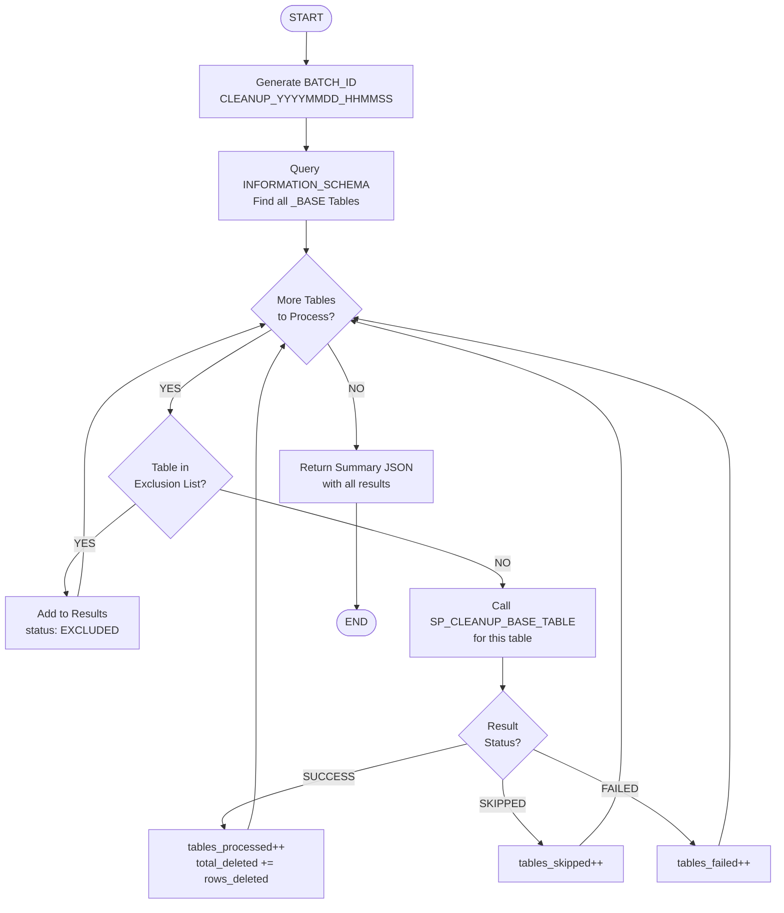

---

# Database Schema

## Entity Relationship Diagram

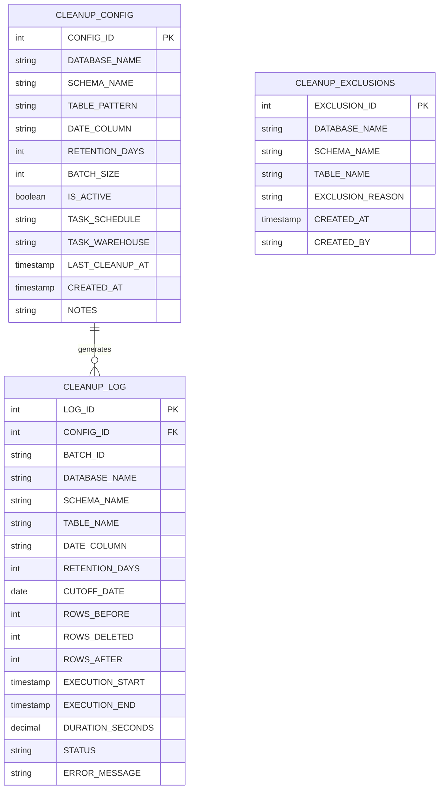

---

## Configuration Table Structure

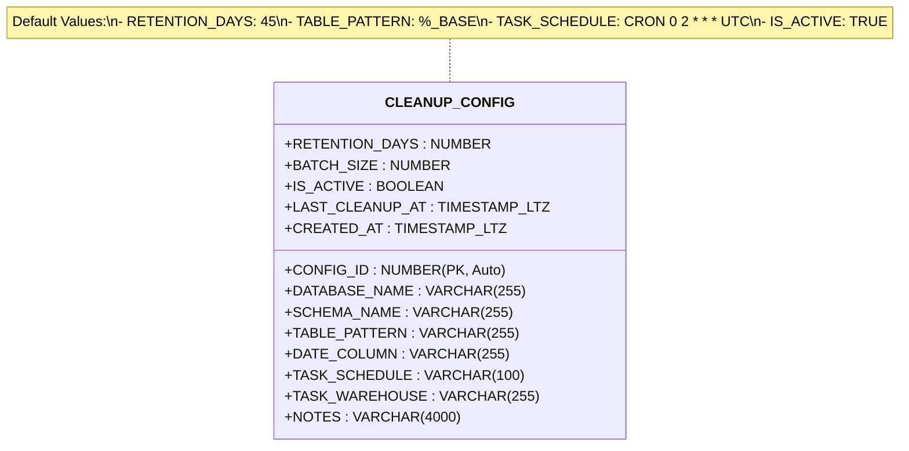

---

# Task Configuration & Scheduling

## How Tasks are Scheduled (Daily 2 AM UTC)

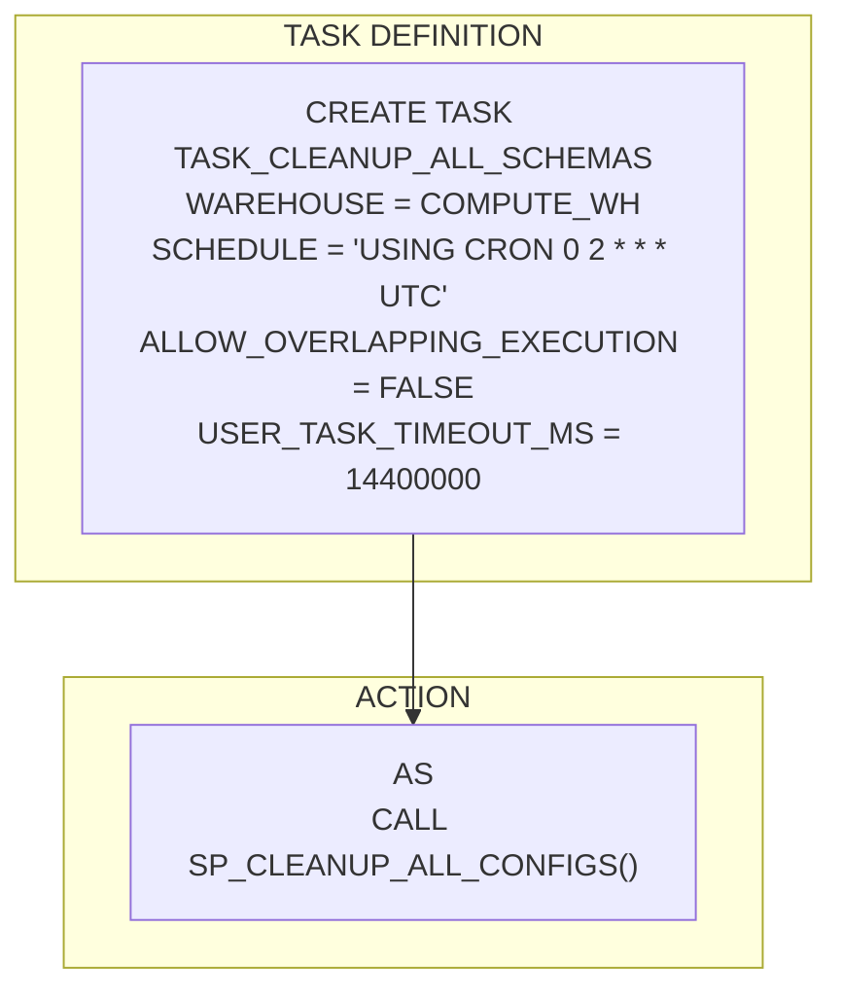

## Task Parameters Explained

| Parameter | Value | Purpose |
|-----------|-------|---------|
| `WAREHOUSE` | `COMPUTE_WH` | Compute resource for execution |
| `SCHEDULE` | `CRON 0 2 * * * UTC` | Daily at 2 AM UTC (low activity) |
| `ALLOW_OVERLAPPING_EXECUTION` | `FALSE` | Prevent duplicate runs |
| `USER_TASK_TIMEOUT_MS` | `14400000` | 4 hour max runtime |

## How to Manage the Task

```sql
-- Option 1: Enable scheduled cleanup
ALTER TASK CDC_PRESERVATION.CLEANUP.TASK_CLEANUP_ALL_SCHEMAS RESUME;

-- Option 2: Disable scheduled cleanup
ALTER TASK CDC_PRESERVATION.CLEANUP.TASK_CLEANUP_ALL_SCHEMAS SUSPEND;

-- Option 3: Run immediately (manual trigger)
EXECUTE TASK CDC_PRESERVATION.CLEANUP.TASK_CLEANUP_ALL_SCHEMAS;

-- Verify task status
SHOW TASKS LIKE 'TASK_CLEANUP%' IN SCHEMA CDC_PRESERVATION.CLEANUP;
-- Look for state = 'started'
```

---

# Monitoring Dashboard

## Key Metrics Views

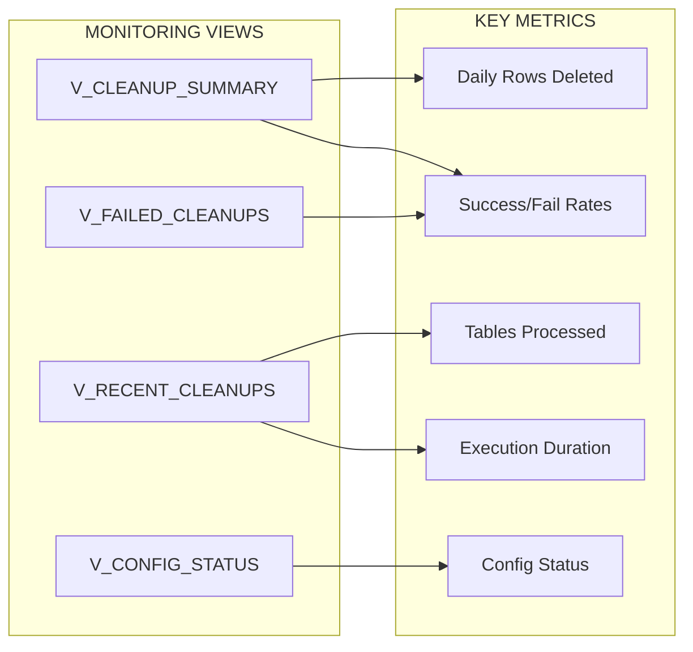

## Sample Dashboard Queries

```sql
-- Daily Health Check
SELECT * FROM CDC_PRESERVATION.CLEANUP.V_CLEANUP_SUMMARY;

-- Recent Cleanup Details
SELECT * FROM CDC_PRESERVATION.CLEANUP.V_RECENT_CLEANUPS;

-- Check for Failures
SELECT * FROM CDC_PRESERVATION.CLEANUP.V_FAILED_CLEANUPS;

-- Active Configurations
SELECT * FROM CDC_PRESERVATION.CLEANUP.V_CONFIG_STATUS
WHERE IS_ACTIVE = TRUE;

-- Task Execution History
SELECT * FROM TABLE(INFORMATION_SCHEMA.TASK_HISTORY(
    TASK_NAME => 'TASK_CLEANUP_ALL_SCHEMAS',
    SCHEDULED_TIME_RANGE_START => DATEADD('day', -7, CURRENT_TIMESTAMP())
)) ORDER BY SCHEDULED_TIME DESC;
```

---

# Test Results Summary

## Test Scenarios Executed

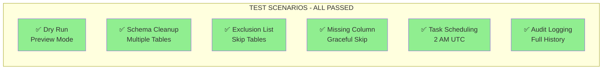

| Test | Description | Result |
|------|-------------|--------|
| **Test 1** | Dry run preview mode | ✅ PASSED - Shows rows to delete without changes |
| **Test 2** | Multi-table schema cleanup | ✅ PASSED - 100 rows deleted from 2 tables |
| **Test 3** | Table exclusion list | ✅ PASSED - Excluded tables skipped |
| **Test 4** | Missing date column handling | ✅ PASSED - Graceful skip with log |
| **Test 5** | Scheduled task creation | ✅ PASSED - 2 AM UTC daily schedule |
| **Test 6** | Audit log completeness | ✅ PASSED - Full metrics captured |

---

# Deployment Guide

## Deployment Steps

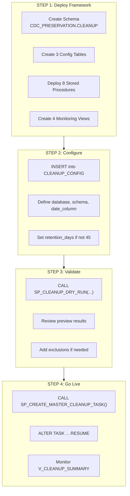

## Adding New Schemas

```sql
-- STEP 1: Add configuration for new schema
INSERT INTO CDC_PRESERVATION.CLEANUP.CLEANUP_CONFIG 
(DATABASE_NAME, SCHEMA_NAME, TABLE_PATTERN, DATE_COLUMN, RETENTION_DAYS, NOTES)
VALUES
('D_BRONZE', 'NEW_SCHEMA', '%_BASE', 'CREATED_DATE', 45, 
 'Cleanup for NEW_SCHEMA _BASE tables');

-- STEP 2: Run dry run to preview
CALL CDC_PRESERVATION.CLEANUP.SP_CLEANUP_DRY_RUN(
    'D_BRONZE', 'NEW_SCHEMA', 'CREATED_DATE', 45, '%_BASE'
);

-- STEP 3: Execute manual test (optional)
CALL CDC_PRESERVATION.CLEANUP.SP_CLEANUP_SCHEMA(
    'D_BRONZE', 'NEW_SCHEMA', 'CREATED_DATE', 45, 100000, '%_BASE'
);

-- Done! Task will include this schema on next scheduled run
```

---

# Summary

## Key Benefits

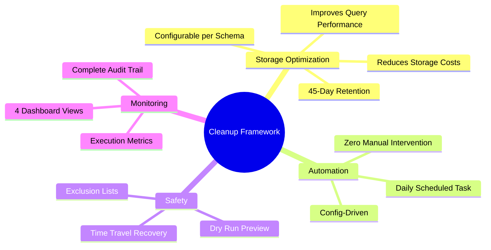

## Framework Comparison

| Feature | Manual Cleanup | With Framework |
|---------|---------------|----------------|
| Execution | ❌ Manual scripts | ✅ Automated daily |
| Consistency | ❌ Varies by engineer | ✅ Standardized |
| Audit Trail | ❌ None | ✅ Complete history |
| Preview | ❌ No preview | ✅ Dry run mode |
| Exclusions | ❌ Code changes | ✅ Config table |
| Monitoring | ❌ Manual checks | ✅ Dashboard views |

---

# Files Delivered

| File | Purpose |
|------|---------|
| `BASE_Table_Cleanup_Framework.sql` | Complete framework with all 8 SPs |
| `BASE_Table_Cleanup_Framework_Runbook.md` | Step-by-step deployment guide |
| `BASE_Table_Cleanup_Framework_Documentation.md` | This customer presentation |
| `Cleanup_Framework_Deployment_Validation.sql` | Multi-environment validation script |

---

# Quick Start Commands

```sql
-- 1. Preview cleanup (DRY RUN - no changes)
CALL CDC_PRESERVATION.CLEANUP.SP_CLEANUP_DRY_RUN(
    'D_BRONZE', 'SALES', 'CREATED_DATE', 45, '%_BASE'
);

-- 2. Execute manual cleanup
CALL CDC_PRESERVATION.CLEANUP.SP_CLEANUP_SCHEMA(
    'D_BRONZE', 'SALES', 'CREATED_DATE', 45, 100000, '%_BASE'
);

-- 3. Enable daily scheduled cleanup
ALTER TASK CDC_PRESERVATION.CLEANUP.TASK_CLEANUP_ALL_SCHEMAS RESUME;

-- 4. Monitor cleanup activity
SELECT * FROM CDC_PRESERVATION.CLEANUP.V_CLEANUP_SUMMARY;
SELECT * FROM CDC_PRESERVATION.CLEANUP.V_RECENT_CLEANUPS;
```

---

# Contact & Support

For questions or issues:
1. Check monitoring views for status: `V_CLEANUP_SUMMARY`
2. Review execution logs: `V_RECENT_CLEANUPS`
3. Check failures: `V_FAILED_CLEANUPS`
4. Contact Data Engineering team

---

*Document Version: 2.0*  
*Framework: BASE Table Data Cleanup*  
*Status: Production Ready*  
*Last Updated: February 2026*
