# Snowflake Streams
## Complete Customer Documentation & Best Practices Guide

---

# Executive Summary

## What is a Snowflake Stream?


**Key Concept:** A stream is like a **bookmark** in a book - it marks a point in time and shows you what changed since that bookmark was placed.

### What a Stream IS:
- ✅ A **metadata object** that tracks changes (CDC) to a source table
- ✅ A **pointer/offset** to a specific point in the table's transaction history
- ✅ A **change table** showing what changed between two points in time
- ✅ **Lightweight** - stores only offset, not actual data

### What a Stream is NOT:
- ❌ NOT a copy of the table data
- ❌ NOT a trigger or stored procedure
- ❌ NOT real-time streaming (it's batch-oriented)
- ❌ NOT a materialized view

---

# How Streams Work

## The Offset Concept


**Key Points:**
1. Stream stores an **offset** (position) in the table's version history
2. When queried, returns all changes **from offset to current version**
3. Offset advances **ONLY** when stream is consumed in a DML transaction

---

## Stream Metadata Columns


| Column | Values | Description |
|--------|--------|-------------|
| `METADATA$ACTION` | `INSERT` or `DELETE` | The DML operation type |
| `METADATA$ISUPDATE` | `TRUE` / `FALSE` | Was this part of an UPDATE? |
| `METADATA$ROW_ID` | Unique ID | Immutable row identifier |

### How Updates are Represented


**Important:** An UPDATE appears as a **DELETE + INSERT pair** with `METADATA$ISUPDATE = TRUE`

---

## Stream Types

```mermaid
flowchart TB
    subgraph Types["THREE STREAM TYPES"]
        STD["STANDARD<br/>(Default)"]
        APP["APPEND-ONLY"]
        INS["INSERT-ONLY"]
    end
    
    subgraph Standard["STANDARD STREAM"]
        S1[Tracks INSERT]
        S2[Tracks UPDATE]
        S3[Tracks DELETE]
        S4[Tracks TRUNCATE]
        S5[Computes Net Delta]
    end
    
    subgraph AppendOnly["APPEND-ONLY STREAM"]
        A1[Tracks INSERT only]
        A2[Ignores UPDATE]
        A3[Ignores DELETE]
        A4[More Performant]
    end
    
    subgraph InsertOnly["INSERT-ONLY STREAM"]
        I1[External Tables only]
        I2[Iceberg Tables only]
        I3[Tracks new files only]
    end
    
    STD --> Standard
    APP --> AppendOnly
    INS --> InsertOnly
    
    style STD fill:#4169E1,color:#fff
    style APP fill:#9370DB,color:#fff
    style INS fill:#20B2AA,color:#fff
```



### Stream Type Comparison

| Feature | Standard | Append-Only | Insert-Only |
|---------|----------|-------------|-------------|
| **Tracks INSERT** | ✅ Yes | ✅ Yes | ✅ Yes |
| **Tracks UPDATE** | ✅ Yes | ❌ No | ❌ No |
| **Tracks DELETE** | ✅ Yes | ❌ No | ❌ No |
| **Tracks TRUNCATE** | ✅ Yes | ❌ No | ❌ No |
| **Net Delta** | ✅ Yes | ❌ No | ❌ No |
| **Performance** | Standard | ⚡ Better | ⚡ Better |
| **Source Objects** | Tables, Views | Tables, Views | External/Iceberg |
| **Geospatial Data** | ❌ No | ✅ Yes | ✅ Yes |

---

## Supported Source Objects


---

# Stream Data Flow

## Basic CDC Pipeline


---

## When Does the Offset Advance?


**Critical Rule:** The offset advances **ONLY** when the stream is consumed in a **DML transaction that commits successfully**.

---

## Net Delta Behavior (Standard Streams)


**Standard streams compute the NET change:**
- Row inserted then deleted = **No record** (net effect is nothing)
- Row inserted then updated = **One INSERT** with final value
- Row updated multiple times = **One UPDATE** with final value

---

# Streams with Tasks

## Recommended Architecture


## Task with Stream Example

```sql
-- 1. Create source table
CREATE TABLE src_orders (
    order_id NUMBER,
    customer_id NUMBER,
    amount NUMBER,
    created_at TIMESTAMP
);

-- 2. Create stream on source
CREATE STREAM orders_stream ON TABLE src_orders;

-- 3. Create target table
CREATE TABLE tgt_orders_history (
    order_id NUMBER,
    customer_id NUMBER,
    amount NUMBER,
    action VARCHAR,
    processed_at TIMESTAMP
);

-- 4. Create task to process stream
CREATE TASK process_orders_task
    WAREHOUSE = compute_wh
    SCHEDULE = '5 MINUTE'
    WHEN SYSTEM$STREAM_HAS_DATA('orders_stream')
AS
    INSERT INTO tgt_orders_history
    SELECT 
        order_id,
        customer_id,
        amount,
        METADATA$ACTION,
        CURRENT_TIMESTAMP()
    FROM orders_stream;

-- 5. Resume task
ALTER TASK process_orders_task RESUME;
```

---

# Staleness and Data Retention

## Stream Staleness Concept


## What Causes Staleness?


## Staleness Prevention

| Parameter | Default | Max | Description |
|-----------|---------|-----|-------------|
| `DATA_RETENTION_TIME_IN_DAYS` | 1 | 90 (Enterprise) | Table's Time Travel retention |
| `MAX_DATA_EXTENSION_TIME_IN_DAYS` | 14 | 90 | Extended retention for streams |

**Best Practice:** Consume streams before `STALE_AFTER` timestamp:
```sql
-- Check stream staleness
DESCRIBE STREAM my_stream;
-- Look at STALE_AFTER column
```

---

# When to Use Streams

## ✅ USE Streams When:


### Ideal Scenarios:

| Scenario | Why Streams Work Well |
|----------|----------------------|
| **Staging → Production ETL** | Process only changed rows efficiently |
| **Data Warehouse Updates** | Incremental loads reduce compute costs |
| **Audit/Compliance** | Complete history of all changes |
| **Real-time Dashboards** | Near real-time data freshness |
| **Microservices Integration** | Track changes for downstream systems |

---

## ❌ DO NOT Use Streams When:


### When to Use Alternatives:

| Scenario | Better Alternative |
|----------|-------------------|
| **Continuous transformation** | Dynamic Tables |
| **Real-time streaming** | Snowpipe Streaming |
| **Complex CDC logic** | Stored Procedures with CHANGES clause |
| **One-time migration** | Direct INSERT/SELECT |
| **Tables with only INSERTs** | Append-only stream or direct query |

---

# Streams on Views

## Supported View Operations


## View Stream Requirements

```sql
-- Step 1: Enable change tracking on underlying tables
ALTER TABLE orders SET CHANGE_TRACKING = TRUE;
ALTER TABLE customers SET CHANGE_TRACKING = TRUE;

-- Step 2: Create view with supported operations
CREATE VIEW orders_with_customers AS
SELECT o.*, c.customer_name
FROM orders o
INNER JOIN customers c ON o.customer_id = c.id;

-- Step 3: Enable change tracking on view
ALTER VIEW orders_with_customers SET CHANGE_TRACKING = TRUE;

-- Step 4: Create stream on view
CREATE STREAM orders_customers_stream ON VIEW orders_with_customers;
```

---

# Edge Cases and Gotchas

## Critical Edge Cases


## Detailed Edge Cases

### 1. Multiple Consumers Need Separate Streams


**Rule:** Create one stream per consumer to avoid data loss.

### 2. Transaction Isolation (Repeatable Read)


**Rule:** Within a transaction, stream queries return the same data (repeatable read).

### 3. Schema Changes Can Break Streams

```sql
-- ❌ This can cause issues:
ALTER TABLE source_table ADD COLUMN new_col VARCHAR NOT NULL;

-- Stream may fail if historical data has NULL for new_col
-- because stream enforces current schema constraints

-- ✅ Better approach:
ALTER TABLE source_table ADD COLUMN new_col VARCHAR;  -- Allow NULL
```

### 4. CREATE OR REPLACE Makes Streams Stale

```sql
-- ❌ This makes all streams on the table STALE:
CREATE OR REPLACE TABLE my_table (...);

-- The table history is reset, stream offset becomes invalid

-- ✅ Use ALTER TABLE instead when possible
```

### 5. TRUNCATE Behavior


---

# CHANGES Clause (Alternative to Streams)

## When to Use CHANGES vs Streams


## CHANGES Clause Example

```sql
-- Enable change tracking first
ALTER TABLE my_table SET CHANGE_TRACKING = TRUE;

-- Query changes between two points in time
SELECT *
FROM my_table
CHANGES(INFORMATION => DEFAULT)
AT(TIMESTAMP => '2024-01-01 00:00:00'::TIMESTAMP)
END(TIMESTAMP => '2024-01-02 00:00:00'::TIMESTAMP);

-- Query changes from a specific offset
SELECT *
FROM my_table
CHANGES(INFORMATION => APPEND_ONLY)
AT(OFFSET => -60*60);  -- Last hour
```

**Key Difference:** CHANGES clause does NOT advance any offset - it's read-only.

---

# Best Practices Summary

## Do's and Don'ts

```mermaid
flowchart TB
    subgraph Dos["✅ DO"]
        D1[Create separate stream per consumer]
        D2[Consume streams regularly]
        D3[Use SYSTEM$STREAM_HAS_DATA in tasks]
        D4[Monitor STALE_AFTER timestamp]
        D5[Use append-only for insert-heavy tables]
        D6[Enable change tracking before creating stream]
    end
    
    subgraph Donts["❌ DON'T"]
        N1[Share streams between consumers]
        N2[Let streams go stale]
        N3[Use CREATE OR REPLACE on source tables]
        N4[Use standard streams for geospatial data]
        N5[Assume stream stores data]
        N6[Query stream without DML to advance offset]
    end
    
    style Dos fill:#90EE90
    style Donts fill:#FF6B6B
```

---

# Quick Reference

## Stream Commands

```sql
-- Create standard stream
CREATE STREAM my_stream ON TABLE my_table;

-- Create append-only stream
CREATE STREAM my_stream ON TABLE my_table APPEND_ONLY = TRUE;

-- Create stream on view
CREATE STREAM my_stream ON VIEW my_view;

-- Check stream status
DESCRIBE STREAM my_stream;
SHOW STREAMS;

-- Check if stream has data
SELECT SYSTEM$STREAM_HAS_DATA('my_stream');

-- Consume stream (advances offset)
INSERT INTO target SELECT * FROM my_stream;

-- Reset stream offset (recreate)
CREATE OR REPLACE STREAM my_stream ON TABLE my_table;

-- Manual offset reset without data
INSERT INTO temp_table SELECT * FROM my_stream WHERE 1=0;
```

## Required Privileges

| Object | Privilege | Notes |
|--------|-----------|-------|
| Database | USAGE | |
| Schema | USAGE | |
| Stream | SELECT | To query stream |
| Source Table/View | SELECT | Stream source |

---

# Summary: Stream Decision Tree

```mermaid
flowchart TD
    START([Need to track table changes?]) --> Q1{Need CDC?}
    
    Q1 -->|Yes| Q2{Automated pipeline?}
    Q1 -->|No| ALT1[Use direct queries]
    
    Q2 -->|Yes| Q3{Multiple consumers?}
    Q2 -->|No| ALT2[Consider CHANGES clause]
    
    Q3 -->|Yes| MULTI[Create separate stream<br/>for each consumer]
    Q3 -->|No| SINGLE[Create single stream]
    
    MULTI --> Q4{Insert-only workload?}
    SINGLE --> Q4
    
    Q4 -->|Yes| APPEND[Use APPEND_ONLY stream]
    Q4 -->|No| Q5{Geospatial data?}
    
    Q5 -->|Yes| APPEND
    Q5 -->|No| STD[Use STANDARD stream]
    
    APPEND --> TASK[Pair with Task<br/>using SYSTEM$STREAM_HAS_DATA]
    STD --> TASK
    
    style START fill:#4169E1,color:#fff
    style TASK fill:#90EE90,stroke:#228B22
```

---

# References

- [Introduction to Streams](https://docs.snowflake.com/en/user-guide/streams-intro)
- [CREATE STREAM](https://docs.snowflake.com/en/sql-reference/sql/create-stream)
- [Streams and Tasks](https://docs.snowflake.com/en/user-guide/data-pipelines-intro)
- [CHANGES Clause](https://docs.snowflake.com/en/sql-reference/constructs/changes)

---

*Document Version: 1.0*  
*Based on: Snowflake Official Documentation*  
*Last Updated: February 2026*
