# Data Prevention Layer Analysis
## Informatica IDMC Redeployment - Data Protection Options

**Prepared for:** Customer Technical Review  
**Date:** March 5, 2026  
**Document Version:** 3.0

---

# EXECUTIVE SUMMARY

## The Problem

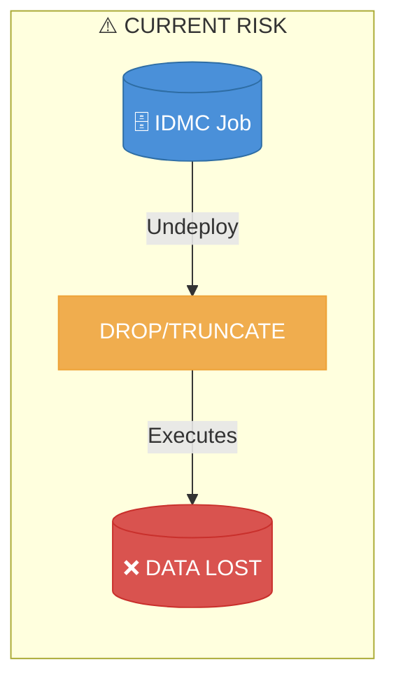

**Impact:** Historical data in RAW layer base tables is destroyed during Informatica IDMC job redeployment.

---

## Solutions Overview

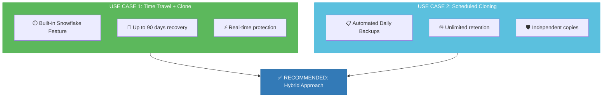

---

## Quick Comparison

| Aspect | Use Case 1 | Use Case 2 |
|--------|-----------|------------|
| **Strategy** | Time Travel + Clone | Scheduled Auto-Cloning |
| **Best For** | Managed redeployments | Unmanaged redeployments |
| **Recovery Window** | Up to 90 days | Unlimited |
| **Real-time?** | ✅ Yes | ❌ No (scheduled) |
| **Effort** | 🟢 Low (built-in) | 🟡 Medium (task setup) |

---

## Recommended Architecture

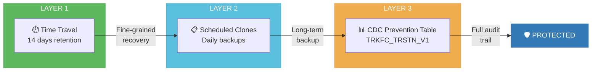

---

## Decision Flowchart

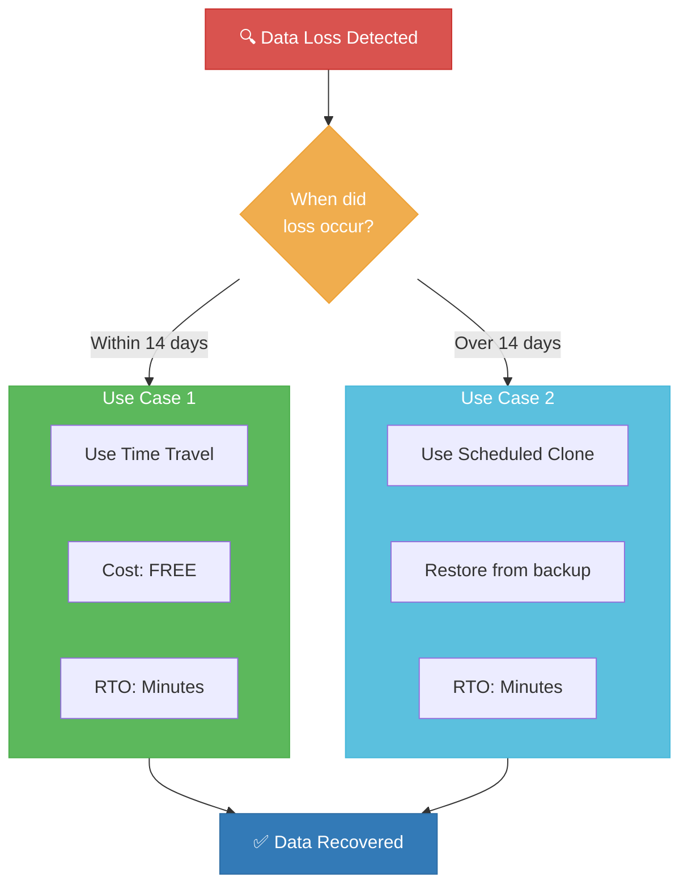

---

## Cost & RTO/RPO Summary

| Metric | Use Case 1 | Use Case 2 | Hybrid |
|--------|-----------|------------|--------|
| **RPO** (max data loss) | 0 seconds | Up to 24 hours | 0 within 14 days |
| **RTO** (recovery time) | 1-5 minutes | 1-5 minutes | 1-5 minutes |
| **Recovery Window** | 14-90 days | Unlimited | Unlimited |
| **Monthly Cost (100GB)** | ~$2.80 | ~$3.40 | ~$6.20 |

---

# DETAILED ANALYSIS

---

## Current Problem Statement

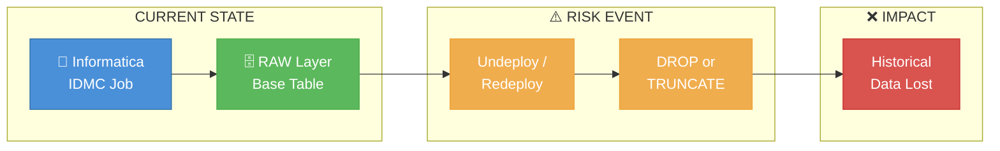

### Critical Question

> ⚠️ **ACTION REQUIRED:** Verify whether IDMC uses `DROP TABLE` or `TRUNCATE TABLE`
> 
> The recovery method differs significantly based on this behavior.

| IDMC Action | Recovery Complexity | Method |
|-------------|---------------------|--------|
| **TRUNCATE TABLE** | 🟢 Simple | Direct Time Travel query |
| **DROP TABLE** | 🟡 Moderate | UNDROP workflow |
| **DROP + CREATE (same name)** | 🔴 Complex | Rename → UNDROP → Restore |

---

## Use Case 1: Time Travel + Zero-Copy Cloning

### Architecture

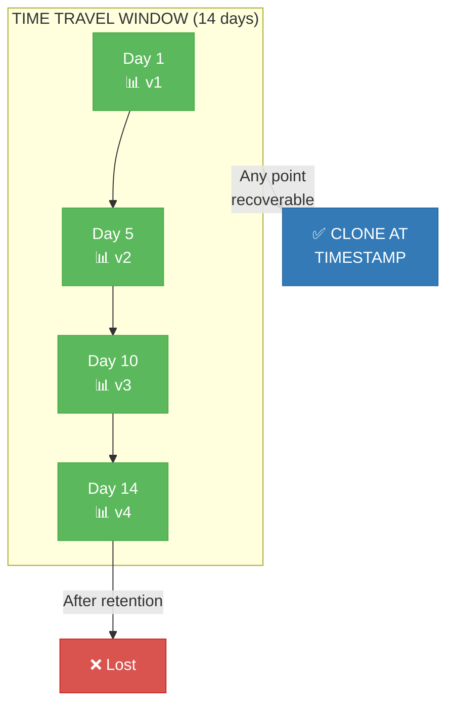

### How It Works

```sql
-- Recovery using Time Travel + Cloning (after TRUNCATE)
CREATE TABLE recovered_table CLONE original_table
  AT(TIMESTAMP => '<timestamp_before_truncation>'::TIMESTAMP_LTZ);
  
-- Recovery after accidental DELETE
SELECT * FROM table_name AT(OFFSET => -3600);  -- 1 hour ago
```

### Pros & Cons

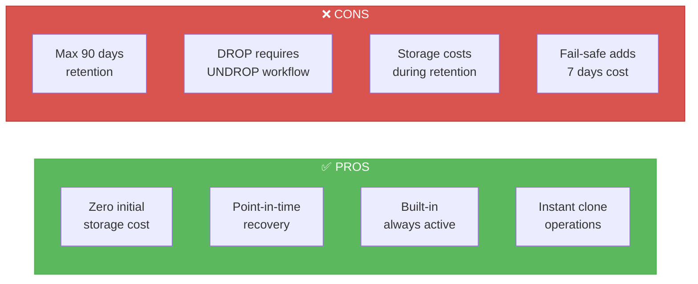

### Recovery Commands

```sql
-- Scenario 1: After TRUNCATE (Simple)
CREATE TABLE D_BRONZE.SADB.TRKFC_TRSTN_BASE_RECOVERED 
  CLONE D_BRONZE.SADB.TRKFC_TRSTN_BASE
  AT(TIMESTAMP => '2026-03-05 10:00:00'::TIMESTAMP_LTZ);

-- Scenario 2: After DROP + CREATE same name (Complex)
-- Step 1: Rename current (new) table
ALTER TABLE D_BRONZE.SADB.TRKFC_TRSTN_BASE 
  RENAME TO D_BRONZE.SADB.TRKFC_TRSTN_BASE_NEW;

-- Step 2: Restore dropped table
UNDROP TABLE D_BRONZE.SADB.TRKFC_TRSTN_BASE;

-- Step 3: Verify data
SELECT COUNT(*) FROM D_BRONZE.SADB.TRKFC_TRSTN_BASE;
```

---

## Use Case 2: Scheduled Automatic Zero-Copy Cloning

### Architecture

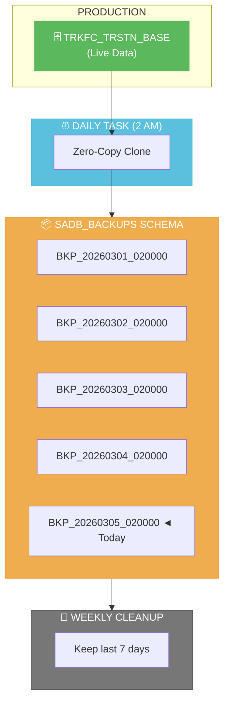

### Implementation

```sql
-- 1. Create backup schema
CREATE SCHEMA IF NOT EXISTS D_BRONZE.SADB_BACKUPS;

-- 2. Stored procedure for automated cloning
CREATE OR REPLACE PROCEDURE D_BRONZE.SADB_BACKUPS.SP_BACKUP_TABLE(
    source_table VARCHAR,
    backup_prefix VARCHAR
)
RETURNS VARCHAR
LANGUAGE SQL
EXECUTE AS CALLER
AS
$$
DECLARE
    backup_name VARCHAR;
    sql_stmt VARCHAR;
BEGIN
    backup_name := backup_prefix || '_' || TO_VARCHAR(CURRENT_TIMESTAMP(), 'YYYYMMDD_HH24MISS');
    sql_stmt := 'CREATE TABLE D_BRONZE.SADB_BACKUPS.' || backup_name || 
                ' CLONE ' || source_table;
    EXECUTE IMMEDIATE sql_stmt;
    RETURN 'Backup created: ' || backup_name;
END;
$$;

-- 3. Daily backup task
CREATE OR REPLACE TASK D_BRONZE.SADB_BACKUPS.TASK_DAILY_BACKUP
    WAREHOUSE = COMPUTE_WH
    SCHEDULE = 'USING CRON 0 2 * * * UTC'
AS
    CALL D_BRONZE.SADB_BACKUPS.SP_BACKUP_TABLE(
        'D_BRONZE.SADB.TRKFC_TRSTN_BASE',
        'TRKFC_TRSTN_BASE_BKP'
    );

ALTER TASK D_BRONZE.SADB_BACKUPS.TASK_DAILY_BACKUP RESUME;

-- 4. Cleanup procedure
CREATE OR REPLACE PROCEDURE D_BRONZE.SADB_BACKUPS.SP_CLEANUP_OLD_BACKUPS(
    retention_days NUMBER
)
RETURNS VARCHAR
LANGUAGE SQL
EXECUTE AS CALLER
AS
$$
DECLARE
    tables_dropped NUMBER := 0;
    cur CURSOR FOR 
        SELECT table_name 
        FROM D_BRONZE.INFORMATION_SCHEMA.TABLES 
        WHERE table_schema = 'SADB_BACKUPS'
          AND table_name LIKE 'TRKFC_TRSTN_BASE_BKP_%'
          AND created < DATEADD(day, -retention_days, CURRENT_TIMESTAMP());
BEGIN
    FOR record IN cur DO
        EXECUTE IMMEDIATE 'DROP TABLE D_BRONZE.SADB_BACKUPS.' || record.table_name;
        tables_dropped := tables_dropped + 1;
    END FOR;
    RETURN 'Dropped ' || tables_dropped || ' old backup tables';
END;
$$;

-- 5. Weekly cleanup task
CREATE OR REPLACE TASK D_BRONZE.SADB_BACKUPS.TASK_CLEANUP_BACKUPS
    WAREHOUSE = COMPUTE_WH
    SCHEDULE = 'USING CRON 0 3 * * 0 UTC'
AS
    CALL D_BRONZE.SADB_BACKUPS.SP_CLEANUP_OLD_BACKUPS(7);

ALTER TASK D_BRONZE.SADB_BACKUPS.TASK_CLEANUP_BACKUPS RESUME;
```

### Pros & Cons

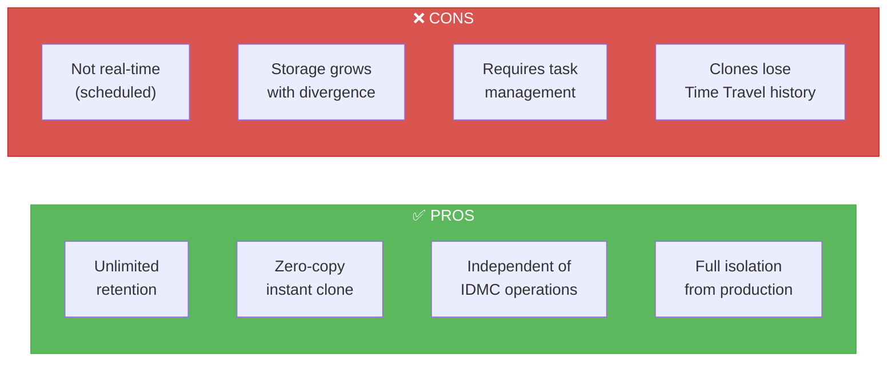

---

## Detailed Comparison Matrix

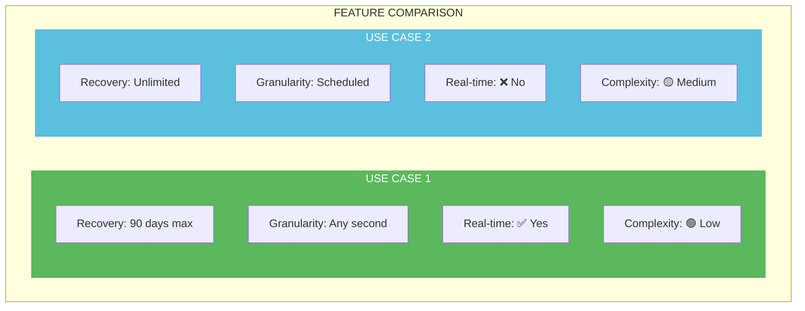

| Criteria | Use Case 1 | Use Case 2 | Winner |
|----------|-----------|------------|--------|
| Max Recovery Window | 90 days | Unlimited | 🏆 UC2 |
| Recovery Granularity | Any second | Scheduled points | 🏆 UC1 |
| Initial Storage Cost | $0 | $0 | 🤝 Tie |
| Operational Complexity | Low | Medium | 🏆 UC1 |
| Protection: DROP | ✅ Yes | ✅ Yes | 🤝 Tie |
| Protection: TRUNCATE | ✅ Yes | ✅ Yes | 🤝 Tie |
| Real-time Protection | ✅ Yes | ❌ No | 🏆 UC1 |
| Works After IDMC Redeploy | Depends | Always | 🏆 UC2 |

---

## RTO/RPO Analysis

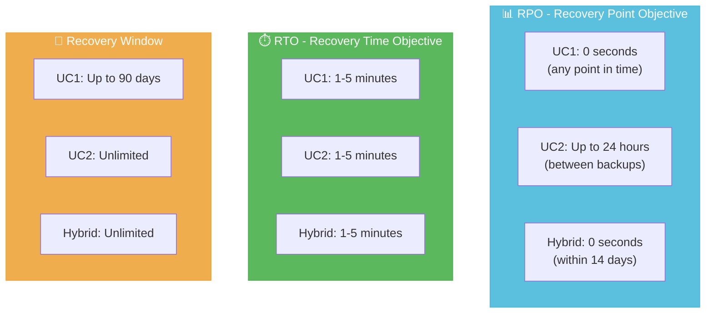

### Business Impact Analysis

| Scenario | Data Loss Risk | Business Impact | Mitigation |
|----------|---------------|-----------------|------------|
| IDMC redeploy within 14 days | 🟢 None | None | Time Travel |
| IDMC redeploy after 14 days | 🟡 Up to 24 hours | Low-Medium | Daily Clone |
| Undetected corruption | 🟢 Full audit trail | Low | CDC Table |
| Accidental DELETE | 🟢 None | None | Time Travel |

---

## Cost Projections

### Assumptions
- Table size: 100 GB
- Daily change rate: 5%
- Snowflake on-demand storage: $40/TB/month
- Compute (X-Small): $2/credit

### Monthly Cost Breakdown

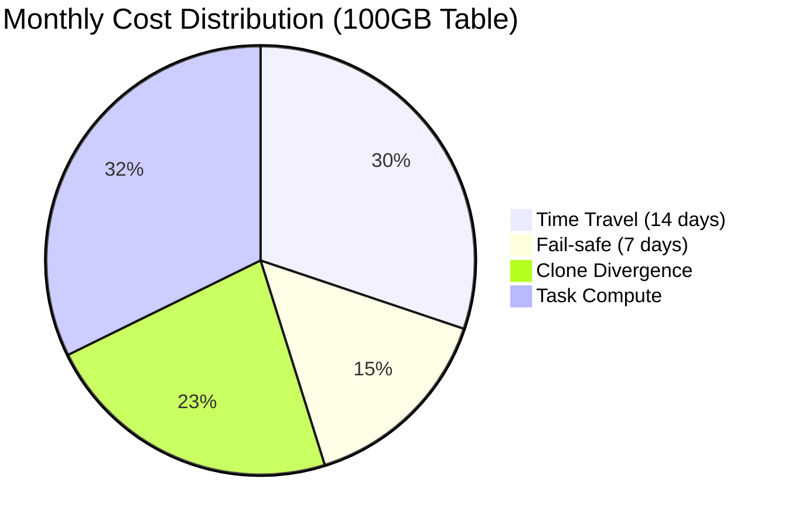

| Component | Calculation | Monthly Cost |
|-----------|-------------|--------------|
| Time Travel (14 days) | 100GB × 14/30 × $40/TB | ~$1.87 |
| Fail-safe (7 days) | 100GB × 7/30 × $40/TB | ~$0.93 |
| Clone Divergence (7 backups) | 100GB × 5% × 7 × $40/TB | ~$1.40 |
| Task Compute | 2 tasks × 1 min × 30 days × $2 | ~$2.00 |
| **TOTAL** | | **~$6.20/month** |

### Cost Scaling

| Table Size | Basic (UC1 only) | Full Protection (Hybrid) |
|------------|------------------|--------------------------|
| 100 GB | ~$2.80/month | ~$6.20/month |
| 1 TB | ~$28/month | ~$62/month |
| 10 TB | ~$280/month | ~$620/month |

---

## Implementation Roadmap

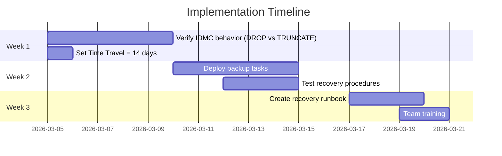

---

## Action Items

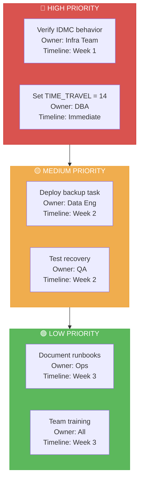

| Priority | Action | Owner | Timeline | Status |
|----------|--------|-------|----------|--------|
| 🔴 High | Verify IDMC behavior (DROP vs TRUNCATE) | Infra Team | Week 1 | ⬜ |
| 🔴 High | Set DATA_RETENTION_TIME_IN_DAYS = 14 | DBA | Immediate | ⬜ |
| 🟡 Medium | Deploy scheduled backup task | Data Eng | Week 2 | ⬜ |
| 🟡 Medium | Deploy cleanup task | Data Eng | Week 2 | ⬜ |
| 🟡 Medium | Test recovery procedures | QA | Week 2 | ⬜ |
| 🟢 Low | Document recovery runbooks | Operations | Week 3 | ⬜ |
| 🟢 Low | Team training | All | Week 3 | ⬜ |

---

## Monitoring Queries

```sql
-- 1. Check Time Travel retention setting
SHOW PARAMETERS LIKE 'DATA_RETENTION_TIME_IN_DAYS' 
  IN TABLE D_BRONZE.SADB.TRKFC_TRSTN_BASE;

-- 2. Monitor storage costs
SELECT 
    table_name,
    ROUND(ACTIVE_BYTES / POWER(1024,3), 2) AS active_gb,
    ROUND(TIME_TRAVEL_BYTES / POWER(1024,3), 2) AS time_travel_gb,
    ROUND(FAILSAFE_BYTES / POWER(1024,3), 2) AS failsafe_gb,
    ROUND((ACTIVE_BYTES + TIME_TRAVEL_BYTES + FAILSAFE_BYTES) 
          / POWER(1024,3), 2) AS total_gb
FROM SNOWFLAKE.ACCOUNT_USAGE.TABLE_STORAGE_METRICS
WHERE table_catalog = 'D_BRONZE'
  AND table_schema IN ('SADB', 'SADB_BACKUPS')
  AND table_name LIKE 'TRKFC_TRSTN%'
  AND DELETED IS NULL;

-- 3. Check backup task status
SHOW TASKS IN SCHEMA D_BRONZE.SADB_BACKUPS;

-- 4. List available backups
SELECT table_name, created
FROM D_BRONZE.INFORMATION_SCHEMA.TABLES
WHERE table_schema = 'SADB_BACKUPS'
ORDER BY created DESC;
```

---

## References

All information based on official Snowflake documentation:

| # | Topic | URL |
|---|-------|-----|
| 1 | Time Travel | [docs.snowflake.com/en/user-guide/data-time-travel](https://docs.snowflake.com/en/user-guide/data-time-travel) |
| 2 | Data Storage | [docs.snowflake.com/en/user-guide/tables-storage-considerations](https://docs.snowflake.com/en/user-guide/tables-storage-considerations) |
| 3 | TRUNCATE TABLE | [docs.snowflake.com/en/sql-reference/sql/truncate-table](https://docs.snowflake.com/en/sql-reference/sql/truncate-table) |
| 4 | UNDROP TABLE | [docs.snowflake.com/en/sql-reference/sql/undrop-table](https://docs.snowflake.com/en/sql-reference/sql/undrop-table) |
| 5 | Storage Costs | [docs.snowflake.com/en/user-guide/data-cdp-storage-costs](https://docs.snowflake.com/en/user-guide/data-cdp-storage-costs) |
| 6 | Tasks | [docs.snowflake.com/en/user-guide/tasks-intro](https://docs.snowflake.com/en/user-guide/tasks-intro) |

---

*Document Version 3.0 | March 5, 2026 | Based on Snowflake Documentation*
