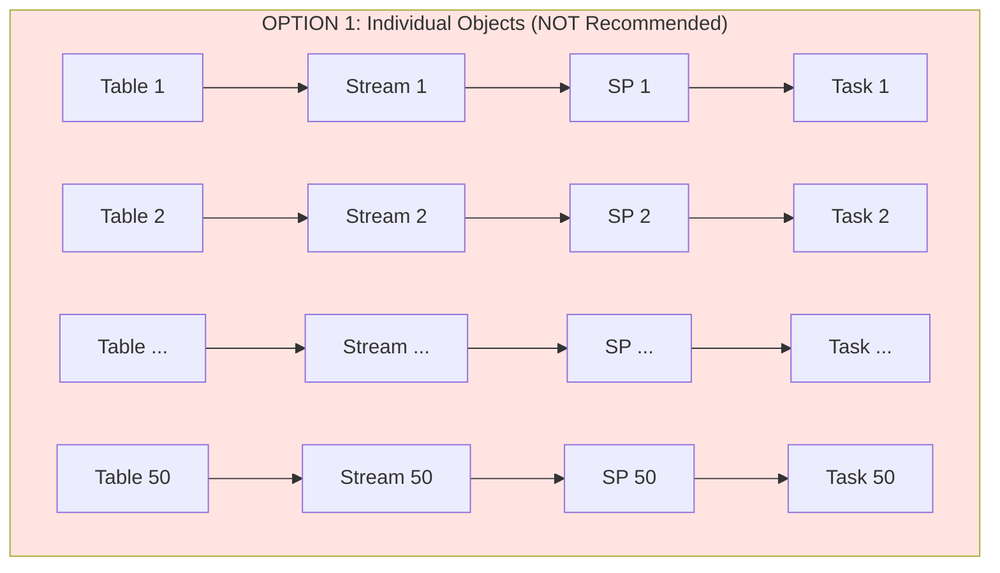
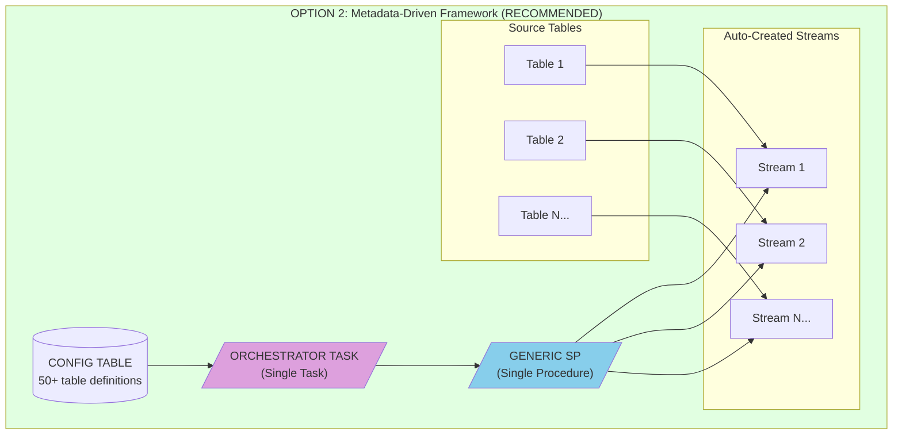
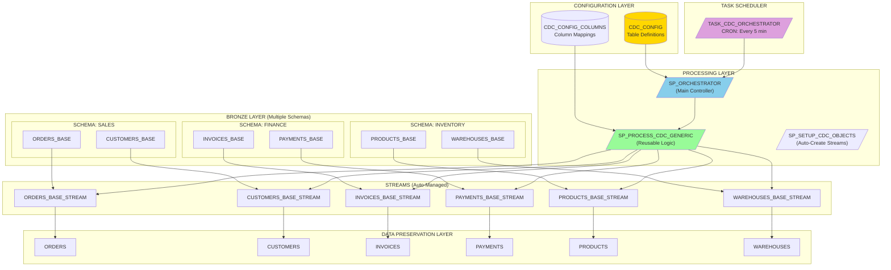
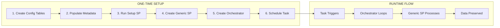
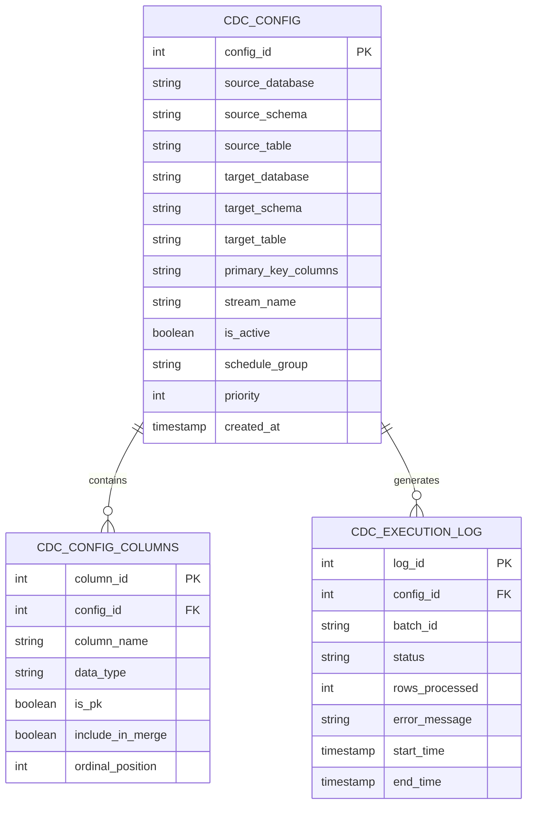
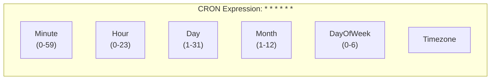
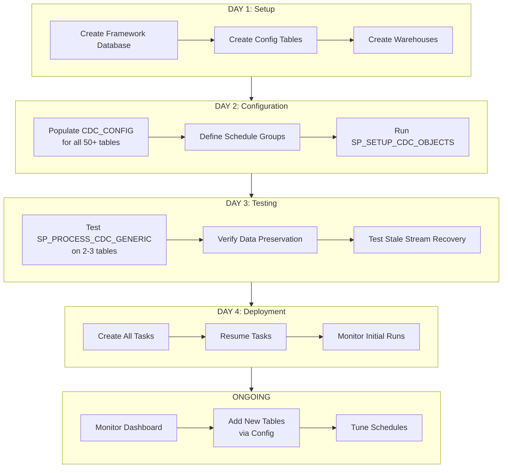
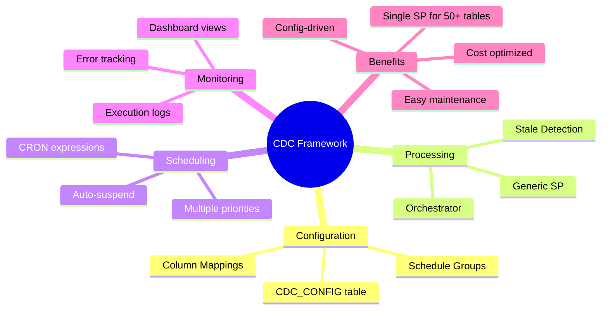

# Enterprise Data Preservation Framework
## Scalable CDC Implementation for 50+ Tables

---

## Executive Summary

This document outlines the enterprise architecture for implementing data preservation across **50+ tables** using Snowflake best practices. Instead of creating individual stored procedures for each table, we recommend a **metadata-driven framework** that is scalable, maintainable, and cost-effective.

---

## Architecture Options Comparison





### Comparison Matrix

| Aspect | Option 1: Individual | Option 2: Metadata-Driven |
|--------|---------------------|---------------------------|
| **Objects to Create** | 200+ (50 tables × 4 objects) | ~60 (50 streams + config + SP + task) |
| **Maintenance Effort** | High - change 50 SPs | Low - change 1 SP |
| **Adding New Table** | Create 4 new objects | Add 1 row to config |
| **Monitoring** | 50 separate dashboards | 1 centralized dashboard |
| **Cost** | 50 tasks = higher compute | 1 task = optimized compute |
| **Deployment Time** | Days | Hours |
| **Error Handling** | Duplicated 50 times | Centralized |

---

## Recommended Architecture: Metadata-Driven Framework



---

## Implementation Components

### Component Overview



---

## Database Schema Design



---

## Detailed Implementation

### Phase 1: Configuration Tables

```sql
-- =============================================================================
-- FRAMEWORK DATABASE AND SCHEMA
-- =============================================================================
CREATE DATABASE IF NOT EXISTS CDC_FRAMEWORK;
CREATE SCHEMA IF NOT EXISTS CDC_FRAMEWORK.CONFIG;
CREATE SCHEMA IF NOT EXISTS CDC_FRAMEWORK.PROCESSING;
CREATE SCHEMA IF NOT EXISTS CDC_FRAMEWORK.MONITORING;

USE SCHEMA CDC_FRAMEWORK.CONFIG;

-- =============================================================================
-- TABLE 1: CDC Configuration (Master Table)
-- =============================================================================
CREATE OR REPLACE TABLE CDC_CONFIG (
    CONFIG_ID               NUMBER AUTOINCREMENT PRIMARY KEY,
    SOURCE_DATABASE         VARCHAR(255) NOT NULL,
    SOURCE_SCHEMA           VARCHAR(255) NOT NULL,
    SOURCE_TABLE            VARCHAR(255) NOT NULL,
    TARGET_DATABASE         VARCHAR(255) NOT NULL,
    TARGET_SCHEMA           VARCHAR(255) NOT NULL,
    TARGET_TABLE            VARCHAR(255) NOT NULL,
    PRIMARY_KEY_COLUMNS     VARCHAR(1000) NOT NULL,
    STREAM_NAME             VARCHAR(255),
    WAREHOUSE_NAME          VARCHAR(255) DEFAULT 'CDC_PROCESSING_WH',
    IS_ACTIVE               BOOLEAN DEFAULT TRUE,
    SCHEDULE_GROUP          VARCHAR(50) DEFAULT 'DEFAULT',
    PRIORITY                NUMBER DEFAULT 100,
    RETRY_COUNT             NUMBER DEFAULT 3,
    LAST_PROCESSED_TIME     TIMESTAMP_NTZ,
    LAST_STATUS             VARCHAR(50),
    LAST_ERROR_MESSAGE      VARCHAR(4000),
    CREATED_AT              TIMESTAMP_NTZ DEFAULT CURRENT_TIMESTAMP(),
    UPDATED_AT              TIMESTAMP_NTZ DEFAULT CURRENT_TIMESTAMP(),
    CREATED_BY              VARCHAR(255) DEFAULT CURRENT_USER(),
    
    UNIQUE (SOURCE_DATABASE, SOURCE_SCHEMA, SOURCE_TABLE)
);

-- =============================================================================
-- TABLE 2: Column Configuration (Optional - for complex mappings)
-- =============================================================================
CREATE OR REPLACE TABLE CDC_CONFIG_COLUMNS (
    COLUMN_ID               NUMBER AUTOINCREMENT PRIMARY KEY,
    CONFIG_ID               NUMBER NOT NULL REFERENCES CDC_CONFIG(CONFIG_ID),
    SOURCE_COLUMN_NAME      VARCHAR(255) NOT NULL,
    TARGET_COLUMN_NAME      VARCHAR(255),
    DATA_TYPE               VARCHAR(100),
    IS_PRIMARY_KEY          BOOLEAN DEFAULT FALSE,
    IS_SOFT_DELETE_FLAG     BOOLEAN DEFAULT FALSE,
    INCLUDE_IN_MERGE        BOOLEAN DEFAULT TRUE,
    DEFAULT_VALUE           VARCHAR(1000),
    TRANSFORMATION_EXPR     VARCHAR(4000),
    ORDINAL_POSITION        NUMBER,
    
    UNIQUE (CONFIG_ID, SOURCE_COLUMN_NAME)
);

-- =============================================================================
-- TABLE 3: Execution Log (Audit Trail)
-- =============================================================================
CREATE OR REPLACE TABLE CDC_EXECUTION_LOG (
    LOG_ID                  NUMBER AUTOINCREMENT PRIMARY KEY,
    CONFIG_ID               NUMBER REFERENCES CDC_CONFIG(CONFIG_ID),
    BATCH_ID                VARCHAR(100) NOT NULL,
    EXECUTION_TYPE          VARCHAR(50),
    STATUS                  VARCHAR(50),
    ROWS_IN_STREAM          NUMBER,
    ROWS_INSERTED           NUMBER,
    ROWS_UPDATED            NUMBER,
    ROWS_DELETED            NUMBER,
    ROWS_TOTAL_PROCESSED    NUMBER,
    ERROR_CODE              VARCHAR(50),
    ERROR_MESSAGE           VARCHAR(4000),
    START_TIME              TIMESTAMP_NTZ,
    END_TIME                TIMESTAMP_NTZ,
    DURATION_SECONDS        NUMBER,
    CREATED_AT              TIMESTAMP_NTZ DEFAULT CURRENT_TIMESTAMP()
);

-- =============================================================================
-- TABLE 4: Schedule Groups (for parallel processing)
-- =============================================================================
CREATE OR REPLACE TABLE CDC_SCHEDULE_GROUPS (
    GROUP_NAME              VARCHAR(50) PRIMARY KEY,
    CRON_EXPRESSION         VARCHAR(100),
    WAREHOUSE_NAME          VARCHAR(255),
    MAX_PARALLEL_TABLES     NUMBER DEFAULT 5,
    IS_ACTIVE               BOOLEAN DEFAULT TRUE,
    DESCRIPTION             VARCHAR(1000)
);

-- Insert default groups
INSERT INTO CDC_SCHEDULE_GROUPS VALUES
    ('CRITICAL', 'USING CRON */2 * * * * UTC', 'CDC_WH_LARGE', 3, TRUE, 'High-priority tables - every 2 min'),
    ('DEFAULT', 'USING CRON */5 * * * * UTC', 'CDC_WH_MEDIUM', 5, TRUE, 'Standard tables - every 5 min'),
    ('LOW_PRIORITY', 'USING CRON */15 * * * * UTC', 'CDC_WH_SMALL', 10, TRUE, 'Low-priority tables - every 15 min'),
    ('HOURLY', 'USING CRON 0 * * * * UTC', 'CDC_WH_SMALL', 20, TRUE, 'Hourly batch tables');
```

### Phase 2: Sample Configuration Data

```sql
-- =============================================================================
-- POPULATE CONFIGURATION FOR 50+ TABLES
-- =============================================================================

-- Example: Sales Schema Tables
INSERT INTO CDC_CONFIG 
    (SOURCE_DATABASE, SOURCE_SCHEMA, SOURCE_TABLE, TARGET_DATABASE, TARGET_SCHEMA, TARGET_TABLE, PRIMARY_KEY_COLUMNS, SCHEDULE_GROUP, PRIORITY)
VALUES
    ('D_BRONZE', 'SALES', 'ORDERS_BASE', 'D_BRONZE', 'SALES', 'ORDERS', 'ORDER_ID', 'CRITICAL', 10),
    ('D_BRONZE', 'SALES', 'ORDER_ITEMS_BASE', 'D_BRONZE', 'SALES', 'ORDER_ITEMS', 'ORDER_ITEM_ID', 'CRITICAL', 20),
    ('D_BRONZE', 'SALES', 'CUSTOMERS_BASE', 'D_BRONZE', 'SALES', 'CUSTOMERS', 'CUSTOMER_ID', 'DEFAULT', 100),
    ('D_BRONZE', 'SALES', 'PRODUCTS_BASE', 'D_BRONZE', 'SALES', 'PRODUCTS', 'PRODUCT_ID', 'DEFAULT', 100);

-- Example: Finance Schema Tables
INSERT INTO CDC_CONFIG 
    (SOURCE_DATABASE, SOURCE_SCHEMA, SOURCE_TABLE, TARGET_DATABASE, TARGET_SCHEMA, TARGET_TABLE, PRIMARY_KEY_COLUMNS, SCHEDULE_GROUP, PRIORITY)
VALUES
    ('D_BRONZE', 'FINANCE', 'INVOICES_BASE', 'D_BRONZE', 'FINANCE', 'INVOICES', 'INVOICE_ID', 'CRITICAL', 10),
    ('D_BRONZE', 'FINANCE', 'PAYMENTS_BASE', 'D_BRONZE', 'FINANCE', 'PAYMENTS', 'PAYMENT_ID', 'CRITICAL', 20),
    ('D_BRONZE', 'FINANCE', 'GL_ENTRIES_BASE', 'D_BRONZE', 'FINANCE', 'GL_ENTRIES', 'GL_ENTRY_ID', 'DEFAULT', 100);

-- Example: Inventory Schema Tables
INSERT INTO CDC_CONFIG 
    (SOURCE_DATABASE, SOURCE_SCHEMA, SOURCE_TABLE, TARGET_DATABASE, TARGET_SCHEMA, TARGET_TABLE, PRIMARY_KEY_COLUMNS, SCHEDULE_GROUP, PRIORITY)
VALUES
    ('D_BRONZE', 'INVENTORY', 'WAREHOUSES_BASE', 'D_BRONZE', 'INVENTORY', 'WAREHOUSES', 'WAREHOUSE_ID', 'LOW_PRIORITY', 100),
    ('D_BRONZE', 'INVENTORY', 'STOCK_LEVELS_BASE', 'D_BRONZE', 'INVENTORY', 'STOCK_LEVELS', 'STOCK_ID', 'DEFAULT', 100);

-- Add more tables as needed...

-- Auto-generate stream names
UPDATE CDC_CONFIG 
SET STREAM_NAME = SOURCE_TABLE || '_STREAM'
WHERE STREAM_NAME IS NULL;
```

### Phase 3: Setup Procedure (Auto-Create Objects)

```sql
USE SCHEMA CDC_FRAMEWORK.PROCESSING;

-- =============================================================================
-- SP: AUTO-CREATE STREAMS AND TARGET TABLES
-- =============================================================================
CREATE OR REPLACE PROCEDURE SP_SETUP_CDC_OBJECTS()
RETURNS VARIANT
LANGUAGE SQL
EXECUTE AS CALLER
AS
$$
DECLARE
    v_config RECORD;
    v_sql VARCHAR;
    v_results ARRAY DEFAULT ARRAY_CONSTRUCT();
    v_success_count NUMBER DEFAULT 0;
    v_error_count NUMBER DEFAULT 0;
    v_cursor CURSOR FOR 
        SELECT * FROM CDC_FRAMEWORK.CONFIG.CDC_CONFIG WHERE IS_ACTIVE = TRUE;
BEGIN
    OPEN v_cursor;
    
    FOR v_config IN v_cursor DO
        BEGIN
            -- 1. Create Stream on Source Table
            v_sql := '
                CREATE OR REPLACE STREAM ' || v_config.SOURCE_DATABASE || '.' || v_config.SOURCE_SCHEMA || '.' || v_config.STREAM_NAME || '
                ON TABLE ' || v_config.SOURCE_DATABASE || '.' || v_config.SOURCE_SCHEMA || '.' || v_config.SOURCE_TABLE || '
                SHOW_INITIAL_ROWS = TRUE
                COMMENT = ''CDC Stream for data preservation - Auto-created by framework''';
            
            EXECUTE IMMEDIATE v_sql;
            
            -- 2. Create Target (Preserved) Table if not exists
            v_sql := '
                CREATE TABLE IF NOT EXISTS ' || v_config.TARGET_DATABASE || '.' || v_config.TARGET_SCHEMA || '.' || v_config.TARGET_TABLE || '
                AS SELECT *, 
                    ''INITIAL'' AS CDC_OPERATION,
                    CURRENT_TIMESTAMP() AS CDC_TIMESTAMP,
                    FALSE AS IS_DELETED,
                    CURRENT_TIMESTAMP() AS RECORD_CREATED_AT,
                    CURRENT_TIMESTAMP() AS RECORD_UPDATED_AT,
                    ''SETUP'' AS SOURCE_LOAD_BATCH_ID
                FROM ' || v_config.SOURCE_DATABASE || '.' || v_config.SOURCE_SCHEMA || '.' || v_config.SOURCE_TABLE || '
                WHERE 1=0';
            
            EXECUTE IMMEDIATE v_sql;
            
            v_success_count := v_success_count + 1;
            v_results := ARRAY_APPEND(v_results, OBJECT_CONSTRUCT(
                'table', v_config.SOURCE_TABLE,
                'status', 'SUCCESS',
                'stream', v_config.STREAM_NAME
            ));
            
        EXCEPTION
            WHEN OTHER THEN
                v_error_count := v_error_count + 1;
                v_results := ARRAY_APPEND(v_results, OBJECT_CONSTRUCT(
                    'table', v_config.SOURCE_TABLE,
                    'status', 'ERROR',
                    'error', SQLERRM
                ));
        END;
    END FOR;
    
    CLOSE v_cursor;
    
    RETURN OBJECT_CONSTRUCT(
        'success_count', v_success_count,
        'error_count', v_error_count,
        'details', v_results
    );
END;
$$;
```

### Phase 4: Generic CDC Processing Procedure

```sql
-- =============================================================================
-- SP: GENERIC CDC PROCESSOR (Handles Any Table)
-- =============================================================================
CREATE OR REPLACE PROCEDURE SP_PROCESS_CDC_GENERIC(
    P_CONFIG_ID NUMBER
)
RETURNS VARCHAR
LANGUAGE SQL
EXECUTE AS CALLER
AS
$$
DECLARE
    v_config RECORD;
    v_batch_id VARCHAR;
    v_stream_stale BOOLEAN DEFAULT FALSE;
    v_staging_count NUMBER DEFAULT 0;
    v_rows_processed NUMBER DEFAULT 0;
    v_start_time TIMESTAMP_NTZ;
    v_sql VARCHAR;
    v_pk_columns VARCHAR;
    v_update_columns VARCHAR;
    v_insert_columns VARCHAR;
    v_error_msg VARCHAR;
    v_status VARCHAR DEFAULT 'SUCCESS';
BEGIN
    v_start_time := CURRENT_TIMESTAMP();
    v_batch_id := 'BATCH_' || P_CONFIG_ID || '_' || TO_VARCHAR(CURRENT_TIMESTAMP(), 'YYYYMMDD_HH24MISS');
    
    -- Get configuration
    SELECT * INTO v_config
    FROM CDC_FRAMEWORK.CONFIG.CDC_CONFIG
    WHERE CONFIG_ID = P_CONFIG_ID AND IS_ACTIVE = TRUE;
    
    IF (v_config IS NULL) THEN
        RETURN 'ERROR: Config ID ' || P_CONFIG_ID || ' not found or inactive';
    END IF;
    
    -- =========================================================================
    -- CHECK 1: Detect Stale Stream
    -- =========================================================================
    BEGIN
        v_sql := 'SELECT COUNT(*) FROM ' || v_config.SOURCE_DATABASE || '.' || 
                 v_config.SOURCE_SCHEMA || '.' || v_config.STREAM_NAME || ' WHERE 1=0';
        EXECUTE IMMEDIATE v_sql;
        v_stream_stale := FALSE;
    EXCEPTION
        WHEN OTHER THEN
            v_stream_stale := TRUE;
            v_error_msg := SQLERRM;
    END;
    
    -- =========================================================================
    -- RECOVERY: Recreate Stream if Stale
    -- =========================================================================
    IF (v_stream_stale) THEN
        v_sql := '
            CREATE OR REPLACE STREAM ' || v_config.SOURCE_DATABASE || '.' || 
            v_config.SOURCE_SCHEMA || '.' || v_config.STREAM_NAME || '
            ON TABLE ' || v_config.SOURCE_DATABASE || '.' || 
            v_config.SOURCE_SCHEMA || '.' || v_config.SOURCE_TABLE || '
            SHOW_INITIAL_ROWS = TRUE';
        
        EXECUTE IMMEDIATE v_sql;
        
        -- Log recovery
        INSERT INTO CDC_FRAMEWORK.CONFIG.CDC_EXECUTION_LOG 
            (CONFIG_ID, BATCH_ID, EXECUTION_TYPE, STATUS, ERROR_MESSAGE, START_TIME, END_TIME)
        VALUES 
            (P_CONFIG_ID, v_batch_id, 'STREAM_RECOVERY', 'RECOVERED', v_error_msg, v_start_time, CURRENT_TIMESTAMP());
    END IF;
    
    -- =========================================================================
    -- STAGE: Copy Stream Data to Temp Table
    -- =========================================================================
    v_sql := '
        CREATE OR REPLACE TEMPORARY TABLE _CDC_STAGING_' || P_CONFIG_ID || ' AS
        SELECT *, METADATA$ACTION AS CDC_ACTION, METADATA$ISUPDATE AS CDC_IS_UPDATE
        FROM ' || v_config.SOURCE_DATABASE || '.' || v_config.SOURCE_SCHEMA || '.' || v_config.STREAM_NAME;
    
    EXECUTE IMMEDIATE v_sql;
    
    EXECUTE IMMEDIATE 'SELECT COUNT(*) FROM _CDC_STAGING_' || P_CONFIG_ID INTO v_staging_count;
    
    IF (v_staging_count = 0) THEN
        -- Update last processed time
        UPDATE CDC_FRAMEWORK.CONFIG.CDC_CONFIG 
        SET LAST_PROCESSED_TIME = CURRENT_TIMESTAMP(), LAST_STATUS = 'NO_DATA'
        WHERE CONFIG_ID = P_CONFIG_ID;
        
        RETURN 'NO_DATA: ' || v_config.SOURCE_TABLE;
    END IF;
    
    -- =========================================================================
    -- BUILD DYNAMIC MERGE
    -- =========================================================================
    v_pk_columns := v_config.PRIMARY_KEY_COLUMNS;
    
    -- Build MERGE statement dynamically
    v_sql := '
        MERGE INTO ' || v_config.TARGET_DATABASE || '.' || v_config.TARGET_SCHEMA || '.' || v_config.TARGET_TABLE || ' AS tgt
        USING (
            SELECT *, ''' || v_batch_id || ''' AS BATCH_ID
            FROM _CDC_STAGING_' || P_CONFIG_ID || '
        ) AS src
        ON tgt.' || v_pk_columns || ' = src.' || v_pk_columns || '
        
        WHEN MATCHED AND src.CDC_ACTION = ''INSERT'' AND src.CDC_IS_UPDATE = TRUE THEN
            UPDATE SET
                CDC_OPERATION = ''UPDATE'',
                CDC_TIMESTAMP = CURRENT_TIMESTAMP(),
                IS_DELETED = FALSE,
                RECORD_UPDATED_AT = CURRENT_TIMESTAMP(),
                SOURCE_LOAD_BATCH_ID = src.BATCH_ID
        
        WHEN MATCHED AND src.CDC_ACTION = ''DELETE'' AND src.CDC_IS_UPDATE = FALSE THEN
            UPDATE SET
                CDC_OPERATION = ''DELETE'',
                CDC_TIMESTAMP = CURRENT_TIMESTAMP(),
                IS_DELETED = TRUE,
                RECORD_UPDATED_AT = CURRENT_TIMESTAMP(),
                SOURCE_LOAD_BATCH_ID = src.BATCH_ID
        
        WHEN MATCHED AND src.CDC_ACTION = ''INSERT'' AND src.CDC_IS_UPDATE = FALSE THEN
            UPDATE SET
                CDC_OPERATION = ''INSERT'',
                CDC_TIMESTAMP = CURRENT_TIMESTAMP(),
                IS_DELETED = FALSE,
                RECORD_UPDATED_AT = CURRENT_TIMESTAMP(),
                SOURCE_LOAD_BATCH_ID = src.BATCH_ID
        
        WHEN NOT MATCHED AND src.CDC_ACTION = ''INSERT'' THEN
            INSERT (CDC_OPERATION, CDC_TIMESTAMP, IS_DELETED, RECORD_CREATED_AT, RECORD_UPDATED_AT, SOURCE_LOAD_BATCH_ID)
            VALUES (''INSERT'', CURRENT_TIMESTAMP(), FALSE, CURRENT_TIMESTAMP(), CURRENT_TIMESTAMP(), src.BATCH_ID)';
    
    EXECUTE IMMEDIATE v_sql;
    v_rows_processed := SQLROWCOUNT;
    
    -- =========================================================================
    -- LOG EXECUTION
    -- =========================================================================
    INSERT INTO CDC_FRAMEWORK.CONFIG.CDC_EXECUTION_LOG 
        (CONFIG_ID, BATCH_ID, EXECUTION_TYPE, STATUS, ROWS_IN_STREAM, ROWS_TOTAL_PROCESSED, START_TIME, END_TIME, DURATION_SECONDS)
    VALUES 
        (P_CONFIG_ID, v_batch_id, 'CDC_PROCESS', v_status, v_staging_count, v_rows_processed, 
         v_start_time, CURRENT_TIMESTAMP(), DATEDIFF('second', v_start_time, CURRENT_TIMESTAMP()));
    
    -- Update config
    UPDATE CDC_FRAMEWORK.CONFIG.CDC_CONFIG 
    SET LAST_PROCESSED_TIME = CURRENT_TIMESTAMP(), 
        LAST_STATUS = v_status,
        UPDATED_AT = CURRENT_TIMESTAMP()
    WHERE CONFIG_ID = P_CONFIG_ID;
    
    -- Cleanup
    EXECUTE IMMEDIATE 'DROP TABLE IF EXISTS _CDC_STAGING_' || P_CONFIG_ID;
    
    RETURN v_status || ': ' || v_config.SOURCE_TABLE || ' - ' || v_rows_processed || ' rows';
    
EXCEPTION
    WHEN OTHER THEN
        v_error_msg := SQLERRM;
        
        INSERT INTO CDC_FRAMEWORK.CONFIG.CDC_EXECUTION_LOG 
            (CONFIG_ID, BATCH_ID, EXECUTION_TYPE, STATUS, ERROR_MESSAGE, START_TIME, END_TIME)
        VALUES 
            (P_CONFIG_ID, v_batch_id, 'CDC_PROCESS', 'ERROR', v_error_msg, v_start_time, CURRENT_TIMESTAMP());
        
        UPDATE CDC_FRAMEWORK.CONFIG.CDC_CONFIG 
        SET LAST_STATUS = 'ERROR', LAST_ERROR_MESSAGE = v_error_msg
        WHERE CONFIG_ID = P_CONFIG_ID;
        
        RETURN 'ERROR: ' || v_config.SOURCE_TABLE || ' - ' || v_error_msg;
END;
$$;
```

### Phase 5: Orchestrator Procedure

```sql
-- =============================================================================
-- SP: ORCHESTRATOR (Processes All Tables in a Schedule Group)
-- =============================================================================
CREATE OR REPLACE PROCEDURE SP_CDC_ORCHESTRATOR(
    P_SCHEDULE_GROUP VARCHAR DEFAULT 'DEFAULT'
)
RETURNS VARIANT
LANGUAGE SQL
EXECUTE AS CALLER
AS
$$
DECLARE
    v_config RECORD;
    v_result VARCHAR;
    v_results ARRAY DEFAULT ARRAY_CONSTRUCT();
    v_success_count NUMBER DEFAULT 0;
    v_error_count NUMBER DEFAULT 0;
    v_skip_count NUMBER DEFAULT 0;
    v_start_time TIMESTAMP_NTZ;
    v_cursor CURSOR FOR 
        SELECT CONFIG_ID, SOURCE_TABLE, STREAM_NAME, SOURCE_DATABASE, SOURCE_SCHEMA
        FROM CDC_FRAMEWORK.CONFIG.CDC_CONFIG 
        WHERE IS_ACTIVE = TRUE 
          AND SCHEDULE_GROUP = P_SCHEDULE_GROUP
        ORDER BY PRIORITY ASC;
BEGIN
    v_start_time := CURRENT_TIMESTAMP();
    
    OPEN v_cursor;
    
    FOR v_config IN v_cursor DO
        BEGIN
            -- Check if stream has data before processing
            EXECUTE IMMEDIATE 'SELECT SYSTEM$STREAM_HAS_DATA(''' || 
                v_config.SOURCE_DATABASE || '.' || v_config.SOURCE_SCHEMA || '.' || v_config.STREAM_NAME || ''')' 
                INTO v_result;
            
            IF (v_result = 'TRUE') THEN
                CALL SP_PROCESS_CDC_GENERIC(v_config.CONFIG_ID) INTO v_result;
                
                IF (v_result LIKE 'SUCCESS%' OR v_result LIKE 'NO_DATA%') THEN
                    v_success_count := v_success_count + 1;
                ELSE
                    v_error_count := v_error_count + 1;
                END IF;
            ELSE
                v_skip_count := v_skip_count + 1;
                v_result := 'SKIPPED: No data in stream';
            END IF;
            
            v_results := ARRAY_APPEND(v_results, OBJECT_CONSTRUCT(
                'table', v_config.SOURCE_TABLE,
                'result', v_result
            ));
            
        EXCEPTION
            WHEN OTHER THEN
                v_error_count := v_error_count + 1;
                v_results := ARRAY_APPEND(v_results, OBJECT_CONSTRUCT(
                    'table', v_config.SOURCE_TABLE,
                    'result', 'ERROR: ' || SQLERRM
                ));
        END;
    END FOR;
    
    CLOSE v_cursor;
    
    RETURN OBJECT_CONSTRUCT(
        'schedule_group', P_SCHEDULE_GROUP,
        'start_time', v_start_time,
        'end_time', CURRENT_TIMESTAMP(),
        'duration_seconds', DATEDIFF('second', v_start_time, CURRENT_TIMESTAMP()),
        'success_count', v_success_count,
        'error_count', v_error_count,
        'skip_count', v_skip_count,
        'details', v_results
    );
END;
$$;
```

### Phase 6: Task Scheduling (Multiple CRON Schedules)

```sql
-- =============================================================================
-- TASKS: Multiple Schedule Groups with Different CRON Expressions
-- =============================================================================

-- CRITICAL: Every 2 minutes
CREATE OR REPLACE TASK CDC_FRAMEWORK.PROCESSING.TASK_CDC_CRITICAL
    WAREHOUSE = CDC_WH_LARGE
    SCHEDULE = 'USING CRON */2 * * * * UTC'
    ALLOW_OVERLAPPING_EXECUTION = FALSE
    SUSPEND_TASK_AFTER_NUM_FAILURES = 3
    USER_TASK_TIMEOUT_MS = 1800000
    COMMENT = 'CDC Processing - Critical tables (every 2 min)'
AS
    CALL CDC_FRAMEWORK.PROCESSING.SP_CDC_ORCHESTRATOR('CRITICAL');

-- DEFAULT: Every 5 minutes
CREATE OR REPLACE TASK CDC_FRAMEWORK.PROCESSING.TASK_CDC_DEFAULT
    WAREHOUSE = CDC_WH_MEDIUM
    SCHEDULE = 'USING CRON */5 * * * * UTC'
    ALLOW_OVERLAPPING_EXECUTION = FALSE
    SUSPEND_TASK_AFTER_NUM_FAILURES = 3
    USER_TASK_TIMEOUT_MS = 3600000
    COMMENT = 'CDC Processing - Default tables (every 5 min)'
AS
    CALL CDC_FRAMEWORK.PROCESSING.SP_CDC_ORCHESTRATOR('DEFAULT');

-- LOW_PRIORITY: Every 15 minutes
CREATE OR REPLACE TASK CDC_FRAMEWORK.PROCESSING.TASK_CDC_LOW_PRIORITY
    WAREHOUSE = CDC_WH_SMALL
    SCHEDULE = 'USING CRON */15 * * * * UTC'
    ALLOW_OVERLAPPING_EXECUTION = FALSE
    SUSPEND_TASK_AFTER_NUM_FAILURES = 3
    USER_TASK_TIMEOUT_MS = 3600000
    COMMENT = 'CDC Processing - Low priority tables (every 15 min)'
AS
    CALL CDC_FRAMEWORK.PROCESSING.SP_CDC_ORCHESTRATOR('LOW_PRIORITY');

-- HOURLY: Every hour at minute 0
CREATE OR REPLACE TASK CDC_FRAMEWORK.PROCESSING.TASK_CDC_HOURLY
    WAREHOUSE = CDC_WH_SMALL
    SCHEDULE = 'USING CRON 0 * * * * UTC'
    ALLOW_OVERLAPPING_EXECUTION = FALSE
    SUSPEND_TASK_AFTER_NUM_FAILURES = 3
    USER_TASK_TIMEOUT_MS = 7200000
    COMMENT = 'CDC Processing - Hourly batch tables'
AS
    CALL CDC_FRAMEWORK.PROCESSING.SP_CDC_ORCHESTRATOR('HOURLY');

-- Resume all tasks
ALTER TASK CDC_FRAMEWORK.PROCESSING.TASK_CDC_CRITICAL RESUME;
ALTER TASK CDC_FRAMEWORK.PROCESSING.TASK_CDC_DEFAULT RESUME;
ALTER TASK CDC_FRAMEWORK.PROCESSING.TASK_CDC_LOW_PRIORITY RESUME;
ALTER TASK CDC_FRAMEWORK.PROCESSING.TASK_CDC_HOURLY RESUME;
```

---

## CRON Expression Reference



### Common CRON Patterns

| Pattern | Expression | Description |
|---------|------------|-------------|
| Every 2 minutes | `*/2 * * * * UTC` | Critical tables |
| Every 5 minutes | `*/5 * * * * UTC` | Standard CDC |
| Every 15 minutes | `*/15 * * * * UTC` | Low priority |
| Every hour | `0 * * * * UTC` | Hourly batch |
| Every 6 hours | `0 */6 * * * UTC` | 4 times daily |
| Daily at midnight | `0 0 * * * UTC` | Once daily |
| Weekdays 9 AM | `0 9 * * 1-5 UTC` | Business hours |
| Sunday 2 AM | `0 2 * * 0 UTC` | Weekly maintenance |

---

## Monitoring Dashboard

```sql
-- =============================================================================
-- MONITORING VIEWS
-- =============================================================================
USE SCHEMA CDC_FRAMEWORK.MONITORING;

-- View: Overall Status Dashboard
CREATE OR REPLACE VIEW V_CDC_DASHBOARD AS
SELECT 
    c.SCHEDULE_GROUP,
    COUNT(*) AS TOTAL_TABLES,
    SUM(CASE WHEN c.IS_ACTIVE THEN 1 ELSE 0 END) AS ACTIVE_TABLES,
    SUM(CASE WHEN c.LAST_STATUS = 'SUCCESS' THEN 1 ELSE 0 END) AS SUCCESS_COUNT,
    SUM(CASE WHEN c.LAST_STATUS = 'ERROR' THEN 1 ELSE 0 END) AS ERROR_COUNT,
    SUM(CASE WHEN c.LAST_STATUS = 'NO_DATA' THEN 1 ELSE 0 END) AS NO_DATA_COUNT,
    MIN(c.LAST_PROCESSED_TIME) AS OLDEST_PROCESS_TIME,
    MAX(c.LAST_PROCESSED_TIME) AS LATEST_PROCESS_TIME
FROM CDC_FRAMEWORK.CONFIG.CDC_CONFIG c
GROUP BY c.SCHEDULE_GROUP;

-- View: Tables with Errors
CREATE OR REPLACE VIEW V_CDC_ERRORS AS
SELECT 
    c.CONFIG_ID,
    c.SOURCE_SCHEMA,
    c.SOURCE_TABLE,
    c.LAST_STATUS,
    c.LAST_ERROR_MESSAGE,
    c.LAST_PROCESSED_TIME,
    DATEDIFF('minute', c.LAST_PROCESSED_TIME, CURRENT_TIMESTAMP()) AS MINUTES_SINCE_LAST_RUN
FROM CDC_FRAMEWORK.CONFIG.CDC_CONFIG c
WHERE c.LAST_STATUS = 'ERROR'
   OR DATEDIFF('hour', c.LAST_PROCESSED_TIME, CURRENT_TIMESTAMP()) > 1;

-- View: Execution Statistics (Last 24 hours)
CREATE OR REPLACE VIEW V_CDC_EXECUTION_STATS AS
SELECT 
    c.SCHEDULE_GROUP,
    c.SOURCE_TABLE,
    COUNT(*) AS EXECUTION_COUNT,
    SUM(CASE WHEN l.STATUS = 'SUCCESS' THEN 1 ELSE 0 END) AS SUCCESS_COUNT,
    SUM(CASE WHEN l.STATUS = 'ERROR' THEN 1 ELSE 0 END) AS ERROR_COUNT,
    SUM(l.ROWS_TOTAL_PROCESSED) AS TOTAL_ROWS_PROCESSED,
    AVG(l.DURATION_SECONDS) AS AVG_DURATION_SEC,
    MAX(l.DURATION_SECONDS) AS MAX_DURATION_SEC
FROM CDC_FRAMEWORK.CONFIG.CDC_CONFIG c
LEFT JOIN CDC_FRAMEWORK.CONFIG.CDC_EXECUTION_LOG l ON c.CONFIG_ID = l.CONFIG_ID
WHERE l.CREATED_AT >= DATEADD('hour', -24, CURRENT_TIMESTAMP())
GROUP BY c.SCHEDULE_GROUP, c.SOURCE_TABLE;

-- View: Task Status
CREATE OR REPLACE VIEW V_TASK_STATUS AS
SELECT 
    NAME AS TASK_NAME,
    STATE,
    SCHEDULE,
    LAST_COMMITTED_ON,
    LAST_SUSPENDED_ON
FROM TABLE(INFORMATION_SCHEMA.TASK_HISTORY())
WHERE NAME LIKE 'TASK_CDC_%'
QUALIFY ROW_NUMBER() OVER (PARTITION BY NAME ORDER BY SCHEDULED_TIME DESC) = 1;
```

---

## Deployment Workflow



---

## Adding a New Table (Post-Deployment)

```sql
-- Adding a new table is simple: just insert into config!

-- Step 1: Add to configuration
INSERT INTO CDC_FRAMEWORK.CONFIG.CDC_CONFIG 
    (SOURCE_DATABASE, SOURCE_SCHEMA, SOURCE_TABLE, 
     TARGET_DATABASE, TARGET_SCHEMA, TARGET_TABLE, 
     PRIMARY_KEY_COLUMNS, SCHEDULE_GROUP)
VALUES
    ('D_BRONZE', 'HR', 'EMPLOYEES_BASE', 
     'D_BRONZE', 'HR', 'EMPLOYEES', 
     'EMPLOYEE_ID', 'DEFAULT');

-- Step 2: Run setup for new table only
CALL CDC_FRAMEWORK.PROCESSING.SP_SETUP_CDC_OBJECTS();

-- That's it! The existing task will pick it up automatically.
```

---

## Cost Estimation

| Component | Individual Approach (50 tables) | Framework Approach |
|-----------|--------------------------------|-------------------|
| Streams | 50 | 50 |
| Stored Procedures | 50 | 3 (Setup + Generic + Orchestrator) |
| Tasks | 50 | 4 (by schedule group) |
| Warehouse Spin-ups/day | 50 × 288 = 14,400 | 4 × 288 = 1,152 |
| **Estimated Cost Savings** | - | **~90%** |

---

## Summary



---

*Document Version: 2.0*  
*Framework: Enterprise CDC Data Preservation*  
*Last Updated: February 2026*
