# SP_PROCESS_OPTRN_EVENT - Technical Documentation

## 📋 Procedure Overview

| Property | Value |
|----------|-------|
| **Procedure Name** | `D_RAW.SADB.SP_PROCESS_OPTRN_EVENT` |
| **Purpose** | CDC (Change Data Capture) processing from Raw to Bronze layer |
| **Source Table** | `D_RAW.SADB.OPTRN_EVENT_BASE` |
| **Stream** | `D_RAW.SADB.OPTRN_EVENT_BASE_HIST_STREAM` |
| **Target Table** | `D_BRONZE.SADB.OPTRN_EVENT` |
| **Return Type** | VARCHAR (status message) |
| **Execution Mode** | EXECUTE AS CALLER |

---

## 🔄 Flow Diagram (Mermaid - Editable)

```mermaid
flowchart TD
    subgraph INIT["🟦 INITIALIZATION"]
        A[("▶ START<br/>Procedure Called")] --> B["Generate Batch ID<br/>BATCH_YYYYMMDD_HH24MISS"]
    end

    subgraph CHECK1["🟨 CHECK 1: STREAM HEALTH"]
        B --> C{"Query Stream<br/>with WHERE 1=0"}
        C -->|"Success"| D["Stream is HEALTHY<br/>v_stream_stale = FALSE"]
        C -->|"Exception"| E["Stream is STALE<br/>v_stream_stale = TRUE"]
    end

    subgraph RECOVERY["🟥 RECOVERY PATH (If Stale)"]
        E --> F["Recreate Stream<br/>SHOW_INITIAL_ROWS = TRUE"]
        F --> G["MERGE: Differential Load<br/>Source → Bronze"]
        G --> H["Filter: Missing or Deleted<br/>in Target"]
        H --> I{{"Return:<br/>RECOVERY_COMPLETE"}}
    end

    subgraph NORMAL["🟩 NORMAL PATH (Stream Healthy)"]
        D --> J["Create Temp Table<br/>_CDC_STAGING_OPTRN_EVENT"]
        J --> K["Read Stream Once<br/>(Best Practice)"]
        K --> L{"Count Rows<br/>in Staging"}
        L -->|"Count = 0"| M["Drop Temp Table"]
        M --> N{{"Return:<br/>NO_DATA"}}
        L -->|"Count > 0"| O["Execute MERGE<br/>into Bronze"]
    end

    subgraph MERGE["🟪 MERGE OPERATIONS"]
        O --> P{"Match on<br/>OPTRN_EVENT_ID"}
        P -->|"MATCHED +<br/>INSERT + ISUPDATE=TRUE"| Q["🔄 UPDATE<br/>All columns updated<br/>CDC_OPERATION = 'UPDATE'"]
        P -->|"MATCHED +<br/>DELETE + ISUPDATE=FALSE"| R["🗑️ SOFT DELETE<br/>IS_DELETED = TRUE<br/>CDC_OPERATION = 'DELETE'"]
        P -->|"MATCHED +<br/>INSERT + ISUPDATE=FALSE"| S["♻️ RE-INSERT<br/>Reactivate deleted record<br/>CDC_OPERATION = 'INSERT'"]
        P -->|"NOT MATCHED +<br/>INSERT"| T["➕ NEW INSERT<br/>Create new record<br/>CDC_OPERATION = 'INSERT'"]
    end

    subgraph CLEANUP["🟦 CLEANUP & RETURN"]
        Q --> U["Drop Temp Table"]
        R --> U
        S --> U
        T --> U
        U --> V{{"Return:<br/>SUCCESS + Row Count"}}
    end

    subgraph ERROR["🟥 ERROR HANDLING"]
        O -.->|"Exception"| W["Drop Temp Table"]
        W --> X{{"Return:<br/>ERROR + Message"}}
    end

    style A fill:#4CAF50,color:#fff
    style E fill:#f44336,color:#fff
    style D fill:#4CAF50,color:#fff
    style Q fill:#2196F3,color:#fff
    style R fill:#f44336,color:#fff
    style S fill:#FF9800,color:#fff
    style T fill:#4CAF50,color:#fff
    style I fill:#9C27B0,color:#fff
    style N fill:#607D8B,color:#fff
    style V fill:#4CAF50,color:#fff
    style X fill:#f44336,color:#fff
```



---

## 📊 Detailed Step-by-Step Explanation

### **STEP 1: Initialization**

```sql
v_batch_id := 'BATCH_' || TO_VARCHAR(CURRENT_TIMESTAMP(), 'YYYYMMDD_HH24MISS');
```

| Action | Description |
|--------|-------------|
| Generate Batch ID | Creates unique identifier like `BATCH_20260304_143022` |
| Purpose | Track all records processed in this execution for audit/debugging |
| Initialize Variables | `v_stream_stale = FALSE`, `v_staging_count = 0`, `v_rows_merged = 0` |

---

### **STEP 2: Stream Health Check**

```sql
SELECT COUNT(*) INTO v_staging_count 
FROM D_RAW.SADB.OPTRN_EVENT_BASE_HIST_STREAM
WHERE 1=0;
```

| Component | Description |
|-----------|-------------|
| **Purpose** | Detect if stream became stale (invalidated) |
| **Why `WHERE 1=0`?** | Returns 0 rows but validates stream accessibility without consuming data |
| **Stale Stream Cause** | Typically caused by IDMC (Informatica Data Management Cloud) truncate/reload operations |
| **Success** | Stream is healthy → Continue normal processing |
| **Exception** | Stream is stale → Trigger recovery path |

#### What Makes a Stream Stale?
- Source table was truncated and reloaded
- Source table DDL changes beyond retention period
- Stream hasn't been consumed beyond data retention period (default 14 days)

---

### **STEP 3A: Recovery Path (If Stream is Stale)**

#### 3A.1: Recreate the Stream

```sql
CREATE OR REPLACE STREAM D_RAW.SADB.OPTRN_EVENT_BASE_HIST_STREAM
ON TABLE D_RAW.SADB.OPTRN_EVENT_BASE
SHOW_INITIAL_ROWS = TRUE
COMMENT = 'CDC Stream recreated after staleness detection';
```

| Parameter | Value | Description |
|-----------|-------|-------------|
| `SHOW_INITIAL_ROWS` | TRUE | Include all existing rows as INSERT operations |
| Purpose | Allows differential comparison with target |

#### 3A.2: Differential MERGE

```sql
MERGE INTO D_BRONZE.SADB.OPTRN_EVENT AS tgt
USING (
    SELECT src.*, 'INSERT' AS CDC_OP, :v_batch_id AS BATCH_ID
    FROM D_RAW.SADB.OPTRN_EVENT_BASE src
    LEFT JOIN D_BRONZE.SADB.OPTRN_EVENT tgt 
        ON src.OPTRN_EVENT_ID = tgt.OPTRN_EVENT_ID
    WHERE tgt.OPTRN_EVENT_ID IS NULL
       OR tgt.IS_DELETED = TRUE
) AS src
ON tgt.OPTRN_EVENT_ID = src.OPTRN_EVENT_ID
```

| Filter Condition | Logic | Purpose |
|------------------|-------|---------|
| `tgt.OPTRN_EVENT_ID IS NULL` | Record doesn't exist in Bronze | Insert new records |
| `tgt.IS_DELETED = TRUE` | Record was soft-deleted | Reactivate previously deleted records |

**Recovery MERGE Actions:**

| Scenario | Action | CDC_OPERATION Value |
|----------|--------|---------------------|
| MATCHED | UPDATE all columns | `'RELOADED'` |
| NOT MATCHED | INSERT new row | `'INSERT'` |

---

### **STEP 3B: Normal Processing Path (Stream is Healthy)**

#### 3B.1: Stage Stream Data into Temporary Table

```sql
CREATE OR REPLACE TEMPORARY TABLE _CDC_STAGING_OPTRN_EVENT AS
SELECT 
    <all_columns>,
    METADATA$ACTION AS CDC_ACTION,
    METADATA$ISUPDATE AS CDC_IS_UPDATE,
    METADATA$ROW_ID AS ROW_ID
FROM D_RAW.SADB.OPTRN_EVENT_BASE_HIST_STREAM;
```

| Component | Description |
|-----------|-------------|
| **Why Temp Table?** | Best practice - consume stream ONCE to prevent re-read issues |
| **METADATA$ACTION** | Stream metadata: `'INSERT'` or `'DELETE'` |
| **METADATA$ISUPDATE** | `TRUE` if row is part of UPDATE operation |
| **METADATA$ROW_ID** | Unique identifier for the change record |

#### 3B.2: Check for Changes

```sql
SELECT COUNT(*) INTO v_staging_count FROM _CDC_STAGING_OPTRN_EVENT;

IF (v_staging_count = 0) THEN
    DROP TABLE IF EXISTS _CDC_STAGING_OPTRN_EVENT;
    RETURN 'NO_DATA: Stream has no changes to process';
END IF;
```

| Condition | Action |
|-----------|--------|
| `count = 0` | No changes → Clean up and exit early |
| `count > 0` | Proceed to MERGE operation |

---

### **STEP 4: Main MERGE Operation (CDC Processing)**

```sql
MERGE INTO D_BRONZE.SADB.OPTRN_EVENT AS tgt
USING _CDC_STAGING_OPTRN_EVENT AS src
ON tgt.OPTRN_EVENT_ID = src.OPTRN_EVENT_ID
```

#### CDC Filter Conditions Explained:

| Scenario | Filter Condition | Snowflake Stream Meaning |
|----------|------------------|-------------------------|
| **UPDATE** | `CDC_ACTION = 'INSERT' AND CDC_IS_UPDATE = TRUE` | Row was modified (new version) |
| **DELETE** | `CDC_ACTION = 'DELETE' AND CDC_IS_UPDATE = FALSE` | Row was physically deleted |
| **RE-INSERT** | `CDC_ACTION = 'INSERT' AND CDC_IS_UPDATE = FALSE` (MATCHED) | Previously deleted row re-inserted |
| **NEW INSERT** | `CDC_ACTION = 'INSERT'` (NOT MATCHED) | Brand new row |

#### Detailed MERGE Scenarios:

##### Scenario 1: UPDATE (Record Modified)
```
Condition: MATCHED AND CDC_ACTION = 'INSERT' AND CDC_IS_UPDATE = TRUE
```

| What Happens | Details |
|--------------|---------|
| All data columns | Updated with new values from source |
| `CDC_OPERATION` | Set to `'UPDATE'` |
| `CDC_TIMESTAMP` | Set to `CURRENT_TIMESTAMP()` |
| `IS_DELETED` | Set to `FALSE` |
| `RECORD_UPDATED_AT` | Set to `CURRENT_TIMESTAMP()` |

##### Scenario 2: DELETE (Soft Delete)
```
Condition: MATCHED AND CDC_ACTION = 'DELETE' AND CDC_IS_UPDATE = FALSE
```

| What Happens | Details |
|--------------|---------|
| Data columns | NOT changed (preserved) |
| `CDC_OPERATION` | Set to `'DELETE'` |
| `IS_DELETED` | Set to `TRUE` |
| `RECORD_UPDATED_AT` | Set to `CURRENT_TIMESTAMP()` |

**Note:** This implements **soft delete** pattern - data is preserved but marked as deleted.

##### Scenario 3: RE-INSERT (Reactivate Deleted Record)
```
Condition: MATCHED AND CDC_ACTION = 'INSERT' AND CDC_IS_UPDATE = FALSE
```

| What Happens | Details |
|--------------|---------|
| All data columns | Updated with source values |
| `CDC_OPERATION` | Set to `'INSERT'` |
| `IS_DELETED` | Set to `FALSE` (reactivated) |

##### Scenario 4: NEW INSERT (New Record)
```
Condition: NOT MATCHED AND CDC_ACTION = 'INSERT'
```

| What Happens | Details |
|--------------|---------|
| All columns | Inserted with source values |
| `CDC_OPERATION` | Set to `'INSERT'` |
| `IS_DELETED` | Set to `FALSE` |
| `RECORD_CREATED_AT` | Set to `CURRENT_TIMESTAMP()` |
| `RECORD_UPDATED_AT` | Set to `CURRENT_TIMESTAMP()` |

---

### **STEP 5: Cleanup and Return**

```sql
v_rows_merged := SQLROWCOUNT;
DROP TABLE IF EXISTS _CDC_STAGING_OPTRN_EVENT;
RETURN 'SUCCESS: Processed ' || v_rows_merged || ' CDC changes. Batch: ' || v_batch_id;
```

| Action | Purpose |
|--------|---------|
| Capture row count | Record how many rows were processed |
| Drop temp table | Clean up resources |
| Return status | Provide execution summary |

---

### **STEP 6: Error Handling**

```sql
EXCEPTION
    WHEN OTHER THEN
        DROP TABLE IF EXISTS _CDC_STAGING_OPTRN_EVENT;
        RETURN 'ERROR: ' || SQLERRM || ' at ' || CURRENT_TIMESTAMP()::VARCHAR;
END;
```

| Action | Purpose |
|--------|---------|
| Catch all exceptions | Prevent procedure failure from leaving orphan temp tables |
| Drop temp table | Ensure cleanup even on failure |
| Return error details | Provide diagnostic information |

---

## 🗂️ Data Flow Architecture

```
┌─────────────────────────────────────────────────────────────────────────────┐
│                              DATA PIPELINE                                   │
├─────────────────────────────────────────────────────────────────────────────┤
│                                                                             │
│  ┌──────────────┐     ┌─────────────────────┐     ┌───────────────────┐    │
│  │   SOURCE     │     │      RAW LAYER      │     │   BRONZE LAYER    │    │
│  │   (IDMC)     │     │     (D_RAW.SADB)    │     │ (D_BRONZE.SADB)   │    │
│  └──────┬───────┘     └──────────┬──────────┘     └─────────┬─────────┘    │
│         │                        │                          │              │
│         │                        │                          │              │
│         ▼                        ▼                          ▼              │
│  ┌──────────────┐     ┌─────────────────────┐     ┌───────────────────┐    │
│  │  External    │────▶│  OPTRN_EVENT_BASE   │     │   OPTRN_EVENT     │    │
│  │  Data Feed   │     │   (Landing Table)   │     │ (Preserved Table) │    │
│  └──────────────┘     └──────────┬──────────┘     └─────────▲─────────┘    │
│                                  │                          │              │
│                                  │                          │              │
│                                  ▼                          │              │
│                       ┌─────────────────────┐               │              │
│                       │ OPTRN_EVENT_BASE_   │               │              │
│                       │   HIST_STREAM       │───────────────┘              │
│                       │  (CDC Capture)      │     MERGE                    │
│                       └─────────────────────┘                              │
│                                                                             │
└─────────────────────────────────────────────────────────────────────────────┘
```

---

## 📌 Key Columns in Target Table (D_BRONZE.SADB.OPTRN_EVENT)

### Business Columns
| Column | Description |
|--------|-------------|
| `OPTRN_EVENT_ID` | Primary Key - Unique event identifier |
| `OPTRN_LEG_ID` | Foreign Key to operation leg |
| `EVENT_TMS` | Event timestamp |
| `TRAIN_PLAN_LEG_ID` | Train plan leg reference |
| `TRAIN_PLAN_EVENT_ID` | Train plan event reference |
| `TRAIN_EVENT_TYPE_CD` | Type of train event |
| `SCAC_CD` | Standard Carrier Alpha Code |
| `FSAC_CD` | FSAC identifier |
| `REGION_NBR` | Region number |

### CDC/Audit Columns
| Column | Description |
|--------|-------------|
| `CDC_OPERATION` | Last operation: INSERT, UPDATE, DELETE, RELOADED |
| `CDC_TIMESTAMP` | When CDC operation was applied |
| `IS_DELETED` | Soft delete flag (TRUE/FALSE) |
| `RECORD_CREATED_AT` | When record was first created in Bronze |
| `RECORD_UPDATED_AT` | When record was last modified in Bronze |
| `SOURCE_LOAD_BATCH_ID` | Batch ID for traceability |

---

## ✅ Return Status Messages

| Return Value | Meaning |
|--------------|---------|
| `SUCCESS: Processed X CDC changes. Batch: BATCH_XXX` | Normal completion with X rows processed |
| `NO_DATA: Stream has no changes to process at <timestamp>` | Stream was empty, no work needed |
| `RECOVERY_COMPLETE: Stream recreated, X rows merged. Batch: XXX` | Stale stream recovered successfully |
| `STREAM_STALE_DETECTED: <error> - Initiating recovery at <timestamp>` | Stale stream detected (informational) |
| `ERROR: <message> at <timestamp>` | Exception occurred during processing |

---

## 🎯 Best Practices Implemented

| Practice | Implementation |
|----------|----------------|
| **Single Stream Read** | Stage to temp table before multiple operations |
| **Soft Delete** | Preserve deleted records with `IS_DELETED` flag |
| **Batch Tracking** | Unique batch ID for each execution |
| **Stale Stream Recovery** | Automatic detection and differential reload |
| **Error Handling** | Cleanup temp resources on any failure |
| **Idempotent Design** | Safe to re-run without data corruption |

---

## 📝 Notes for Demo

1. **Why EXECUTE AS CALLER?** - Procedure runs with the permissions of the calling user, not the owner
2. **Why Soft Delete?** - Maintains data lineage and allows recovery of deleted records
3. **Stream Consumption** - Reading a stream advances its offset; staging to temp table prevents data loss on retry
4. **Differential Load** - Recovery path only loads missing/deleted records, not full reload

---

*Document Generated: March 4, 2026*
*For: Team Demo & Customer Presentation*
