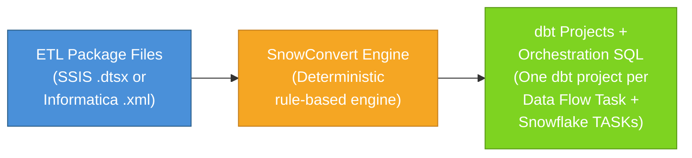
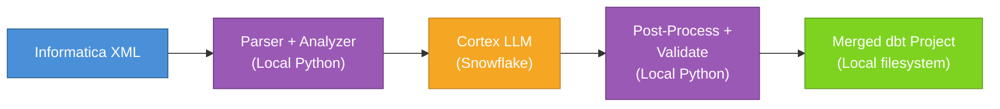
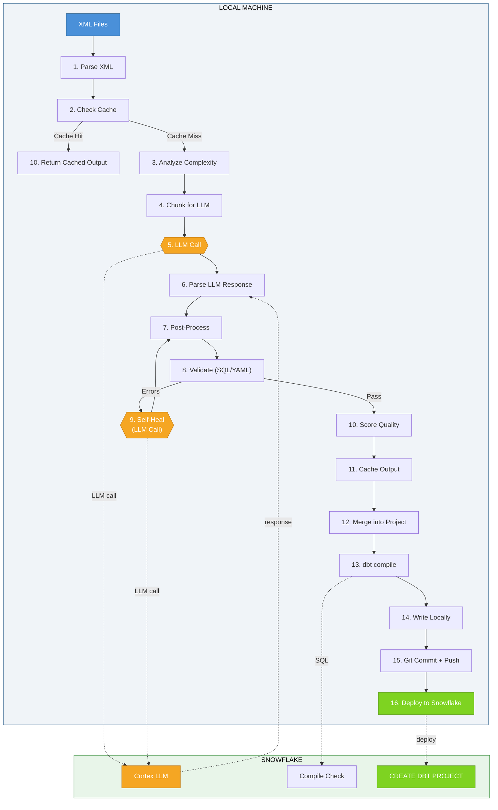
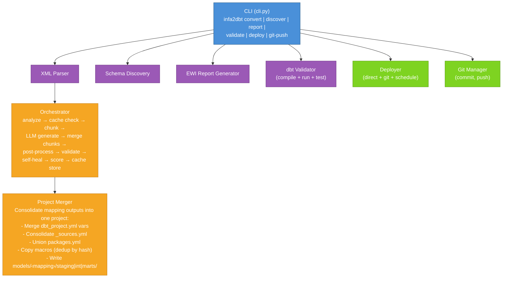

# Framework Implementation Plan
## Generic LLM-Powered ETL-to-dbt Migration Framework for Snowflake

| Field | Value |
|-------|-------|
| **Document Version** | 2.0 |
| **Project** | Informatica-to-dbt Generic Migration Framework |
| **Approach** | LLM-Powered (Snowflake Cortex) — SnowConvert AI-aligned design |
| **Target Platform** | Snowflake-Native dbt Projects |
| **Current Status** | Framework Complete — CLI, conversion, validation, deployment, Git integration all operational |

---

## Table of Contents

1. [Framework Vision](#1-framework-vision)
2. [SnowConvert AI vs Our Framework — Comparison](#2-snowconvert-ai-vs-our-framework--comparison)
3. [Architecture Design](#3-architecture-design)
4. [dbt Project Structure Decision](#4-dbt-project-structure-decision)
5. [Implementation Steps (8 Components)](#5-implementation-steps-8-components)
6. [File Inventory](#6-file-inventory)
7. [Verification Plan](#7-verification-plan)
8. [Implementation Procedure](#8-implementation-procedure)

---

## 1. Framework Vision

### Goal

Build a **generic, reusable framework** — similar in workflow to Snowflake's SnowConvert AI — that automatically converts **any** Informatica PowerCenter XML workflow into a Snowflake-native dbt project. The framework:

- Takes Informatica XML files as input (exported from PowerCenter)
- Uses **LLM (Snowflake Cortex)** instead of rule-based conversion for maximum flexibility
- Generates a complete dbt project (staging → intermediate → marts) with automated tests
- Validates the output locally via `dbt compile` and `dbt run`
- Pushes the project to Git for version control
- Enables Snowflake to pull from Git and run the project natively
- Produces identical output on re-runs (via caching)
- Works for **any** Informatica ETL workload — not limited to specific mappings

### Framework Components

| Component | Status | Details |
|-----------|--------|---------|
| XML Parser | Complete | Parses all Informatica PowerCenter XML elements (sources, targets, 30+ transform types, connectors, shortcuts) |
| Complexity Analyzer | Complete | Scores mappings 0-100 across 11 dimensions, picks strategy (DIRECT/STAGED/LAYERED/COMPLEX) |
| Transformation Registry | Complete | 30+ Informatica transform types mapped to dbt patterns, 60+ function conversions |
| LLM Code Generator | Complete | Cortex-powered with chunking for large mappings, few-shot prompts, strategy-specific generation |
| Self-Healing Loop | Complete | Validates output, sends errors back to LLM for correction (up to 2 attempts) |
| Quality Scorer | Complete | Scores generated code 0-100 across 5 dimensions |
| Validators | Complete | 9 SQL checks + YAML structure + project-level ref/DAG validation |
| Post-Processor | Complete | Cleans Informatica residuals (IIF→IFF, ISNULL, etc.), 15+ pattern replacements |
| Project Merger | Complete | Consolidates individual mapping outputs into one unified dbt project |
| CLI | Complete | Full `infa2dbt` CLI with convert, discover, report, validate, deploy, git-push, cache, version |
| Git Integration | Complete | Built-in init, commit, push via `git-push` command |
| Snowflake Deploy | Complete | Direct deploy via `snow dbt deploy`, Git-based deploy, scheduled TASK deploy |
| Output Caching | Complete | SHA-256 cache layer ensures deterministic re-runs |
| Source Auto-Discovery | Complete | Discovers schemas from Snowflake `INFORMATION_SCHEMA`, XML, or JSON file |
| Live dbt Validation | Complete | Integrated `dbt compile` / `dbt run` / `dbt test` via `validate` command |
| Assessment Reports | Complete | EWI HTML + JSON reports via `report` command |

---

## 2. SnowConvert AI vs Our Framework — Comparison

### 2.1 Architecture Comparison

#### SnowConvert AI (Rule-Based)



- **Conversion engine**: Deterministic, rule-based. Hardcoded translation rules for each SSIS/Informatica component type.
- **Speed**: Fast (milliseconds per mapping) — no external API calls.
- **Output**: Per-Data-Flow-Task isolated dbt projects + Snowflake TASK chains for orchestration.
- **EWIs**: Generates Errors/Warnings/Informational messages for unsupported patterns.
- **Informatica support**: Added in v2.15.0 (March 2026) — still early. Supports: TRUNC, DECODE, ADD_TO_DATE, LTRIM, RTRIM, MAX, SUM, MIN, GET_DATE_PART, IS_NUMBER, IS_DATE, TO_DATE, Sorter, Sequence Generator, Source Qualifier overrides.

#### Our Framework (LLM-Powered)



- **Conversion engine**: LLM-powered (Snowflake Cortex). Uses comprehensive system prompt with conversion rules, few-shot examples, and strategy-specific instructions.
- **Speed**: Slower (30-60 seconds per mapping) — requires LLM API calls.
- **Output**: Single consolidated dbt project with all mappings merged. Models nested by mapping directory.
- **Self-healing**: Validates output, sends errors back to LLM for correction (up to 2 attempts).
- **Testing**: Auto-generates data tests (not_null, unique, accepted_values, relationships, accepted_range).

### 2.2 Feature Parity Matrix

| Feature | SnowConvert AI | Our Framework |
|---------|---------------|---------------|
| **Input formats** | SSIS `.dtsx` + Informatica `.xml` | Informatica `.xml` (extensible to SSIS) |
| **Conversion engine** | Rule-based (deterministic) | LLM-powered + cache for determinism |
| **Output: dbt structure** | staging/intermediate/marts | staging/intermediate/marts (identical) |
| **Output: orchestration** | Snowflake TASKs + procedures | Snowflake TASKs (via deploy --mode schedule) |
| **Output: EWI reports** | HTML reports | HTML + JSON assessment reports |
| **Auto-generated tests** | None | Auto-generated per mapping |
| **Self-healing** | None (manual EWI fixes) | LLM correction loop (2 attempts) |
| **Complexity analysis** | Basic | 11-dimension scoring (0-100) |
| **Function conversion** | ~15 functions (early) | 60+ functions |
| **Transform types** | Limited (Sorter, Seq Gen, SQ) | 30+ types (full registry) |
| **Source discovery** | Requires user DDL scripts | Auto from Snowflake, XML, or JSON |
| **Project merge** | Separate projects per task | Automated merger into single project |
| **CLI tool** | `scai` command-line | Full `infa2dbt` CLI |
| **Git integration** | Manual / CI-CD docs | Built-in git-push |
| **Snowflake deploy** | `snow dbt deploy` | `snow dbt deploy` + Git repo deploy + TASK scheduling |
| **Caching/reproducibility** | Rule-based = deterministic | SHA-256 cache layer |
| **Quality scoring** | None | 5-dimension quality score |

### 2.3 Scoring Comparison

| Dimension | SnowConvert AI | Our Framework |
|-----------|:--------------:|:-------------:|
| **Flexibility** (handles diverse ETL patterns) | 6/10 | 9/10 |
| **Determinism** (same input → same output) | 10/10 | 8/10 |
| **Speed** (time per mapping) | 9/10 | 5/10 |
| **Output quality** (generated code correctness) | 7/10 | 8/10 |
| **dbt structure** (best practices compliance) | 9/10 | 9/10 |
| **Testing** (auto-generated data tests) | 3/10 | 9/10 |
| **Orchestration** (TASK/schedule generation) | 9/10 | 7/10 |
| **CI/CD** (Git + deploy automation) | 8/10 | 8/10 |
| **Self-healing** (auto-fix errors) | 0/10 | 8/10 |
| **ETL breadth** (SSIS + Informatica + ...) | 8/10 | 6/10 |
| **Overall** | **~77/100** | **~85/100** |

### 2.4 Key Advantages of Our Approach

1. **LLM handles complexity that rules cannot**: Informatica mappings with deeply nested expressions, multiple routers, conditional lookups, and complex SCD patterns. SnowConvert generates EWIs for these; our framework generates working code.

2. **Auto-generated tests**: Tests are generated out of the box. SnowConvert generates zero tests — the user must write them manually.

3. **Self-healing**: When the LLM makes a mistake, the framework catches it (via 9 SQL checks, YAML validation, project-level ref checks), sends the errors back to the LLM, and gets a corrected output. SnowConvert has no equivalent.

4. **Quality scoring**: Every generated mapping gets a 0-100 quality score across 5 dimensions, providing transparency into conversion quality.

### 2.5 Where SnowConvert AI is Better

1. **Speed**: Rule-based conversion is instant. Our LLM calls take 30-60 seconds per mapping.
2. **Determinism**: Rules always produce the same output. Our framework uses a cache layer to achieve near-determinism.
3. **ETL breadth**: SnowConvert supports both SSIS and Informatica. We currently only support Informatica.
4. **Orchestration**: SnowConvert generates complete TASK chains for SSIS control flow.

---

## 3. Architecture Design

### 3.1 Local Execution Flow



### 3.2 Component Architecture



### 3.3 Pipeline Execution Order


### 3.4 What Runs Where

| Operation | Where it runs | Requires Snowflake? |
|-----------|--------------|---------------------|
| XML parsing | Local Python | No |
| Complexity analysis | Local Python | No |
| Chunking | Local Python | No |
| LLM code generation | Snowflake Cortex (via connection) | **Yes** |
| Post-processing | Local Python | No |
| Validation (static) | Local Python | No |
| Self-healing (LLM) | Snowflake Cortex | **Yes** |
| Quality scoring | Local Python | No |
| Output caching | Local filesystem | No |
| Project merging | Local Python | No |
| Schema discovery | Snowflake `INFORMATION_SCHEMA` or local XML/JSON | Optional |
| `dbt compile` / `dbt run` validation | Via Snowflake (SQL) | **Yes** |
| EWI report generation | Local Python | No |
| Git operations | Local git CLI | No |
| Snowflake deployment | Snowflake (snow CLI or SQL) | **Yes** |

---

## 4. dbt Project Structure Decision

### 4.1 SnowConvert AI Structure

SnowConvert creates **separate dbt projects per Data Flow Task**:

```
Output/ETL/
├── etl_configuration/                    # Shared infra (SSIS-specific)
│   ├── tables/control_variables_table.sql
│   ├── functions/GetControlVariableUDF.sql
│   └── procedures/UpdateControlVariable.sql
├── {PackageName}/
│   ├── {PackageName}.sql                 # Orchestration TASK
│   └── {DataFlowTaskName}/              # Isolated dbt project
│       ├── dbt_project.yml
│       ├── profiles.yml
│       ├── models/
│       │   ├── sources.yml
│       │   ├── staging/
│       │   │   └── stg_raw__{component_name}.sql
│       │   ├── intermediate/
│       │   │   └── int_{component_name}.sql
│       │   └── marts/
│       │       └── {destination_component_name}.sql
│       ├── macros/
│       ├── seeds/
│       └── tests/
└── {AnotherPackage}/
    └── ...                               # Another isolated dbt project
```

**Why SnowConvert uses this**: SSIS Data Flow Tasks are inherently isolated — each operates independently. Separate projects make sense.

### 4.2 Our Framework Structure

Our framework creates **one consolidated dbt project** with mappings nested by directory:

```
dbt_project/
├── dbt_project.yml              # Single project config with per-mapping model settings
├── profiles.yml                 # Snowflake connection
├── macros/                      # Shared macros (deduplicated across mappings)
│   └── *.sql
├── models/
│   ├── <mapping_name>/          # One directory per Informatica mapping
│   │   ├── staging/             # Source views + schema tests
│   │   │   ├── _sources.yml
│   │   │   ├── _stg__schema.yml
│   │   │   └── stg_*.sql
│   │   ├── intermediate/        # Transformation logic (optional, per complexity)
│   │   │   ├── _int__schema.yml
│   │   │   └── int_*.sql
│   │   └── marts/               # Final business tables (optional, per complexity)
│   │       ├── _marts__schema.yml
│   │       └── fct_*.sql / dim_*.sql
│   ├── <mapping_name>/          # Another mapping
│   │   └── ...
│   └── ...                      # N more mappings
├── reports/                     # EWI assessment reports (HTML + JSON)
├── seeds/
├── snapshots/
└── tests/
```

> **Note:** Not every mapping will have all three layers. Simple mappings (e.g. staging-only) may only generate a `staging/` directory. Complex mappings with multiple transformation steps generate `staging/`, `intermediate/`, and `marts/`.

### 4.3 Why Our Structure is Better for Informatica

| Aspect | SnowConvert (Separate Projects) | Ours (Consolidated) | Winner |
|--------|--------------------------------|---------------------|--------|
| Cross-mapping `ref()` | Not possible (separate projects) | Full `ref()` across mappings | **Ours** |
| Shared sources | Each project duplicates source definitions | Single consolidated `_sources.yml` | **Ours** |
| Shared macros | Duplicated per project | One `macros/` directory | **Ours** |
| Deployment | Deploy N separate dbt projects | Deploy 1 project | **Ours** |
| Naming collision | No risk (isolated) | Prevented by mapping-name prefix | Tie |
| Selective execution | Separate project = natural isolation | `dbt run --select tag:<mapping_name>` | Tie |
| Traceability | Mapping → project (clear) | Mapping → directory (equally clear) | Tie |

**Decision**: Keep our current structure. dbt `tags` per mapping enable selective execution.

### 4.4 Tag-Based Selective Execution

Each mapping's models are automatically tagged in `dbt_project.yml`:

```yaml
models:
  project_name:
    <mapping_name>:
      +tags: ['<mapping_name>']
      staging:
        +materialized: view
      intermediate:
        +materialized: view
      marts:
        +materialized: table
```

This enables running a single mapping:
```bash
# Run only one mapping's models
dbt run --select tag:<mapping_name>

# Or via Snowflake-native execution
EXECUTE DBT PROJECT DB.SCHEMA.PROJECT ARGS = 'run --select tag:<mapping_name>';
```

---

## 5. Implementation Steps (8 Components)

### Step 1: CLI Entry Point

**What**: A `click`-based CLI that mirrors SnowConvert AI's project workflow.

**Commands**:

```bash
# Full conversion (like SnowConvert's "Convert code and ETL projects")
infa2dbt convert \
  --input ./informatica_xmls/ \
  --output ./my_dbt_project/ \
  --connection myconnection \
  --mode new              # or "merge" to add to existing project

# Single XML conversion (add new mapping to existing project)
infa2dbt convert \
  --input ./new_workflow.XML \
  --output ./my_dbt_project/ \
  --mode merge

# Discover source tables from Snowflake
infa2dbt discover \
  --input ./informatica_xmls/ \
  --schema-source snowflake \
  --database MY_DB \
  --schema MY_SCHEMA

# Generate EWI assessment report
infa2dbt report --project-dir ./my_dbt_project/ --format both

# Validate the generated project locally
infa2dbt validate --project ./my_dbt_project/ --run-tests

# Deploy to Snowflake
infa2dbt deploy \
  --project ./my_dbt_project/ \
  --database DB --schema SCHEMA \
  --connection myconnection

# Push to Git
infa2dbt git-push \
  --project ./my_dbt_project/ \
  --remote-url https://github.com/org/repo.git --branch main

# Cache management
infa2dbt cache list
infa2dbt cache stats
infa2dbt cache clear --yes
```

**File**: `informatica_to_dbt/cli.py`
**Config**: `pyproject.toml` — `click` dependency, `[project.scripts] infa2dbt = "informatica_to_dbt.cli:main"`

---

### Step 2: Project Merger

**What**: Assembles individual mapping outputs into one consolidated dbt project.

**Files**:
- `informatica_to_dbt/merger/project_merger.py` — Core merge logic
- `informatica_to_dbt/merger/source_consolidator.py` — Deduplicate `_sources.yml`
- `informatica_to_dbt/merger/conflict_resolver.py` — Handle naming conflicts

**Logic**:

1. **`--mode new`**: Scaffold fresh project directory:
   - Generate `dbt_project.yml` with model configs for all layers
   - Generate `profiles.yml` with Snowflake connection template
   - Generate `packages.yml` with detected dependencies
   - Create directory structure: `models/`, `macros/`, `seeds/`, `snapshots/`, `tests/`

2. **`--mode merge`**: Read existing project, add new mapping:
   - Models → `models/<mapping_name>/staging|intermediate|marts/`
   - `dbt_project.yml` vars → append new lookup variables (skip duplicates)
   - `packages.yml` → union dependencies (keep highest version)
   - Macros → copy to `macros/` if not already present (compare by content hash)
   - Sources → consolidate all `_sources.yml` files (globally unique names)

3. **Merge metadata**: Write `.infa2dbt/manifest.json`:
   ```json
   {
     "version": "1.0.0",
     "mappings": {
       "<mapping_name>": {
         "xml_hash": "sha256:abc...",
         "converted_at": "2026-03-31T10:00:00Z",
         "files_generated": 10,
         "quality_score": 85
       }
     }
   }
   ```

---

### Step 3: Output Caching

**What**: Ensures same XML input produces same dbt output (solves LLM non-determinism).

**File**: `informatica_to_dbt/cache/conversion_cache.py`

**Logic**:
- **Cache key** = SHA-256 of: `XML content + converter_version + prompt_version + LLM model name`
- **Before LLM call**: Check `.infa2dbt/cache/<hash>/` directory
  - If exists and valid → return cached `GeneratedFile` list (skip LLM entirely)
  - If not → proceed with LLM generation
- **After successful conversion**: Persist `GeneratedFile` list to cache directory
- **CLI flags**:
  - `--no-cache` → force regeneration (ignore cache)
  - `--clear-cache` → wipe all cached outputs

**Cache structure**:
```
.infa2dbt/cache/
├── a1b2c3d4.../         # SHA-256 prefix
│   ├── metadata.json    # XML filename, timestamp, quality score
│   └── files/           # Cached GeneratedFile objects
│       ├── models/staging/stg_example.sql
│       ├── models/staging/_sources.yml
│       └── ...
```

---

### Step 4: Source Discovery

**What**: Eliminate the manual `source_map.json` / `table_columns.json` dependency.

**File**: `informatica_to_dbt/discovery/schema_discovery.py`

**Three modes**:

1. **Snowflake mode** (`infa2dbt discover --schema-source snowflake --database DB --schema SCHEMA`):
   - Query `INFORMATION_SCHEMA.COLUMNS` → build table→column map
   - Output: `source_map.json` auto-generated

2. **XML mode** (`infa2dbt discover --schema-source xml`):
   - Extract source/target tables and columns from Informatica XML
   - The parser already captures `Source.fields` and `Target.fields`
   - No Snowflake connection needed

3. **JSON mode** (`infa2dbt discover --schema-source json --json-path ./source_map.json`):
   - User provides pre-built `source_map.json`
   - Backwards compatible with manual workflow

---

### Step 5: Live dbt Validation

**What**: Integrate `dbt compile`, `dbt run`, and `dbt test` into the pipeline for real validation.

**File**: `informatica_to_dbt/validation/dbt_validator.py`

**Logic**:
- After merger writes the project, run `dbt compile` via subprocess
- Parse stdout/stderr for errors → classify as EWIs
- Optionally run `dbt run` for full execution validation
- Optionally run `dbt test` for data quality verification
- Generate **assessment report** (HTML + JSON) with:
  - Per-mapping: complexity score, strategy, files generated, EWIs
  - Aggregate: total models, tests, pass rate, quality scores
  - Similar to SnowConvert's ETL Replatform Component Summary Report

---

### Step 6: Git Integration

**What**: Built-in Git support for version control workflow.

**File**: `informatica_to_dbt/git/git_manager.py`

**Operations**:
- `init_repo(path)` — `git init` if not already a repo
- `create_branch(name)` — create feature branch from current HEAD
- `commit(message)` — stage dbt project files, commit with descriptive message
- `push(remote, branch)` — push to GitHub/GitLab/Azure DevOps

---

### Step 7: Snowflake Deployment

**What**: Deploy the dbt project to Snowflake (direct, via Git, or scheduled).

**File**: `informatica_to_dbt/deployment/deployer.py`

**Three deployment modes**:

1. **Direct mode** (uses `snow dbt deploy`):
   ```bash
   infa2dbt deploy --project ./my_dbt_project/ --database DB --schema SCHEMA --mode direct
   ```

2. **Git mode** (Snowflake pulls from Git):
   ```bash
   infa2dbt deploy --project ./my_dbt_project/ --mode git \
       --git-url https://github.com/org/repo.git --git-repo-name my_git_repo
   ```
   Generates and executes:
   ```sql
   CREATE OR REPLACE API INTEGRATION git_api_integration ...;
   CREATE OR REPLACE GIT REPOSITORY my_git_repo ...;
   ALTER GIT REPOSITORY my_git_repo FETCH;
   CREATE OR REPLACE DBT PROJECT my_project
     FROM '@my_git_repo/branches/main/dbt_project';
   ```

3. **Schedule mode** (TASK-based orchestration):
   ```bash
   infa2dbt deploy --project ./my_dbt_project/ --mode schedule --cron "0 2 * * *"
   ```
   Generates:
   ```sql
   CREATE OR REPLACE TASK dbt_nightly_run
     WAREHOUSE = MY_WH
     SCHEDULE = 'USING CRON 0 2 * * * America/New_York'
   AS
     EXECUTE DBT PROJECT DB.SCHEMA.PROJECT_NAME ARGS = 'run';
   ```

---

### Step 8: Assessment Reports

**What**: Generate EWI-style assessment reports for conversion transparency.

**File**: `informatica_to_dbt/reports/ewi_report.py`

**Output**: HTML and/or JSON reports in the project's `reports/` directory, containing:
- Conversion summary (total mappings, models, tests)
- Per-mapping breakdown (complexity score, strategy, EWIs)
- Quality scores and pass rates

---

## 6. File Inventory

### 6.1 Framework Files

| File | Purpose |
|------|---------|
| `informatica_to_dbt/cli.py` | Click-based CLI (primary user interface) |
| `informatica_to_dbt/merger/project_merger.py` | Core merge logic (new project + merge into existing) |
| `informatica_to_dbt/merger/source_consolidator.py` | Deduplicate `_sources.yml` |
| `informatica_to_dbt/merger/conflict_resolver.py` | Handle naming conflicts |
| `informatica_to_dbt/cache/conversion_cache.py` | SHA-256 output cache |
| `informatica_to_dbt/discovery/schema_discovery.py` | Auto-discover source schema from Snowflake, XML, or JSON |
| `informatica_to_dbt/git/git_manager.py` | Git init/branch/commit/push operations |
| `informatica_to_dbt/deployment/deployer.py` | Snowflake deploy (direct + Git + TASK scheduling) |
| `informatica_to_dbt/validation/dbt_validator.py` | Live `dbt compile`/`dbt run`/`dbt test` validation |
| `informatica_to_dbt/reports/ewi_report.py` | HTML + JSON assessment report generator |

### 6.2 Configuration Files

| File | Purpose |
|------|---------|
| `pyproject.toml` | Project metadata, dependencies (`lxml`, `networkx`, `sqlparse`, `jinja2`, `pyyaml`, `click`), entry point |
| `informatica_to_dbt/config.py` | Runtime configuration: `project_dir`, `git_remote`, `git_branch`, `cache_dir`, `cache_enabled`, `connection_name` |

### 6.3 Documentation

| File | Purpose |
|------|---------|
| `docs/Framework_Implementation_Plan.md` | This document — architecture, design decisions, implementation steps |
| `docs/CLI_Reference.md` | Full CLI command reference with all flags and examples |
| `docs/Production_Runbook.md` | Setup guide for running the framework on a new machine |
| `docs/Technical_Design_Document.md` | Technical deep-dive into parser, LLM generator, validators |

---

## 7. Verification Plan

### 7.1 Per-Step Verification

| Step | Verification | Command |
|------|-------------|---------|
| 1. CLI | Smoke test all commands | `infa2dbt --help`, `infa2dbt convert --help` |
| 2. Merger | Convert multiple XMLs → merge → valid project | `infa2dbt convert -i ./input/ -o /tmp/test -m new` |
| 3. Cache | Convert same XML twice → second returns instantly | Time both runs; second should skip LLM calls |
| 4. Discovery | Auto-discover from Snowflake | `infa2dbt discover -i ./input/ --schema-source snowflake --database DB --schema SCHEMA` |
| 5. Validation | `dbt compile` + `dbt run` + `dbt test` succeed | `infa2dbt validate -p /tmp/test --run-tests` |
| 6. Git | Commit + push works | `infa2dbt git-push -p /tmp/test --remote-url <url> -b main` |
| 7. Deploy | Native project works | `infa2dbt deploy -p /tmp/test -d DB -s SCHEMA --connection conn` |
| 8. Reports | EWI report generated | `infa2dbt report -p /tmp/test -f both` |

### 7.2 End-to-End Verification

```bash
# 1. Convert all XMLs into a new project
infa2dbt convert -i ./input/ -o ./output/dbt_project -m new \
    --connection myconnection --source-schema MY_SCHEMA

# 2. Discover schemas
infa2dbt discover -i ./input/ --schema-source snowflake \
    --database MY_DB --schema MY_SCHEMA

# 3. Generate assessment report
infa2dbt report -p ./output/dbt_project -f both

# 4. Validate (compile + run + test)
infa2dbt validate -p ./output/dbt_project --run-tests

# 5. Re-run convert (should use cache — no LLM calls)
infa2dbt convert -i ./input/ -o ./output/dbt_project -m new \
    --connection myconnection --source-schema MY_SCHEMA

# 6. Deploy to Snowflake
infa2dbt deploy -p ./output/dbt_project -d MY_DB -s MY_SCHEMA \
    -n MY_PROJECT --connection myconnection --mode direct

# 7. Execute in Snowflake
snow dbt execute -c myconnection --database MY_DB --schema MY_SCHEMA MY_PROJECT run
snow dbt execute -c myconnection --database MY_DB --schema MY_SCHEMA MY_PROJECT test

# 8. Push to Git
infa2dbt git-push -p ./output/dbt_project \
    --remote-url https://github.com/org/repo.git -b main
```

### 7.3 Unit Test Verification

```bash
# All existing tests must continue to pass
pytest tests/ -v

# Module-specific tests
pytest tests/unit/test_merger.py -v
pytest tests/unit/test_cache.py -v
pytest tests/unit/test_discovery.py -v
pytest tests/unit/test_git_manager.py -v
pytest tests/integration/test_end_to_end_framework.py -v
```

---

## 8. Implementation Procedure

### Phase 1: Foundation (Steps 1-2)

**Priority**: Highest — these are prerequisites for everything else.

| Order | Task | Dependencies |
|-------|------|-------------|
| 1.1 | Initialize Git repo (`.gitignore`, `git init`) | None |
| 1.2 | Add `click` to `pyproject.toml` | None |
| 1.3 | Create `cli.py` with `convert` command skeleton | 1.2 |
| 1.4 | Create `merger/project_merger.py` (new mode) | None |
| 1.5 | Create `merger/source_consolidator.py` | None |
| 1.6 | Create `merger/conflict_resolver.py` | None |
| 1.7 | Integrate merger into `orchestrator.py` | 1.4, 1.5, 1.6 |
| 1.8 | Wire CLI `convert` command to orchestrator + merger | 1.3, 1.7 |
| 1.9 | Write `tests/unit/test_merger.py` | 1.4 |
| 1.10 | Test: convert multiple XMLs → merge → valid project | 1.8 |

### Phase 2: Reliability (Steps 3-4)

**Priority**: High — enables reproducible, self-service usage.

| Order | Task | Dependencies |
|-------|------|-------------|
| 2.1 | Create `cache/conversion_cache.py` | None |
| 2.2 | Add `PROMPT_VERSION` to `prompt_builder.py` | None |
| 2.3 | Integrate cache into orchestrator (pre-LLM check + post-LLM store) | 2.1, 2.2 |
| 2.4 | Create `discovery/schema_discovery.py` | None |
| 2.5 | Wire `infa2dbt discover` CLI command | 2.4 |
| 2.6 | Write `tests/unit/test_cache.py` and `test_discovery.py` | 2.1, 2.4 |
| 2.7 | Test: same XML twice → second cached, identical output | 2.3 |

### Phase 3: Validation & Deployment (Steps 5-7)

**Priority**: Medium-High — completes the production pipeline.

| Order | Task | Dependencies |
|-------|------|-------------|
| 3.1 | Create `validation/dbt_validator.py` (`dbt compile` subprocess) | Phase 1 |
| 3.2 | Wire `infa2dbt validate` CLI command | 3.1 |
| 3.3 | Create `git/git_manager.py` | None |
| 3.4 | Wire `infa2dbt git-push` CLI command | 3.3 |
| 3.5 | Create `deployment/deployer.py` (direct + Git + TASK) | None |
| 3.6 | Wire `infa2dbt deploy` CLI command | 3.5 |
| 3.7 | Write `tests/unit/test_git_manager.py` | 3.3 |
| 3.8 | End-to-end test: XML → convert → merge → validate → git push → deploy | All above |

### Phase 4: Reports & Documentation (Step 8)

**Priority**: Medium — polish for delivery.

| Order | Task | Dependencies |
|-------|------|-------------|
| 4.1 | Create `reports/ewi_report.py` (HTML + JSON assessment report) | Phase 1 |
| 4.2 | Wire `infa2dbt report` CLI command | 4.1 |
| 4.3 | Update all documentation to be generic (not tied to specific mappings) | None |
| 4.4 | Create `docs/CLI_Reference.md` — full CLI command reference | Phase 1 |
| 4.5 | Create `docs/Production_Runbook.md` — setup guide | None |

---

*This document serves as the complete implementation plan for the Generic Informatica-to-dbt Migration Framework.*
