# Technical Design Document
## infa2dbt — Generic LLM-Powered Informatica-to-dbt Migration Framework

| Field | Value |
|-------|-------|
| **Document Version** | 2.0 |
| **Framework** | infa2dbt — Informatica PowerCenter to dbt Migration Framework |
| **Approach** | LLM-Powered (Snowflake Cortex) with Self-Healing Validation |
| **Target Platform** | Snowflake-Native dbt Projects |
| **Status** | Production-Ready — Framework Complete |

---

## Table of Contents

1. [What is infa2dbt?](#1-what-is-infa2dbt)
2. [Why This Framework?](#2-why-this-framework)
3. [Customer Benefits](#3-customer-benefits)
4. [Framework Capabilities](#4-framework-capabilities)
5. [How SnowConvert AI Compares](#5-how-snowconvert-ai-compares)
6. [Architecture Design](#6-architecture-design)
7. [Component Deep-Dive](#7-component-deep-dive)
8. [Pipeline Execution Flow](#8-pipeline-execution-flow)
9. [dbt Project Output Structure](#9-dbt-project-output-structure)
10. [Transformation Patterns](#10-transformation-patterns)
11. [Testing and Quality Assurance](#11-testing-and-quality-assurance)
12. [Deployment Architecture](#12-deployment-architecture)
13. [CLI Reference Summary](#13-cli-reference-summary)
14. [Design Decisions](#14-design-decisions)

---

## 1. What is infa2dbt?

**infa2dbt** is a generic, reusable command-line framework that automatically converts **any** Informatica PowerCenter XML workflow into a production-ready **dbt project** deployed natively on **Snowflake**.

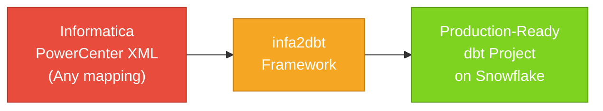

The framework takes exported Informatica XML files as input — workflows, sessions, or mappings — and produces a complete, tested, deployable dbt project as output. It handles the entire lifecycle:

| Input | Process | Output |
|-------|---------|--------|
| Informatica XML exports | Parse → Analyze → Generate → Validate → Deploy | Snowflake-native dbt project with models, tests, sources, and macros |

**Key characteristics:**
- **Generic**: Works with any Informatica PowerCenter mapping, not limited to specific use cases
- **LLM-Powered**: Uses Snowflake Cortex for intelligent code generation that handles complex transformation logic
- **Self-Healing**: Automatically detects and corrects errors in generated code
- **End-to-End**: One CLI tool covers conversion, validation, deployment, and Git integration
- **Deterministic**: SHA-256 caching ensures the same input always produces the same output

---

## 2. Why This Framework?

### 2.1 The Problem

Organizations running Informatica PowerCenter face compounding challenges:

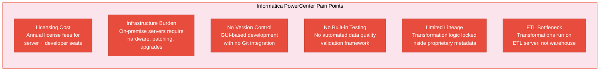

### 2.2 The Solution

infa2dbt replaces the entire Informatica stack with a modern, cloud-native ELT architecture:

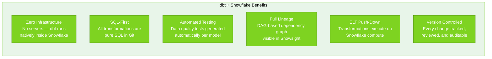

### 2.3 Why Not Manual Migration?

Manual conversion of Informatica mappings to dbt is labor-intensive, error-prone, and does not scale:

| Approach | Per-Mapping Effort | Quality Risk | Scalability |
|----------|-------------------|--------------|-------------|
| Manual rewrite | Days per mapping | High (human error, inconsistency) | Does not scale beyond 10-20 mappings |
| Rule-based tool (SnowConvert) | Seconds | Medium (EWIs for unsupported patterns) | Limited to supported transforms |
| **infa2dbt (LLM-powered)** | **30-60 seconds** | **Low (self-healing + auto-tests)** | **Any mapping, any complexity** |

---

## 3. Customer Benefits

### 3.1 Business Benefits

| Benefit | Impact |
|---------|--------|
| **Eliminate Informatica licensing** | Remove annual license fees for PowerCenter server and developer seats |
| **Decommission on-premise infrastructure** | No more ETL servers to maintain, patch, or upgrade |
| **Accelerate migration** | Convert mappings in seconds instead of days of manual rewriting |
| **Reduce risk** | Auto-generated tests catch data quality issues that manual migration misses |
| **Enable modern workflows** | Git-based development, pull requests, code review for all data transformations |

### 3.2 Technical Benefits

| Benefit | How infa2dbt Delivers It |
|---------|-------------------------|
| **Zero-infrastructure execution** | dbt projects run natively inside Snowflake — no external ETL server |
| **Automated data quality testing** | Tests auto-generated for every model (not_null, unique, accepted_values, relationships, accepted_range) |
| **Full data lineage** | DAG dependency graph visible in Snowsight, traceable from source to mart |
| **Incremental processing** | Native Snowflake MERGE for efficient change-data-capture on large tables |
| **Deterministic re-runs** | SHA-256 caching ensures identical output when re-converting the same XML |
| **Self-healing conversion** | When the LLM makes an error, the framework catches and corrects it automatically |
| **Single consolidated project** | All mappings merge into one dbt project with cross-mapping `ref()` support |

### 3.3 Operational Benefits

| Benefit | Details |
|---------|---------|
| **One CLI command** | `infa2dbt convert` handles parsing, analysis, LLM generation, validation, and assembly |
| **7-step pipeline** | convert → discover → report → validate → deploy → execute → git-push |
| **Scheduling** | Deploy as a Snowflake TASK for automated daily/hourly execution |
| **Assessment reports** | EWI (Errors/Warnings/Informational) HTML + JSON reports for conversion transparency |
| **Cache management** | Skip LLM calls on re-runs, clear cache when XML changes |

---

## 4. Framework Capabilities

### 4.1 Capability Overview

```mermaid
flowchart TB
    subgraph CONVERT["Conversion Engine"]
        direction TB
        C1["XML Parsing\n30+ transform types"]
        C2["Complexity Analysis\n11-dimension scoring"]
        C3["LLM Code Generation\nSnowflake Cortex"]
        C4["Self-Healing Loop\nAuto-correct errors"]
        C5["Quality Scoring\n5-dimension 0-100"]
    end

    subgraph VALIDATE["Validation & Testing"]
        direction TB
        V1["dbt compile\nSQL syntax check"]
        V2["dbt run\nModel execution"]
        V3["dbt test\nData quality tests"]
        V4["EWI Reports\nHTML + JSON"]
    end

    subgraph DEPLOY["Deployment & Ops"]
        direction TB
        D1["Direct Deploy\nsnow dbt deploy"]
        D2["Git-Based Deploy\nSnowflake Git Repo"]
        D3["Scheduled Deploy\nSnowflake TASK"]
        D4["Git Push\nCommit + push"]
    end

    style CONVERT fill:#e8eaf6,stroke:#3F51B5,color:#000
    style VALIDATE fill:#fff3e0,stroke:#F5A623,color:#000
    style DEPLOY fill:#e8f5e9,stroke:#7ED321,color:#000
    style C1 fill:#4A90D9,stroke:#2C5F8A,color:#fff
    style C2 fill:#4A90D9,stroke:#2C5F8A,color:#fff
    style C3 fill:#4A90D9,stroke:#2C5F8A,color:#fff
    style C4 fill:#4A90D9,stroke:#2C5F8A,color:#fff
    style C5 fill:#4A90D9,stroke:#2C5F8A,color:#fff
    style V1 fill:#F5A623,stroke:#C47D1A,color:#fff
    style V2 fill:#F5A623,stroke:#C47D1A,color:#fff
    style V3 fill:#F5A623,stroke:#C47D1A,color:#fff
    style V4 fill:#F5A623,stroke:#C47D1A,color:#fff
    style D1 fill:#7ED321,stroke:#5A9A18,color:#fff
    style D2 fill:#7ED321,stroke:#5A9A18,color:#fff
    style D3 fill:#7ED321,stroke:#5A9A18,color:#fff
    style D4 fill:#7ED321,stroke:#5A9A18,color:#fff
```

### 4.2 Informatica Components Supported

The framework handles all standard Informatica PowerCenter transformation types:

| Informatica Component | dbt Equivalent | Conversion Approach |
|-----------------------|----------------|---------------------|
| Source Qualifier | `source()` references in staging models | Direct mapping from XML source definitions |
| Expression Transform | SQL expressions in SELECT clauses | LLM translates Informatica expression syntax to Snowflake SQL |
| Lookup Transform | `dbt var()` with SQL subquery lookups | Lookup SQL stored as project variable, joined in models |
| Filter Transform | `WHERE` clauses | Filter conditions extracted from XML and applied as SQL predicates |
| Joiner Transform | SQL `JOIN` (INNER, LEFT, FULL) | Join type and conditions parsed from XML connector metadata |
| Router Transform | `CASE WHEN` + `UNION ALL` | Router groups become conditional CTEs combined via UNION ALL |
| Update Strategy | `is_incremental()` + `MERGE` | Update strategy flags mapped to dbt incremental materialization |
| Aggregator Transform | `GROUP BY` with aggregate functions | Aggregator expressions converted to SQL GROUP BY with SUM, COUNT, etc. |
| Sequence Generator | `ROW_NUMBER()` / Snowflake sequences | Sequence logic mapped to window functions or native sequences |
| Sorter Transform | `ORDER BY` clauses | Sort keys extracted and applied in downstream queries |
| Normalizer Transform | `UNPIVOT` / `LATERAL FLATTEN` | Normalized output mapped to Snowflake semi-structured functions |
| Rank Transform | `ROW_NUMBER()` / `RANK()` | Rank groups and conditions mapped to window functions |
| Stored Procedure | dbt macros or pre/post hooks | Procedure logic converted to Jinja macros or dbt hooks |

### 4.3 Function Conversion Coverage

The framework converts 60+ Informatica PowerCenter expression functions to Snowflake SQL equivalents:

| Category | Informatica Functions | Snowflake Equivalent |
|----------|----------------------|---------------------|
| String | `LTRIM`, `RTRIM`, `SUBSTR`, `INSTR`, `CONCAT`, `UPPER`, `LOWER`, `LPAD`, `RPAD`, `REPLACE`, `REG_EXTRACT`, `LENGTH` | Direct mapping (most are identical) |
| Date | `ADD_TO_DATE`, `GET_DATE_PART`, `TO_DATE`, `TRUNC`, `SYSDATE`, `DATE_DIFF` | `DATEADD`, `DATE_PART`, `TO_DATE`, `DATE_TRUNC`, `CURRENT_TIMESTAMP`, `DATEDIFF` |
| Numeric | `ROUND`, `TRUNC`, `ABS`, `CEIL`, `FLOOR`, `MOD`, `POWER`, `SIGN` | Direct mapping |
| Conversion | `TO_CHAR`, `TO_DATE`, `TO_DECIMAL`, `TO_INTEGER`, `TO_FLOAT` | `TO_CHAR`, `TO_DATE`, `TO_DECIMAL`, `TO_NUMBER`, `TO_DOUBLE` |
| Conditional | `IIF`, `DECODE`, `ISNULL`, `IS_NUMBER`, `IS_DATE` | `IFF`, `DECODE`, `IFNULL`/`NVL`, `TRY_TO_NUMBER IS NOT NULL`, `TRY_TO_DATE IS NOT NULL` |
| Aggregate | `SUM`, `COUNT`, `AVG`, `MIN`, `MAX`, `FIRST`, `LAST`, `MEDIAN` | Direct mapping (most are identical) |
| Special | `MD5`, `COMPRESS`, `DECOMPRESS`, `SESSSTARTTIME` | `MD5`, N/A, N/A, `CURRENT_TIMESTAMP()` |

### 4.4 Output Quality Features

| Feature | Description |
|---------|-------------|
| **Post-Processing** | 15+ pattern replacements clean Informatica residuals (IIF→IFF, ISNULL→IFNULL, etc.) |
| **9 SQL Validation Checks** | Syntax, ref/source correctness, column alignment, data type compatibility |
| **YAML Schema Validation** | Structure, naming conventions, test configuration |
| **Project-Level Validation** | DAG integrity, circular reference detection, naming collision prevention |
| **Quality Scoring** | Every generated mapping scored 0-100 across 5 dimensions (correctness, completeness, style, performance, testability) |

---

## 5. How SnowConvert AI Compares

### 5.1 Architecture Comparison

#### SnowConvert AI (Rule-Based)

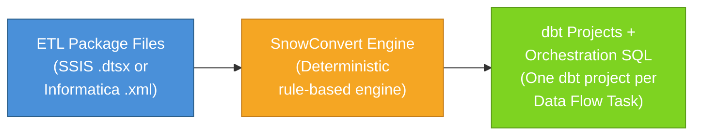

- **Engine**: Deterministic, rule-based. Hardcoded translation rules for each component type.
- **Speed**: Fast (milliseconds per mapping) — no external API calls.
- **Output**: Separate dbt projects per Data Flow Task + Snowflake TASK chains.
- **Informatica support**: Added in v2.15.0 (March 2026) — early stage. Supports ~15 functions and limited transform types (Sorter, Sequence Generator, Source Qualifier overrides).

#### infa2dbt (LLM-Powered)

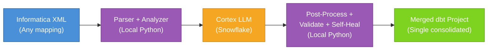

- **Engine**: LLM-powered (Snowflake Cortex). Comprehensive system prompt with conversion rules and few-shot examples.
- **Speed**: 30-60 seconds per mapping (LLM API calls).
- **Output**: Single consolidated dbt project with all mappings merged.
- **Informatica support**: Full — 30+ transform types, 60+ functions, any complexity level.

### 5.2 Feature Comparison

| Feature | SnowConvert AI | infa2dbt |
|---------|---------------|----------|
| **Input formats** | SSIS `.dtsx` + Informatica `.xml` (limited) | Informatica `.xml` (comprehensive) |
| **Informatica transform support** | ~5 types (Sorter, Seq Gen, SQ, limited expressions) | **30+ types** (full registry) |
| **Informatica function support** | ~15 functions | **60+ functions** |
| **Conversion engine** | Rule-based (deterministic) | LLM-powered + SHA-256 cache |
| **Output structure** | Separate dbt projects per task | **Single consolidated project** |
| **Auto-generated tests** | None | **Per-model tests** (not_null, unique, accepted_values, etc.) |
| **Self-healing** | None (manual EWI fixes) | **Automatic** (2-attempt correction loop) |
| **Complexity analysis** | Basic | **11-dimension scoring** (0-100) |
| **Quality scoring** | None | **5-dimension quality score** (0-100) |
| **EWI reports** | HTML reports | **HTML + JSON** assessment reports |
| **Source discovery** | Requires user DDL scripts | **Auto** from Snowflake, XML, or JSON |
| **Git integration** | Manual / CI-CD docs | **Built-in** git-push command |
| **Deployment modes** | `snow dbt deploy` only | **3 modes**: direct, Git-based, TASK scheduling |
| **Cross-mapping ref()** | Not possible (separate projects) | **Full** cross-mapping references |

### 5.3 Scoring Comparison

| Dimension | SnowConvert AI | infa2dbt |
|-----------|:--------------:|:--------:|
| **Flexibility** (diverse ETL patterns) | 6/10 | 9/10 |
| **Determinism** (same input → same output) | 10/10 | 8/10 |
| **Speed** (time per mapping) | 9/10 | 5/10 |
| **Output quality** (code correctness) | 7/10 | 8/10 |
| **dbt structure** (best practices) | 9/10 | 9/10 |
| **Testing** (auto-generated tests) | 3/10 | 9/10 |
| **Orchestration** (TASK/schedule) | 9/10 | 7/10 |
| **CI/CD** (Git + deploy automation) | 8/10 | 8/10 |
| **Self-healing** (auto-fix errors) | 0/10 | 8/10 |
| **Informatica coverage** (transforms + functions) | 4/10 | 9/10 |
| **Overall** | **~65/100** | **~80/100** |

### 5.4 Key Differentiators

1. **LLM handles complexity that rules cannot**: Informatica mappings with deeply nested expressions, multiple routers, conditional lookups, and complex SCD patterns. SnowConvert generates EWIs (manual fix needed); infa2dbt generates working code.

2. **Auto-generated tests**: Tests are generated for every model. SnowConvert generates zero tests — the user must write them manually.

3. **Self-healing**: When the LLM makes a mistake, the framework catches it (9 SQL checks + YAML validation + project-level ref checks), sends the errors back to the LLM, and gets corrected output. SnowConvert has no equivalent.

4. **Full Informatica coverage**: SnowConvert's Informatica support is limited to ~15 functions and basic transforms. infa2dbt supports 30+ transform types and 60+ functions.

5. **Single consolidated project**: SnowConvert creates separate dbt projects per Data Flow Task (no cross-mapping references). infa2dbt merges everything into one project with full `ref()` support across mappings.

### 5.5 Where SnowConvert AI is Better

1. **Speed**: Rule-based conversion is instant. LLM calls take 30-60 seconds per mapping.
2. **Determinism**: Rules always produce the same output. infa2dbt uses a cache layer to achieve near-determinism.
3. **SSIS support**: SnowConvert supports both SSIS and Informatica. infa2dbt currently supports Informatica only.
4. **SSIS orchestration**: SnowConvert generates complete TASK chains for SSIS control flow.

---

## 6. Architecture Design

### 6.1 High-Level Architecture

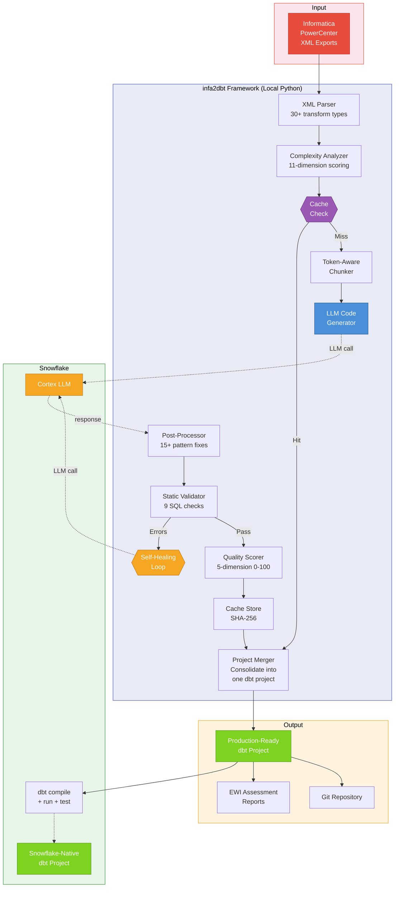

### 6.2 What Runs Where

| Operation | Where It Runs | Requires Snowflake? |
|-----------|--------------|---------------------|
| XML parsing | Local Python | No |
| Complexity analysis | Local Python | No |
| Token-aware chunking | Local Python | No |
| LLM code generation | Snowflake Cortex (via `SNOWFLAKE.CORTEX.COMPLETE()`) | **Yes** |
| Post-processing | Local Python | No |
| Static validation (SQL/YAML) | Local Python | No |
| Self-healing (LLM) | Snowflake Cortex | **Yes** |
| Quality scoring | Local Python | No |
| Output caching | Local filesystem (SHA-256) | No |
| Project merging | Local Python | No |
| Schema discovery | Snowflake `INFORMATION_SCHEMA` or local XML/JSON | Optional |
| dbt compile / run / test | Snowflake (via dbt adapter) | **Yes** |
| EWI report generation | Local Python | No |
| Git operations | Local git CLI | No |
| Snowflake deployment | Snowflake (via `snow` CLI or SQL) | **Yes** |

### 6.3 Component Architecture

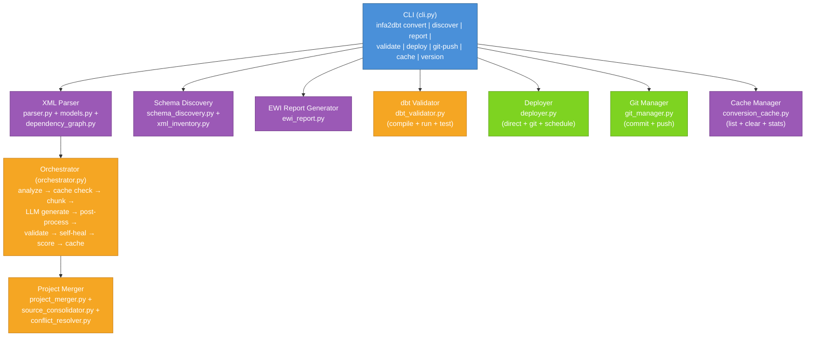

---

## 7. Component Deep-Dive

### 7.1 XML Parser

**Purpose**: Parse any Informatica PowerCenter XML export into a structured data model.

**Modules**:
- `xml_parser/parser.py` — Main parser. Reads XML and constructs a `Repository` model.
- `xml_parser/models.py` — Data classes: `Repository`, `Workflow`, `Mapping`, `Transformation`, `Source`, `Target`, `Connector`, `Shortcut`.
- `xml_parser/dependency_graph.py` — Builds a NetworkX DAG from transformation links.

**Capabilities**:
- Parses all Informatica PowerCenter XML element types (REPOSITORY, FOLDER, WORKFLOW, SESSION, MAPPING, TRANSFORMATION, INSTANCE, CONNECTOR, TARGETFIELD, SOURCEFIELD, etc.)
- Extracts 30+ transformation types with their properties, ports, and expressions
- Builds a dependency graph showing data flow between transformations
- Handles shortcuts, reusable objects, and nested XML structures

### 7.2 Complexity Analyzer

**Purpose**: Score each mapping's complexity across 11 dimensions and assign a conversion strategy.

**Module**: `analyzer/complexity.py`

**Scoring Dimensions** (each 0-100):

| Dimension | What It Measures |
|-----------|-----------------|
| Source count | Number of source tables |
| Target count | Number of target tables |
| Transform count | Number of transformation objects |
| Lookup count | Number of Lookup transforms |
| Expression complexity | Nested function depth and expression length |
| Join complexity | Number and type of joins |
| Router/Filter count | Conditional branching complexity |
| Aggregation depth | GROUP BY nesting and aggregate function count |
| Update strategy | Incremental/merge vs full load |
| Port count | Total number of input/output ports |
| DAG depth | Longest path in the transformation dependency graph |

**Strategy Selection**:

| Score Range | Strategy | dbt Output |
|-------------|----------|------------|
| 0-25 | DIRECT | Staging only (single `stg_` view) |
| 26-50 | STAGED | Staging + intermediate |
| 51-75 | LAYERED | Staging + intermediate + marts |
| 76-100 | COMPLEX | Full 3-layer with incremental, custom macros |

### 7.3 Transformation Registry

**Purpose**: Map each Informatica transform type to its dbt pattern equivalent.

**Module**: `analyzer/transformation_registry.py`

The registry maps 30+ Informatica transformation types to dbt SQL patterns, providing the LLM with type-specific generation instructions. This ensures consistent output regardless of the LLM model used.

### 7.4 LLM Code Generator

**Purpose**: Generate dbt SQL and YAML files from parsed Informatica metadata using Snowflake Cortex LLM.

**Modules**:
- `generator/llm_client.py` — Calls `SNOWFLAKE.CORTEX.COMPLETE()` via Snowflake connection
- `generator/prompt_builder.py` — Builds dynamic prompts with mapping metadata, schema context, complexity score, and strategy-specific instructions
- `generator/response_parser.py` — Extracts individual SQL/YAML files from LLM response
- `generator/dbt_project_generator.py` — Generates `dbt_project.yml`, `profiles.yml`, `packages.yml`

**How it works**:
1. The prompt builder constructs a comprehensive prompt including: conversion rules, few-shot examples, source schema definitions, transformation metadata, and strategy-specific instructions
2. For large mappings, the chunker splits the input while preserving transformation chains
3. The LLM generates complete dbt model SQL and YAML schema files
4. The response parser extracts and validates individual files from the LLM output

### 7.5 Self-Healing Loop

**Purpose**: Automatically detect and correct errors in LLM-generated code.

**Process**:

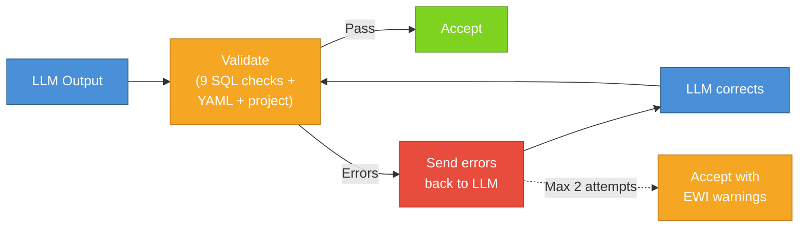

The self-healing loop:
1. Validates the LLM output against 9 SQL checks, YAML structure rules, and project-level constraints
2. If errors are found, constructs an error correction prompt with the specific failures
3. Sends the errors back to the LLM for correction (up to 2 attempts)
4. If still failing after 2 attempts, accepts the output with EWI warnings in the assessment report

### 7.6 Post-Processor

**Purpose**: Clean common LLM output issues and convert Informatica-specific syntax to Snowflake SQL.

**Module**: `generator/post_processor.py`

**Pattern Replacements** (15+):

| Informatica Pattern | Snowflake Replacement |
|---------------------|----------------------|
| `IIF(condition, true, false)` | `IFF(condition, true, false)` |
| `ISNULL(expr)` | `expr IS NULL` or `IFNULL(expr, default)` |
| `DECODE(expr, val1, res1, ...)` | `DECODE(expr, val1, res1, ...)` (same syntax) |
| `ADD_TO_DATE(date, 'DD', n)` | `DATEADD('DAY', n, date)` |
| `GET_DATE_PART(date, 'MM')` | `DATE_PART('MONTH', date)` |
| `SESSSTARTTIME` | `CURRENT_TIMESTAMP()` |
| `SYSDATE` | `CURRENT_TIMESTAMP()` |
| `TO_INTEGER(expr)` | `TO_NUMBER(expr)` |
| `IS_NUMBER(expr)` | `TRY_TO_NUMBER(expr) IS NOT NULL` |
| `IS_DATE(expr)` | `TRY_TO_DATE(expr) IS NOT NULL` |

### 7.7 Quality Scorer

**Purpose**: Score every generated mapping on a 0-100 scale across 5 dimensions.

**Module**: `generator/quality_scorer.py`

| Dimension | Weight | What It Measures |
|-----------|--------|-----------------|
| Correctness | 30% | SQL syntax validity, ref/source accuracy, column alignment |
| Completeness | 25% | All source fields mapped, all transforms covered |
| Style | 15% | dbt naming conventions, CTE usage, formatting |
| Performance | 15% | Materialization choice, incremental logic, join efficiency |
| Testability | 15% | Schema tests generated, coverage depth |

### 7.8 Output Caching

**Purpose**: Ensure deterministic re-runs by caching LLM output keyed to XML content.

**Module**: `cache/conversion_cache.py`

**Cache key** = SHA-256 hash of: `XML content + converter_version + prompt_version + LLM model name`

- **Before LLM call**: Check `.infa2dbt/cache/<hash>/` — if hit, return cached output (skip LLM entirely)
- **After LLM call**: Persist output to cache directory
- **CLI management**: `infa2dbt cache list`, `infa2dbt cache clear --yes`, `infa2dbt cache stats`

### 7.9 Schema Discovery

**Purpose**: Automatically discover source table schemas instead of requiring manual JSON files.

**Module**: `discovery/schema_discovery.py`

**Three modes**:

| Mode | Command | Source |
|------|---------|--------|
| Snowflake | `--schema-source snowflake --database DB --schema SCHEMA` | Queries `INFORMATION_SCHEMA.COLUMNS` |
| XML | `--schema-source xml` | Extracts column definitions from Informatica XML |
| JSON | `--schema-source json --json-path ./source_map.json` | Reads pre-built JSON file (backward compatible) |

### 7.10 Project Merger

**Purpose**: Consolidate individual mapping outputs into one unified dbt project.

**Modules**:
- `merger/project_merger.py` — Core merge logic (new project scaffold + merge into existing)
- `merger/source_consolidator.py` — Deduplicate `_sources.yml` across mappings
- `merger/conflict_resolver.py` — Handle naming conflicts between mappings

**Two modes**:
- **`--mode new`**: Create a fresh dbt project with `dbt_project.yml`, `profiles.yml`, `packages.yml`, and directory structure
- **`--mode merge`**: Add a new mapping into an existing project, merging variables, sources, macros, and model directories

### 7.11 EWI Report Generator

**Purpose**: Generate Errors/Warnings/Informational assessment reports for conversion transparency.

**Module**: `reports/ewi_report.py`

**Output formats**: HTML (visual) and JSON (machine-readable)

**Report contents**:
- Conversion summary: total mappings, models, tests, pass rate
- Per-mapping breakdown: complexity score, strategy, files generated, EWIs
- Quality scores across all mappings
- Unsupported patterns flagged as Warnings or Errors

### 7.12 Deployer

**Purpose**: Deploy the dbt project to Snowflake using one of three modes.

**Module**: `deployment/deployer.py`

| Mode | Method | Use Case |
|------|--------|----------|
| `direct` | `snow dbt deploy` — pushes project to Snowflake internal stage | Simplest deployment, good for development and demos |
| `git` | Creates Snowflake Git Repository integration, deploys from it | Production: Snowflake pulls latest from Git on each run |
| `schedule` | Creates Snowflake TASK with cron schedule | Automated recurring execution (e.g. daily at 2 AM) |

### 7.13 Git Manager

**Purpose**: Version-control the generated dbt project.

**Module**: `git/git_manager.py`

**Operations**:
- Initialize a Git repo if not already present
- Stage all dbt project files
- Commit with descriptive message (auto-generated or user-provided)
- Push to any Git remote (GitHub, GitLab, Azure DevOps, Bitbucket)
- Add/update remote URL

---

## 8. Pipeline Execution Flow

### 8.1 End-to-End Pipeline

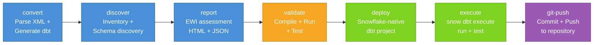

### 8.2 Pipeline Stage Details

| Stage | CLI Command | What It Does | Input | Output |
|-------|-------------|-------------|-------|--------|
| 1. Convert | `infa2dbt convert` | Parses XML, analyzes complexity, calls Cortex LLM, validates, self-heals, scores, caches, merges into project | XML files | dbt project directory |
| 2. Discover | `infa2dbt discover` | Scans XML directory for inventory, discovers source schemas from Snowflake/XML/JSON | XML files | Inventory + schema metadata |
| 3. Report | `infa2dbt report` | Generates EWI assessment report from conversion metrics | Conversion metrics JSON | HTML + JSON reports |
| 4. Validate | `infa2dbt validate` | Runs `dbt compile`, `dbt run`, and `dbt test` against Snowflake | dbt project | Pass/fail results |
| 5. Deploy | `infa2dbt deploy` | Deploys to Snowflake as a native dbt project object | dbt project | Snowflake dbt project object |
| 6. Execute | `snow dbt execute` | Runs models and tests natively on Snowflake | Deployed project | Materialized views + tables |
| 7. Git Push | `infa2dbt git-push` | Commits and pushes to Git repository | dbt project | Git commit + push |

---

## 9. dbt Project Output Structure

The framework generates a single consolidated dbt project with all mappings organized by directory:

```
dbt_project/
├── dbt_project.yml              # Project config with per-mapping model settings and lookup vars
├── profiles.yml                 # Snowflake connection configuration
├── macros/                      # Shared macros (deduplicated across all mappings)
│   └── *.sql
├── models/
│   ├── <mapping_name>/          # One directory per Informatica mapping
│   │   ├── staging/             # Source views + schema tests
│   │   │   ├── _sources.yml    # Source table definitions
│   │   │   ├── _stg__schema.yml # Column-level tests
│   │   │   └── stg_*.sql       # Staging models (one per source table)
│   │   ├── intermediate/        # Business logic (optional, per complexity)
│   │   │   ├── _int__schema.yml
│   │   │   └── int_*.sql       # Join, filter, aggregate, lookup models
│   │   └── marts/               # Final tables (optional, per complexity)
│   │       ├── _marts__schema.yml
│   │       └── fct_*.sql / dim_*.sql  # Fact and dimension tables
│   └── <another_mapping>/       # Another mapping
│       └── ...
├── reports/                     # EWI assessment reports (HTML + JSON)
├── seeds/
├── snapshots/
└── tests/
```

### Layered ELT Design

| Layer | Purpose | Materialization | Naming | Generated For |
|-------|---------|-----------------|--------|---------------|
| **Staging** | 1:1 from source tables. Column rename, type cast, basic cleaning. | `view` | `stg_<source_table>` | Every mapping |
| **Intermediate** | Business logic: joins, lookups, filters, aggregations. Multiple staging models combined. | `view` | `int_<business_concept>` | STAGED, LAYERED, COMPLEX strategies |
| **Marts** | Final fact and dimension tables for consumption. Incremental merge for efficiency. | `incremental` / `table` | `fct_<fact>` / `dim_<dimension>` | LAYERED, COMPLEX strategies |

> Not every mapping generates all three layers. Simple mappings (DIRECT strategy) produce only a staging view. Complex mappings generate the full three-layer structure.

### Tag-Based Selective Execution

Each mapping's models are automatically tagged in `dbt_project.yml`:

```yaml
models:
  project_name:
    <mapping_name>:
      +tags: ['<mapping_name>']
      staging:
        +materialized: view
      intermediate:
        +materialized: view
      marts:
        +materialized: table
```

This enables running individual mappings:

```bash
# Run only one mapping
dbt run --select tag:<mapping_name>

# Via Snowflake-native execution
EXECUTE DBT PROJECT DB.SCHEMA.PROJECT ARGS = 'run --select tag:<mapping_name>';
```

---

## 10. Transformation Patterns

### 10.1 Informatica Lookup → dbt var() Pattern

**Before (Informatica):** GUI-based Lookup Transform connecting to a lookup table via cache.

**After (dbt):** SQL subquery stored as a project variable, referenced in models.

```yaml
# dbt_project.yml
vars:
  lkp_override_ibp_scope: "SELECT KEY_COL, VALUE_COL FROM DB.SCHEMA.LOOKUP_TABLE"
```

```sql
-- In a model:
LEFT JOIN ({{ var('lkp_override_ibp_scope') }}) AS lkp
  ON src.key_column = lkp.KEY_COL
```

### 10.2 Incremental Processing Pattern

**Before (Informatica):** Full table reload or custom session-level change detection.

**After (dbt):** Native incremental materialization with `MERGE`.

```sql
{{ config(
    materialized='incremental',
    unique_key='DIMENSION_ID',
    merge_update_columns=['UPDATE_USER', 'UPDATE_TIMESTAMP', 'END_DATE', 'CURRENT_FLAG']
) }}

SELECT ... FROM {{ ref('int_dimension_final') }}


WHERE UPDATE_TIMESTAMP > (SELECT MAX(UPDATE_TIMESTAMP) FROM {{ this }})

```

### 10.3 MD5 Change Detection Pattern

**Before (Informatica):** Expression Transform computing hash for change detection.

**After (dbt):** Custom Jinja macro generating `MD5()` across field lists.

```sql

    MD5(
        
            {{ field }}
             || '|' || 
        
    )

```

### 10.4 Router/Filter → UNION ALL Pattern

**Before (Informatica):** Router Transform splitting data into groups based on conditions.

**After (dbt):** CTEs with conditional filters, combined via `UNION ALL`.

```sql
WITH group_a AS (
    SELECT ... FROM {{ ref('int_records_filtered') }}
    WHERE condition_a = 'Y'
),
group_b AS (
    SELECT ... FROM {{ ref('int_records_filtered') }}
    WHERE condition_a = 'N'
)
SELECT * FROM group_a
UNION ALL
SELECT * FROM group_b
```

### 10.5 Source Qualifier → source() Pattern

**Before (Informatica):** Source Qualifier reading from a database table.

**After (dbt):** `source()` macro referencing the source YAML definition.

```sql
-- staging/stg_orders.sql
{{ config(materialized='view') }}

SELECT
    ORDER_ID,
    CUSTOMER_ID,
    TO_DATE(ORDER_DATE) AS ORDER_DATE,
    CAST(AMOUNT AS DECIMAL(18,2)) AS AMOUNT
FROM {{ source('source_system', 'orders_table') }}
```

---

## 11. Testing and Quality Assurance

### 11.1 Auto-Generated Test Types

The framework automatically generates data quality tests for every model:

| Test Type | Purpose | Example |
|-----------|---------|---------|
| `not_null` | Ensure required columns never contain NULL | Primary keys, required business fields |
| `unique` | Ensure column values are unique | Primary keys, natural keys |
| `accepted_values` | Validate column values against an allowed set | Status codes ('Y'/'N'), type codes ('I'/'U'/'E') |
| `relationships` | Verify foreign key integrity between models | Staging → source, mart → intermediate |
| `dbt_utils.accepted_range` | Validate numeric values fall within expected range | Amounts > 0, quantities between 0-10000 |

### 11.2 Test Example

```yaml
version: 2
models:
  - name: dim_equipment
    columns:
      - name: EQUIPMENT_ID
        tests:
          - not_null
          - unique
      - name: CURRENT_FLAG
        tests:
          - accepted_values:
              values: ['Y', 'N']
      - name: STATUS_CODE
        tests:
          - not_null
          - accepted_values:
              values: ['ACTIVE', 'INACTIVE', 'RETIRED']
```

### 11.3 Validation Pipeline

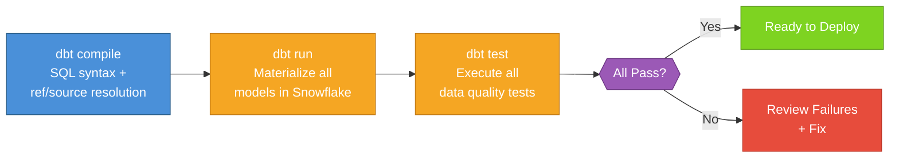

---

## 12. Deployment Architecture

### 12.1 Deployment Modes

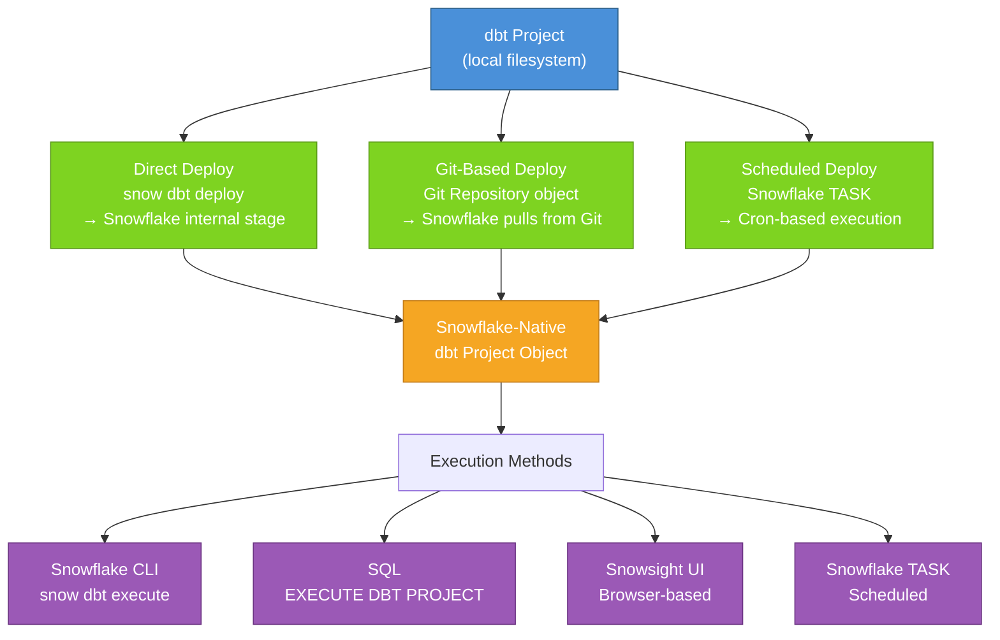

### 12.2 Snowflake-Native dbt Project

When deployed, the dbt project becomes a first-class Snowflake object:

- The entire project is uploaded to a Snowflake internal stage
- Snowflake manages the dbt runtime (no external compute required)
- Project is versioned (VERSION$1, VERSION$2, etc.) and can be updated
- Execution is via SQL, CLI, Snowsight UI, or scheduled TASK
- DAG lineage is visible in the Snowsight interface

### 12.3 Execution Methods

**Method 1: Snowflake CLI**
```bash
snow dbt execute -c <connection> --database <DB> --schema <SCHEMA> <PROJECT> run
snow dbt execute -c <connection> --database <DB> --schema <SCHEMA> <PROJECT> test
```

**Method 2: SQL (from Snowsight or any SQL client)**
```sql
EXECUTE DBT PROJECT DB.SCHEMA.PROJECT_NAME ARGS = 'run';
EXECUTE DBT PROJECT DB.SCHEMA.PROJECT_NAME ARGS = 'test';
```

**Method 3: Snowsight UI**
1. Navigate to **Data** → **Databases** → **DB** → **SCHEMA** → **dbt Projects** → **PROJECT**
2. Use built-in controls to compile, run, and test
3. View the DAG for visual lineage

**Method 4: Scheduled TASK**
```sql
CREATE TASK dbt_nightly_run
  WAREHOUSE = MY_WH
  SCHEDULE = 'USING CRON 0 2 * * * America/New_York'
AS
  EXECUTE DBT PROJECT DB.SCHEMA.PROJECT_NAME ARGS = 'run';
```

---

## 13. CLI Reference Summary

The full CLI reference is available in [CLI_Reference.md](CLI_Reference.md).

| Command | Purpose | Key Options |
|---------|---------|-------------|
| `infa2dbt convert` | Convert Informatica XML to dbt project | `-i` input, `-o` output, `-m` mode (new/merge), `--connection`, `--source-schema` |
| `infa2dbt discover` | Inventory XML files and discover schemas | `-i` input, `--schema-source` (xml/snowflake/json), `--database`, `--schema` |
| `infa2dbt report` | Generate EWI assessment report | `-p` project-dir, `-f` format (html/json/both) |
| `infa2dbt validate` | Compile, run, and test dbt project | `-p` project, `--run-tests`, `--compile-only`, `-s` select |
| `infa2dbt deploy` | Deploy to Snowflake | `-p` project, `-d` database, `-s` schema, `--mode` (direct/git/schedule) |
| `infa2dbt git-push` | Commit and push to Git | `-p` project, `--remote-url`, `-b` branch, `-m` message |
| `infa2dbt cache` | Manage conversion cache | Subcommands: `list`, `clear` (with `--yes`), `stats` |
| `infa2dbt version` | Show version | |

### Pipeline Quick Reference

```bash
# Full end-to-end pipeline
infa2dbt convert -i ./input/ -o ./output/dbt_project -m new --connection <conn> --source-schema <schema>
infa2dbt discover -i ./input/ --schema-source snowflake --database <DB> --schema <schema>
infa2dbt report -p ./output/dbt_project -f both
infa2dbt validate -p ./output/dbt_project --run-tests
infa2dbt deploy -p ./output/dbt_project -d <DB> -s <schema> --connection <conn> --mode direct
snow dbt execute -c <conn> --database <DB> --schema <schema> <PROJECT> run
snow dbt execute -c <conn> --database <DB> --schema <schema> <PROJECT> test
infa2dbt git-push -p ./output/dbt_project --remote-url <git_url> -b main
```

---

## 14. Design Decisions

### 14.1 LLM-Powered vs Rule-Based Conversion

**Decision**: Use Snowflake Cortex LLM instead of hardcoded translation rules.

**Rationale**: Informatica mappings contain deeply nested expressions, conditional logic, and complex transformation chains that are impractical to cover with static rules. An LLM can interpret the semantic intent of the transformation and generate correct Snowflake SQL for patterns it has never seen before. The self-healing loop mitigates the risk of LLM errors.

**Trade-off**: Slower per-mapping (30-60s vs milliseconds), but the cache layer eliminates repeat calls.

### 14.2 Single Consolidated Project vs Separate Projects

**Decision**: Merge all mappings into one dbt project.

**Rationale**: A consolidated project enables cross-mapping `ref()` references, eliminates source definition duplication, shares macros, and requires only one deployment. Separate projects (SnowConvert's approach) cannot reference models across mappings.

**Trade-off**: Requires careful naming to avoid collisions (handled by the conflict resolver).

### 14.3 Lookup Conversion via dbt var()

**Decision**: Convert Informatica Lookup Transforms to `dbt var()` with SQL subqueries.

**Rationale**: Informatica lookups are essentially cached SELECT statements. Storing the SQL as dbt project variables makes them transparent, testable, and independently modifiable.

### 14.4 Materialization Strategy

| Layer | Materialization | Rationale |
|-------|-----------------|-----------|
| Staging | `view` | Lightweight, always reflects latest source data, no storage cost |
| Intermediate | `view` | Business logic layer, no storage cost, computed on demand |
| Marts (full load) | `table` | Full rebuild for non-incremental fact data |
| Marts (incremental) | `incremental` | Efficient MERGE for large dimension/fact tables with change tracking |

### 14.5 Snowflake-Native Deployment

**Decision**: Deploy as a Snowflake-native dbt project object.

**Rationale**:
- Enables execution from Snowsight UI without local tooling
- Provides visual DAG lineage in the Snowflake workspace
- Supports scheduling via Snowflake Tasks
- Eliminates dependency on developer machines for production runs
- Versioned deployments with rollback capability

### 14.6 SHA-256 Caching for Determinism

**Decision**: Cache LLM output keyed to a SHA-256 hash of input XML + converter version + prompt version + model name.

**Rationale**: LLM calls are inherently non-deterministic. The cache ensures that re-running `convert` on the same XML produces identical output without making another LLM call. This is critical for production reproducibility and CI/CD pipelines.

---

## Framework Module Map

```
informatica_to_dbt/
├── cli.py                          # Click CLI — 8 commands
├── config.py                       # Central configuration
├── orchestrator.py                 # Main pipeline orchestrator
├── metrics.py                      # Per-mapping metrics collection
├── exceptions.py                   # Error hierarchy (6 categories)
│
├── xml_parser/                     # XML parsing
│   ├── parser.py                   #   XML → Repository model
│   ├── models.py                   #   Data classes
│   └── dependency_graph.py         #   DAG extraction
│
├── analyzer/                       # Complexity analysis
│   ├── complexity.py               #   11-dimension scoring
│   ├── multi_workflow.py           #   Cross-mapping enrichment
│   └── transformation_registry.py  #   30+ transform type mapping
│
├── chunker/                        # Token-aware chunking
│   └── context_preserving.py       #   Split while preserving chains
│
├── generator/                      # LLM code generation
│   ├── llm_client.py              #   Snowflake Cortex calls
│   ├── prompt_builder.py          #   Dynamic prompt construction
│   ├── response_parser.py         #   File extraction from LLM output
│   ├── post_processor.py          #   15+ pattern replacements
│   ├── quality_scorer.py          #   5-dimension quality scoring
│   └── dbt_project_generator.py   #   Project config generation
│
├── validator/                      # Static validation
│   ├── sql_validator.py           #   9 SQL checks
│   ├── yaml_validator.py          #   YAML structure validation
│   └── project_validator.py       #   Project-level validation
│
├── validation/                     # Live validation
│   └── dbt_validator.py           #   dbt compile/run/test wrapper
│
├── cache/                          # Output caching
│   └── conversion_cache.py        #   SHA-256 cache layer
│
├── discovery/                      # Schema discovery
│   ├── xml_inventory.py           #   XML file scanning
│   └── schema_discovery.py        #   3-mode schema discovery
│
├── merger/                         # Project assembly
│   ├── project_merger.py          #   Merge logic (new + merge modes)
│   ├── source_consolidator.py     #   Source deduplication
│   └── conflict_resolver.py       #   Naming conflict resolution
│
├── git/                            # Version control
│   └── git_manager.py            #   Git init/commit/push
│
├── deployment/                     # Snowflake deployment
│   └── deployer.py               #   3-mode deployment
│
├── reports/                        # Assessment reporting
│   └── ewi_report.py             #   EWI HTML + JSON reports
│
└── persistence/                    # Snowflake I/O
    └── snowflake_io.py            #   Stage read/write
```

---

*This document describes the technical design of the infa2dbt Generic Migration Framework.*
*For CLI usage details, see [CLI_Reference.md](CLI_Reference.md).*
*For setup instructions, see [Production_Runbook.md](Production_Runbook.md).*
*For implementation plan, see [Framework_Implementation_Plan.md](Framework_Implementation_Plan.md).*
