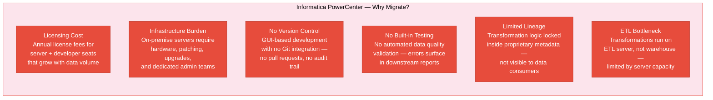
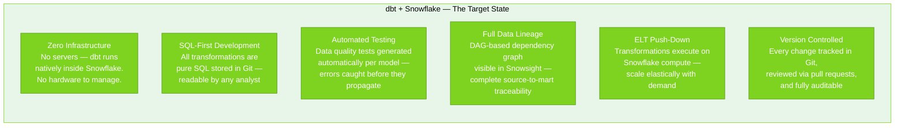
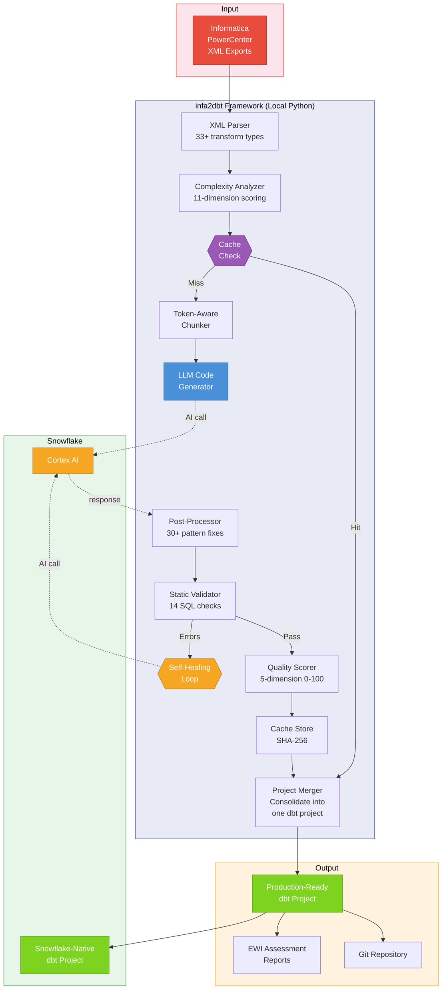
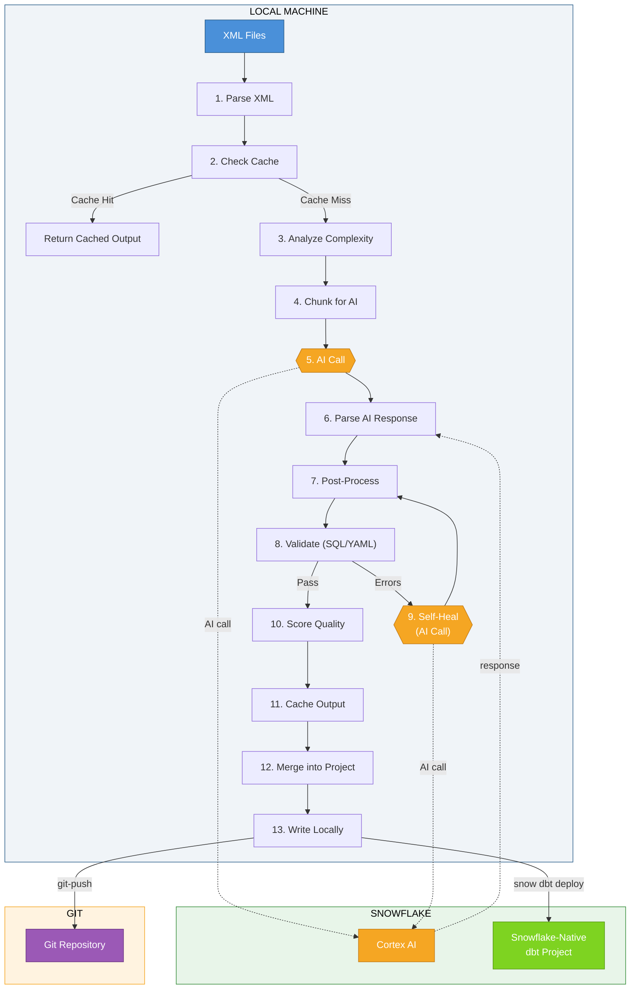
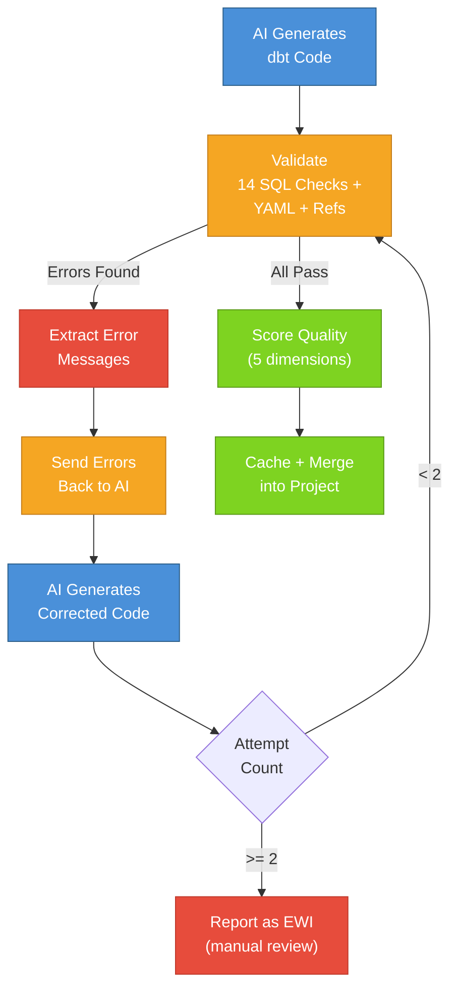
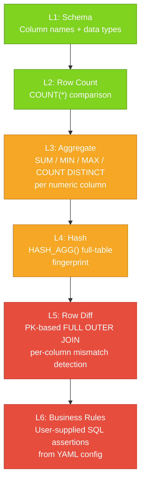

# Automated Informatica PowerCenter to Snowflake Migration with infa2dbt

### An AI-Powered Framework for Zero-Touch ETL Modernization

| Field | Value |
|-------|-------|
| **Document Version** | 1.0 |
| **Date** | April 2026 |
| **Author** | SquadronData |
| **Classification** | Customer-Facing — Technical Whitepaper |

---

## Table of Contents

1. [Executive Summary](#1-executive-summary)
2. [The Migration Imperative](#2-the-migration-imperative)
3. [Solution Overview — What is infa2dbt?](#3-solution-overview--what-is-infa2dbt)
4. [Architecture](#4-architecture)
5. [Intelligent Automation](#5-intelligent-automation)
6. [Conversion Examples — Before vs After](#6-conversion-examples--before-vs-after)
7. [Data Validation and Reconciliation](#7-data-validation-and-reconciliation)
8. [Security and Enterprise Hardening](#8-security-and-enterprise-hardening)
9. [Production Results](#9-production-results)
10. [Industry Positioning](#10-industry-positioning)
11. [Limitations and Boundaries](#11-limitations-and-boundaries)
12. [Quick Start Reference](#12-quick-start-reference)
13. [Conclusion and Next Steps](#13-conclusion-and-next-steps)

---

## 1. Executive Summary

Organizations running Informatica PowerCenter face mounting pressure to modernize their data infrastructure. Annual licensing fees, on-premise server maintenance, and the absence of modern engineering practices — version control, automated testing, data lineage — create compounding technical debt that grows with every year of continued investment. A mid-size enterprise running 200-500 Informatica mappings typically carries $500K-$1.5M annually in combined licensing, infrastructure, and dedicated admin costs. Manual migration to a cloud-native stack takes 12-18 months and $1M-$3M in consulting fees — and that assumes the consulting engagement stays on schedule.

**infa2dbt** is an AI-powered migration framework that converts Informatica PowerCenter XML exports into production-ready dbt projects deployed to Snowflake. The framework automates the entire migration journey — from XML parsing to Snowflake deployment, testing, data reconciliation, and version control — through a single command-line interface. Powered by Snowflake Cortex AI for intelligent code generation and self-healing validation, it eliminates the months of manual SQL rewriting that traditional migration approaches require.

The framework has been validated across 8 Informatica mappings of varying complexity (simple to complex SCD Type 2), producing 73 dbt models with 390 automated data quality tests across 4 deployed Snowflake projects. Conversion takes 30-60 seconds per mapping at a cost of approximately $0.50-2.00 in Snowflake Cortex credits — with a 99%+ success rate after the self-healing validation loop.

> **Key Metrics at a Glance**
>
> | Metric | Value |
> |--------|-------|
> | Conversion speed | 30-60 seconds per mapping |
> | Cost per mapping | ~$0.50-2.00 (Cortex credits) |
> | First-pass success rate | 85-95% |
> | After self-healing | 99%+ |
> | Deployed models | 73 across 4 Snowflake projects |
> | Automated dbt tests | 390 |
> | Framework test suite | 827 automated tests |
> | Informatica coverage | 33+ transform types, 60+ functions |

---

## 2. The Migration Imperative

### 2.1 Why Organizations Must Leave Informatica PowerCenter

Informatica PowerCenter was the industry standard for ETL when on-premise data warehouses dominated the landscape. But in a cloud-native world, the platform's architecture creates six compounding challenges:



These are not isolated issues — they compound. The licensing cost makes it expensive to stay, but the lack of version control and testing makes it risky to leave without a structured migration path.

### 2.2 The Target State — dbt on Snowflake

The target architecture eliminates every pain point above:



### 2.3 The Challenge — How Do You Get There?

The question is not *whether* to migrate, but *how* to migrate hundreds of Informatica mappings without a multi-year manual effort:

| Migration Approach | Per-Mapping Effort | Quality Risk | Scalability | Testing |
|-------------------|-------------------|--------------|-------------|---------|
| **Manual rewrite** | Days per mapping | High — human error, inconsistency | Does not scale beyond 10-20 mappings | Manual — often skipped |
| **Rule-based tools** | Seconds | Medium — limited to supported patterns | Limited to supported transforms | None — user must write tests |
| **AI-powered (infa2dbt)** | **30-60 seconds** | **Low — self-healing + auto-tests** | **Any mapping, any complexity** | **Auto-generated per model** |

Manual rewriting is thorough but does not scale. Rule-based tools are fast but limited in what they can handle. AI-powered conversion combines the speed of automation with the depth of understanding needed to handle complex transformation logic — lookups, routers, update strategies, aggregators, and SCD Type 2 patterns.

---

## 3. Solution Overview — What is infa2dbt?

**infa2dbt** is a command-line framework that reads Informatica PowerCenter XML exports and produces complete, tested, deployable dbt projects on Snowflake. It is the only single-CLI tool that covers the entire migration lifecycle — from XML parsing to production deployment, automated testing, data reconciliation, scheduling, and version control.

### Core Capabilities

| Capability | Description |
|-----------|-------------|
| **AI Code Generation** | Uses Snowflake Cortex AI to analyze Informatica transformation logic and generate semantically equivalent dbt SQL — not literal translation, but idiomatic dbt with `ref()`, `source()`, Jinja macros, and incremental patterns |
| **Complexity Analysis** | Automatically scores each mapping on 11 dimensions (source count, transform diversity, DAG depth, port count, lookup complexity, expression complexity, etc.) and routes to the optimal conversion strategy |
| **Self-Healing Validation** | After generation, every model is validated against 14 SQL checks + YAML structure. If validation fails, the framework automatically retries with error context fed back to the AI (up to 2 attempts) |
| **Auto-Generated Tests** | Generates per-model dbt tests automatically — `not_null`, `unique`, `accepted_values`, `relationships`, and `accepted_range` — based on source data analysis |
| **Deterministic Caching** | Every AI call is cached using a SHA-256 fingerprint of the input. Re-running on unchanged input produces identical output instantly — no redundant AI calls |
| **6-Layer Reconciliation** | Validates that dbt output matches original source data across 6 progressive layers: schema, row count, aggregate, hash, row diff, and business rules |
| **Snowflake Scheduling** | Deploys as Snowflake TASKs for automated daily/hourly execution with root + child task patterns |
| **Git Integration** | Built-in commit and push to Git repositories — full version control for all generated code |

### Technology Stack

| Component | Technology |
|-----------|-----------|
| Framework runtime | Python 3.9+ |
| AI engine | Snowflake Cortex AI (`SNOWFLAKE.CORTEX.COMPLETE()`) |
| Deployment | Snowflake CLI (`snow dbt deploy` / `snow dbt execute`) |
| Target platform | Snowflake-native dbt |
| Source format | Informatica PowerCenter XML exports |
| Output | Production-ready dbt project (models, tests, sources, macros) |

### Why Snowflake Cortex AI?

A natural question is why the framework uses Snowflake Cortex AI rather than external LLM providers (OpenAI, Anthropic, etc.). The choice is deliberate and driven by enterprise requirements:

- **Data residency**: Informatica XML exports contain table names, column names, business logic, and transformation rules — all of which are proprietary metadata. With Cortex AI, this data never leaves the Snowflake environment. No external API calls, no data egress, no third-party data processing agreements required.
- **Single vendor billing**: Cortex AI usage is billed as Snowflake credits on the existing contract. No separate API keys to provision, no additional vendor procurement, no usage-based billing surprises from a second provider.
- **Governance simplicity**: Security and compliance teams approve one vendor (Snowflake), not two. This eliminates a common 4-8 week procurement delay when adding external AI providers to enterprise environments.
- **Performance co-location**: The AI engine and the deployment target are in the same platform. Generated code is validated and deployed without data movement between cloud providers.

The framework's architecture allows the AI engine to be swapped (the LLM interface is abstracted), but Snowflake Cortex is the default and recommended choice for production deployments.

---

## 4. Architecture

### 4.1 High-Level Architecture

The framework takes any Informatica PowerCenter XML export as input and produces a complete, tested, deployable dbt project as output. The conversion engine runs locally (Python), with AI calls and deployment executing on Snowflake:



> **Note**: Deployment to Snowflake (`snow dbt deploy`) and Git Push are **independent operations** — neither depends on the other. They are shown as parallel output paths from the generated project.

### 4.2 Conversion Engine — 10 Internal Steps

When you run `infa2dbt convert`, the engine executes 10 steps internally:

| Step | Operation | Where It Runs |
|------|-----------|--------------|
| 1 | **Parse XML** — Extract sources, targets, transforms, connectors from Informatica XML | Local Python |
| 2 | **Enrich Metadata** — Resolve shortcuts, flatten nested transforms, build transformation DAG | Local Python |
| 3 | **Score Complexity** — Evaluate 11 dimensions, assign 0-100 score, select strategy (DIRECT / STAGED / LAYERED / COMPLEX) | Local Python |
| 4 | **Check Cache** — Compute SHA-256 fingerprint of (XML content + converter version + AI model + prompt hash). If cache hit, skip to step 10 | Local Python |
| 5 | **Chunk for AI** — Split large mappings into token-aware chunks that fit within AI context limits (up to 80,000 tokens) | Local Python |
| 6 | **Build Prompt** — Construct strategy-specific system prompt with few-shot examples, Informatica function mappings, and dbt conventions | Local Python |
| 7 | **AI Generation** — Send prompt to Snowflake Cortex AI, receive generated dbt models, tests, sources, and macros | Snowflake Cortex |
| 8 | **Post-Process** — Apply 30 pattern fixes: 16 function replacements (IIF→IFF, NVL→COALESCE, etc.), 5 regex transformations, 5 pre-pass conversions, 4 sanitization rules | Local Python |
| 9 | **Validate + Self-Heal** — Run 14 SQL checks + YAML validation. If errors found, send error context back to AI for correction (up to 2 attempts). Score quality on 5 dimensions. | Local + Snowflake |
| 10 | **Cache + Merge** — Store output in SHA-256 cache. Merge into consolidated dbt project (dedup sources, resolve naming conflicts, consolidate macros) | Local Python |

### 4.3 Pipeline Steps

After conversion, the framework provides CLI commands for each subsequent step. The practical end-to-end workflow follows this order:

```mermaid
flowchart LR
    A["convert\nParse XML +\nGenerate dbt"] --> B["discover\nInventory sources +\nSchema discovery"]
    B --> C["report\nEWI assessment\nHTML + JSON"]
    C --> D["validate\ndbt compile +\nrun + test"]
    D --> E["deploy\nSnowflake-native\ndbt project"]
    E --> F["execute\nRun models +\ntests on Snowflake"]
    F --> G["reconcile\n6-layer source vs\ntarget validation"]

    style A fill:#4A90D9,stroke:#2C5F8A,color:#fff
    style B fill:#4A90D9,stroke:#2C5F8A,color:#fff
    style C fill:#4A90D9,stroke:#2C5F8A,color:#fff
    style D fill:#F5A623,stroke:#C47D1A,color:#fff
    style E fill:#7ED321,stroke:#5A9A18,color:#fff
    style F fill:#7ED321,stroke:#5A9A18,color:#fff
    style G fill:#E74C3C,stroke:#C0392B,color:#fff
```



Additionally, **git-push** (commit and push to Git) can be executed at any point after conversion — it is independent of the Snowflake deployment path. Likewise, **schedule** (create Snowflake TASKs for automated execution) can be added after deployment.

### 4.4 What Runs Where

| Operation | Where It Runs | Requires Snowflake? |
|-----------|--------------|---------------------|
| XML parsing | Local Python | No |
| Complexity analysis | Local Python | No |
| Token-aware chunking | Local Python | No |
| AI code generation | Snowflake Cortex | **Yes** |
| Post-processing (30 pattern fixes) | Local Python | No |
| Static validation (14 SQL checks) | Local Python | No |
| Self-healing (AI correction loop) | Snowflake Cortex | **Yes** |
| Quality scoring (5 dimensions) | Local Python | No |
| Output caching (SHA-256) | Local filesystem | No |
| Project merging | Local Python | No |
| Schema discovery | Snowflake or local XML/JSON | Optional |
| EWI report generation | Local Python | No |
| Snowflake deployment | Snowflake (via `snow` CLI) | **Yes** |
| Model execution + testing | Snowflake (dbt runtime) | **Yes** |
| Reconciliation (6-layer) | Snowflake (SQL queries) | **Yes** |
| Git operations | Local Git CLI | No |

### 4.5 Local Execution Flow

The following diagram shows the detailed internal flow. Note that deployment to Snowflake and Git Push are **independent parallel paths** — they do not depend on each other:



---

## 5. Intelligent Automation

### 5.1 Complexity Analysis — 11 Dimensions, 4 Strategies

The framework does not apply a one-size-fits-all conversion approach. Instead, it evaluates each mapping across 11 dimensions to determine the optimal conversion strategy:

| Dimension | What It Measures |
|-----------|-----------------|
| Source count | Number of source tables |
| Target count | Number of target tables |
| Transform count | Number of transformation objects |
| Lookup count | Number of Lookup transforms |
| Expression complexity | Nested function depth and expression length |
| Join complexity | Number and type of joins |
| Router/Filter count | Conditional branching complexity |
| Aggregation depth | GROUP BY nesting and aggregate function count |
| Update strategy | Incremental/merge vs full load |
| Port count | Total number of input/output ports |
| DAG depth | Longest path in the transformation dependency graph |

**Strategy Selection**:

| Complexity Score | Strategy | dbt Output | Example |
|-----------------|----------|------------|---------|
| 0-30 | **DIRECT** | Staging only (single view) | Simple source-to-target copy |
| 31-55 | **STAGED** | Staging + intermediate | Customer mapping (4 sources, basic joins) |
| 56-80 | **LAYERED** | Staging + intermediate + marts | AP Payments mapping (expression transforms, validation) |
| 81-100 | **COMPLEX** | Full 3-layer with incremental, custom macros | Equipment mapping (11 sources, lookups, SCD Type 2) |

This ensures simple mappings stay simple (a single staging view), while complex mappings get the full treatment — multi-layer models, incremental materializations, custom macros, and SCD Type 2 handling.

### 5.2 Self-Healing Validation Loop

When the AI generates code with errors, the framework automatically detects and corrects them — up to 2 correction attempts before escalating to an EWI (Error, Warning, Information) report for human review:



**14 Validation Checks**:

1. Must contain `SELECT` statement
2. Must contain `FROM` clause
3. Should have `config()` block
4. Must use `ref()` or `source()`
5. No hardcoded three-part names (DB.SCHEMA.TABLE)
6. No trailing semicolons
7. No unconverted Informatica functions or patterns (`:LKP`, `$$PARAM`, etc.)
8. Balanced parentheses
9. Balanced Jinja braces (`{{` / `}}`)
10. Truncation detection (incomplete SQL)
11. Markdown artifact detection (code fences in output)
12. Comment-only file detection
13. JSON path syntax on XML data detection
14. Column list abbreviation detection

Plus cross-file: `ref()` target resolution validation across the entire project.

### 5.3 Quality Scoring — 5 Dimensions

Every generated mapping receives a quality score from 0-100 across 5 dimensions:

| Dimension | What It Measures | Weight |
|-----------|-----------------|--------|
| **File Structure** | Expected files present per strategy (models, schema YAML, sources) | 20% |
| **dbt Conventions** | Proper use of `config()`, `ref()`, `source()` macros | 25% |
| **SQL Syntax** | Balanced parentheses/braces, no trailing semicolons, valid SQL | 20% |
| **Function Conversion** | No leftover Informatica functions or patterns in output | 25% |
| **YAML Quality** | YAML files present and parseable, correct structure | 10% |

### 5.4 Post-Processing Engine — 30 Pattern Fixes

After AI generation, the post-processor cleans Informatica-specific residuals that AI models commonly leave behind. The 30 fixes are organized into 4 categories:

| Category | Count | Examples |
|----------|-------|---------|
| **Function replacements** | 16 | `IIF` → `IFF`, `NVL` → `COALESCE`, `ADD_TO_DATE` → `DATEADD`, `GET_DATE_PART` → `DATE_PART`, `SYSDATE` → `CURRENT_TIMESTAMP()`, `TRUNC(date)` → `DATE_TRUNC` |
| **Regex transformations** | 5 | Strip Informatica port prefixes, normalize expression syntax, fix date format strings |
| **Pre-pass conversions** | 5 | Convert Informatica-style variable references, normalize lookup patterns, resolve shortcut references |
| **Sanitization rules** | 4 | Remove trailing semicolons, strip markdown artifacts, fix truncated output, normalize whitespace |

The post-processor uses a strip-and-restore pattern to protect string literals and Jinja blocks from unintended modification during function replacement.

### 5.5 Deterministic Caching

Every AI call is cached using a content-addressed SHA-256 fingerprint:

**Cache key** = `SHA-256(XML content + converter version + AI model + prompt hash)`

| Property | Behavior |
|----------|----------|
| **Content-addressed** | Same input always produces the same cache key |
| **Append-only** | Old cache entries are never overwritten or modified |
| **No TTL** | Cache entries persist indefinitely until explicitly cleared |
| **No overwrite** | If a cache entry exists, the AI is never called |
| **Instant re-runs** | Re-running `convert` on unchanged input completes in seconds |

Any framework change that modifies prompts (new few-shot examples, updated instructions) automatically invalidates existing cache entries because the prompt hash changes.

---

## 6. Conversion Examples — Before vs After

### 6.1 Simple Mapping — Customer (STAGED Strategy)

| Attribute | Value |
|-----------|-------|
| **XML file** | `wf_AM_DI_CUSTOMER.XML` |
| **Sources** | 4 tables (cust_adrs, cust_master, ptnr_fctn, bus_ptnr_ids) |
| **Transforms** | Expression, Joiner |
| **Complexity score** | 31-55 (STAGED) |
| **Generated models** | 1 staging model |

**Generated project structure**:
```
models/m_AM_DI_CUSTOMER/
└── staging/
    ├── _sources.yml          # 4 source tables defined
    ├── _stg__schema.yml      # Schema tests (not_null, unique)
    └── stg_am_di_customer.sql  # Staging view — joins 4 customer tables
```

### 6.2 Moderate Mapping — AP Payments (LAYERED Strategy)

| Attribute | Value |
|-----------|-------|
| **XML file** | `wf_AP_FF_AP_PAYMENTS_VCA.XML` |
| **Sources** | 1 table (t_ap_payments_vca) with 24 columns |
| **Transforms** | Expression, Filter, Router |
| **Complexity score** | 56-80 (LAYERED) |
| **Generated models** | 3 models (staging + intermediate + marts) |

**Generated project structure**:
```
models/m_AP_FF_AP_PAYMENTS_VCA/
├── staging/
│   ├── _sources.yml
│   ├── _stg__schema.yml
│   └── stg_ap_payments_vca.sql          # Column selection + typing
├── intermediate/
│   ├── _int__schema.yml
│   └── int_ap_payments_vca_validated.sql # Validation logic + business rules
└── marts/
    ├── _marts__schema.yml
    └── fct_ap_payments_vca.sql           # Final fact table — enriched + categorized
```

**Sample generated SQL — Intermediate layer (business logic)**:

```sql
-- int_ap_payments_vca_validated.sql (generated by infa2dbt)
{{ config(materialized='view') }}

WITH source_data AS (
    SELECT * FROM {{ ref('stg_ap_payments_vca') }}
),
validated AS (
    SELECT *,
        CASE
            WHEN ACTION_TYPE IN ('A','U','D') AND RECORD_ID IS NOT NULL
            THEN 'VALID'
            ELSE 'INVALID'
        END AS VALIDATION_STATUS,
        -- File name generation (converted from Informatica expression)
        'FF_' || TO_CHAR(CDF_PAYMENT_DATE, 'YYYYMMDD') || '_AP_PAYMENTS_VCA.dat' AS FILE_NAME
    FROM source_data
)
SELECT * FROM validated
```

### 6.3 Complex Mapping — DIM_EQUIPMENT (COMPLEX Strategy)

| Attribute | Value |
|-----------|-------|
| **XML file** | `s_m_INCR_DM_DIM_EQUIPMENT.XML` |
| **Sources** | 11 tables (DIM_EQUIPMENT, EQPMNT_AAR_BASE, EQPMNT_NON_RGSTRD + 8 more) |
| **Transforms** | Lookup, Router, Update Strategy, Aggregator, Expression, Filter, Joiner |
| **Complexity score** | 81-100 (COMPLEX) |
| **Generated models** | 12 models (3 staging + 8 intermediate + 1 mart + schema/source files) |

**Generated project structure**:
```
models/m_INCR_DM_DIM_EQUIPMENT/
├── staging/
│   ├── _sources.yml                         # 11 source tables
│   ├── _stg__schema.yml
│   ├── stg_dim_equipment.sql
│   ├── stg_eqpmnt_aar_base.sql
│   └── stg_eqpmnt_non_rgstrd.sql
├── intermediate/                            # 8 intermediate models
│   ├── _int__schema.yml
│   ├── int_eqpmnt_aar_base_transform.sql
│   ├── int_eqpmnt_non_rgstrd_transform.sql
│   ├── int_equipment_final_gather.sql
│   ├── int_equipment_router_logic.sql
│   ├── int_equipment_insert_transform.sql
│   ├── int_equipment_update_transform.sql
│   ├── int_equipment_type2_update_transform.sql
│   └── int_dim_equipment_soft_delete.sql
└── marts/                                   # 1 mart table
    ├── _marts__schema.yml
    └── dim_equipment.sql                    # SCD Type 2 — table materialization
```

This mapping demonstrates the framework's ability to handle real-world complexity: 11 source tables are parsed, joined, routed through conditional logic, and materialized as an SCD Type 2 dimension table with proper surrogate keys (MD5 hash), effective/expiry dates, and current-row flags — all generated automatically from the Informatica XML.

### 6.4 Transformation Pattern Examples

The framework converts Informatica-specific patterns into idiomatic dbt equivalents:

#### Lookup Transform → dbt `var()` Pattern

**Before (Informatica)**: GUI-based Lookup Transform connecting to a lookup table via cache.

**After (dbt)**: SQL subquery stored as a project variable, referenced in models.

```yaml
# dbt_project.yml
vars:
  lkp_override_ibp_scope: "SELECT KEY_COL, VALUE_COL FROM DB.SCHEMA.LOOKUP_TABLE"
```

```sql
-- In a model:
LEFT JOIN ({{ var('lkp_override_ibp_scope') }}) AS lkp
  ON src.key_column = lkp.KEY_COL
```

> **Design note**: Storing lookup SQL in `dbt_project.yml` as `var()` references is a deliberate choice for AI-generated output. Informatica lookups are cache-based single-row fetches — they do not map cleanly to staging models with `ref()`, which represent full-table materializations. The `var()` pattern preserves the original lookup semantics (subquery join) while keeping the SQL configurable at the project level. For organizations that prefer the staging-model pattern, the lookup SQL can be refactored into dedicated staging models post-conversion — the generated code isolates all lookup definitions in one place to make this straightforward.

#### Incremental Processing → dbt `MERGE` Pattern

**Before (Informatica)**: Full table reload or custom session-level change detection.

**After (dbt)**: Native incremental materialization with `MERGE`.

```sql
{{ config(
    materialized='incremental',
    unique_key='DIMENSION_ID',
    merge_update_columns=['UPDATE_USER', 'UPDATE_TIMESTAMP', 'END_DATE', 'CURRENT_FLAG']
) }}

SELECT ... FROM {{ ref('int_dimension_final') }}


WHERE UPDATE_TIMESTAMP > (SELECT MAX(UPDATE_TIMESTAMP) FROM {{ this }})

```

#### Router Transform → `UNION ALL` Pattern

**Before (Informatica)**: Router Transform splitting data into groups based on conditions.

**After (dbt)**: CTEs with conditional filters, combined via `UNION ALL`.

```sql
WITH group_a AS (
    SELECT ... FROM {{ ref('int_records_filtered') }}
    WHERE condition_a = 'Y'
),
group_b AS (
    SELECT ... FROM {{ ref('int_records_filtered') }}
    WHERE condition_a = 'N'
)
SELECT * FROM group_a
UNION ALL
SELECT * FROM group_b
```

#### Source Qualifier → `source()` Pattern

**Before (Informatica)**: Source Qualifier reading from a database table.

**After (dbt)**: `source()` macro referencing the source YAML definition.

```sql
{{ config(materialized='view') }}

SELECT
    ORDER_ID,
    CUSTOMER_ID,
    TO_DATE(ORDER_DATE) AS ORDER_DATE,
    CAST(AMOUNT AS DECIMAL(18,2)) AS AMOUNT
FROM {{ source('source_system', 'orders_table') }}
```

---

## 7. Data Validation and Reconciliation

After deployment, the reconciliation engine validates that the dbt output matches the original source data. It runs 6 layers of progressively deeper checks — from fast structural validation to precise row-level comparison:



### Reconciliation Layers Explained

| Layer | What It Checks | Typical Use |
|-------|---------------|-------------|
| **L1: Schema** | Column names and data types match between source and target | Quick structural sanity check |
| **L2: Row Count** | `COUNT(*)` is identical — no dropped or duplicated rows | Data completeness verification |
| **L3: Aggregate** | `SUM`, `MIN`, `MAX`, `COUNT DISTINCT` per numeric column match | Numerical accuracy validation |
| **L4: Hash** | `HASH_AGG()` full-table fingerprint is identical | Fast whole-table equivalence check |
| **L5: Row Diff** | Primary-key-based `FULL OUTER JOIN` showing exactly which rows and columns differ | Precise mismatch identification |
| **L6: Business Rules** | User-supplied SQL assertions from YAML configuration | Custom domain-specific validation |

### Operating Modes

| Mode | How It Works | When to Use |
|------|-------------|-------------|
| **Auto-Discovery** | Matches tables by name between source and target schemas | Quick validation when table names align |
| **Config-Driven** | YAML file specifies explicit source-to-target mappings, primary keys, column exclusions, tolerances | Production pipelines with name differences or composite keys |

**Output**: HTML dashboard and JSON report with per-table, per-layer PASS/FAIL results, mismatch details, and aggregate metrics — suitable for CI/CD integration.

---

## 8. Security and Enterprise Hardening

The framework implements 6 security measures to protect against common attack vectors in AI-powered code generation pipelines:

| Threat | Protection | Implementation |
|--------|-----------|----------------|
| **XML External Entity (XXE)** | Blocked at parser level | `lxml` configured with `resolve_entities=False`, external DTD loading disabled |
| **Prompt Injection** | Input sanitization | User-controlled content (XML values, table names) sanitized before AI prompts — special characters escaped, injection patterns stripped |
| **Path Traversal** | Output path validation | All output paths validated against a whitelist — directory escape attempts (`../`) rejected |
| **SQL Injection** | Parameterized queries | All Snowflake queries use bind parameters — no string concatenation of user input into SQL |
| **Output Isolation** | Sandboxed output directory | Generated files written only to the specified output directory — no writes outside the project boundary |
| **Error Sanitization** | Sensitive data stripped from logs | Stack traces and error messages sanitized to remove connection strings, credentials, and internal paths before logging |

---

## 9. Production Results

### 9.1 Deployed Snowflake Projects

The framework has been validated end-to-end with 4 deployed Snowflake projects covering all complexity levels:

| Project | Mappings | Models | dbt Tests | Scheduled TASKs | Complexity |
|---------|----------|--------|-----------|-----------------|------------|
| `ALL_XMLS_TEST` | 8 (all types) | 37 | 251 | Daily run + test | DIRECT, STAGED, LAYERED, COMPLEX |
| `DIM_EQUIPMENT_CLEAN` | 1 (complex) | 17 | 62 | Daily run + test | COMPLEX (SCD Type 2) |
| `DIM_EQUIPMENT_CLEAN_V1` | 1 (complex) | 12 | 58 | Daily run + test | COMPLEX (SCD Type 2) |
| `ITEM_MTRL_MASTER_CLEAN` | 1 (moderate) | 7 | 19 | Daily run + test | LAYERED |
| **Total** | **8 unique** | **73** | **390** | **8 TASKs** | All 4 strategies |

All 73 models pass. All 390 dbt tests pass. All 8 Snowflake TASKs are operational.

### 9.2 Performance Metrics

| Metric | Value |
|--------|-------|
| Conversion time (per mapping, first run) | 30-60 seconds |
| Conversion time (cached, per mapping) | < 1 second |
| Conversion time (8-XML batch, first run) | ~18 minutes |
| Conversion time (8-XML batch, cached) | < 10 seconds |
| Cost per mapping | ~$0.50-2.00 (Snowflake Cortex credits) |
| First-pass AI success rate | 85-95% |
| After self-healing loop | 99%+ |
| Framework test suite | 827 automated tests (all passing) |

### 9.3 Scalability

The framework is designed to scale from proof-of-concept to enterprise migration:

| Scale | Mappings | Approach |
|-------|----------|----------|
| **POC** (current) | 8 mappings (73 models, 390 tests) | Single `infa2dbt convert` run |
| **Pilot** | 10-20 mappings | Batch convert with `--mode merge` |
| **Production** | 100+ mappings | Wave-based migration with EWI triage per wave |
| **Enterprise** | 500+ mappings | Parallelized conversion with CI/CD pipeline integration |

### 9.4 Projection — Enterprise-Scale Migration

Based on validated conversion rates, the following projections illustrate what enterprise-scale migration looks like with infa2dbt:

| Scenario | Mappings | Estimated Time | Estimated Cost (Cortex credits) | Comparable Consulting Cost |
|----------|----------|---------------|--------------------------------|---------------------------|
| **Pilot** | 20 | 10-20 minutes | $10-40 | $50K-100K |
| **Mid-size** | 100 | 1-2 hours | $50-200 | $250K-500K |
| **Large** | 300 | 3-5 hours | $150-600 | $750K-1.5M |
| **Enterprise** | 500 | 4-8 hours | $250-1,000 | $1.25M-2.5M |

*Assumptions: 30-60 seconds per mapping (first run), $0.50-2.00 per mapping in Cortex credits. Consulting cost estimated at $2,500-5,000 per mapping (industry average for manual rewrite + testing). Time estimates assume sequential processing; parallelized execution would reduce wall-clock time proportionally. Actual conversion times may vary for mappings with unsupported features (see Section 11), which require manual remediation outside these estimates.*

These projections are mathematically derived from validated POC data. The per-mapping economics remain constant at scale — there is no volume licensing tier, no per-seat fee, and no engagement minimum. The only variable cost is Snowflake Cortex credits consumed during AI generation.

### 9.5 Informatica Component Coverage

| Informatica Component | dbt Equivalent | Conversion Approach |
|-----------------------|----------------|---------------------|
| Source Qualifier | `source()` references in staging models | Direct mapping from XML source definitions |
| Expression Transform | SQL expressions in SELECT clauses | AI translates Informatica expression syntax to Snowflake SQL |
| Lookup Transform | `dbt var()` with SQL subquery lookups | Lookup SQL stored as project variable, joined in models |
| Filter Transform | `WHERE` clauses | Filter conditions extracted from XML and applied as SQL predicates |
| Joiner Transform | SQL `JOIN` (INNER, LEFT, FULL) | Join type and conditions parsed from XML connector metadata |
| Router Transform | `CASE WHEN` + `UNION ALL` | Router groups become conditional CTEs combined via UNION ALL |
| Update Strategy | `is_incremental()` + `MERGE` | Update strategy flags mapped to dbt incremental materialization |
| Aggregator Transform | `GROUP BY` with aggregate functions | Aggregator expressions converted to SQL GROUP BY |
| Sequence Generator | `ROW_NUMBER()` / Snowflake sequences | Sequence logic mapped to window functions or native sequences |
| Sorter Transform | `ORDER BY` clauses | Sort keys extracted and applied in downstream queries |
| Normalizer Transform | `UNPIVOT` / `LATERAL FLATTEN` | Normalized output mapped to Snowflake semi-structured functions |
| Rank Transform | `ROW_NUMBER()` / `RANK()` | Rank groups and conditions mapped to window functions |
| Stored Procedure | dbt macros or pre/post hooks | Procedure logic converted to Jinja macros or dbt hooks |

**Function coverage**: 60+ Informatica functions converted to Snowflake SQL equivalents across string, date, numeric, conversion, conditional, and aggregate categories.

---

## 10. Industry Positioning

### 10.1 Migration Approaches in the Market

The ETL modernization market offers three broad approaches to Informatica migration:

| Approach | How It Works | Strengths | Limitations |
|----------|-------------|-----------|-------------|
| **Consulting-led** | Professional services firms assess, migrate, and optimize using proprietary tooling + manual effort | Enterprise change management, proven at scale, cloud-native refactoring | High cost (consulting fees), vendor dependency, long engagement timelines |
| **Rule-based tools** | Deterministic translation engines that map ETL components to SQL patterns using hardcoded rules | Fast (milliseconds), deterministic, good for simple patterns | Limited Informatica support, no self-healing, no auto-tests, separate projects per mapping |
| **AI-powered (infa2dbt)** | AI-driven framework that understands transformation intent and generates idiomatic dbt code | Deep Informatica coverage, self-healing, auto-tests, single consolidated project, self-service | Newer approach, building enterprise proof points |

### 10.2 Framework Self-Assessment — 12 Dimensions

The following self-assessment reflects honest evaluation based on current proof points. Scores are calibrated against architectural capability and validated behavior across 8 Informatica mappings (73 models, 390 tests, 4 deployed Snowflake projects). As enterprise-scale deployments (500+ mappings) are completed, these scores will be re-evaluated with broader evidence:

| Dimension | Score | Justification |
|-----------|-------|---------------|
| Informatica depth | **9/10** | 33+ transform types, 60+ functions — covers all common patterns. Deducted for mapplets and reusable transforms (not yet supported). |
| Automation quality | **8/10** | Self-healing + 30 post-processing fixes is differentiated. Deducted because self-healing is capped at 2 attempts — some edge cases still require manual review. |
| Testing and validation | **9/10** | Auto-generated tests + 14 SQL checks + 6-layer reconciliation. This is genuinely the strongest dimension — no comparable tool auto-generates both dbt tests and reconciliation. |
| Self-healing | **8/10** | Automated AI correction loops work well for common errors (syntax, function names, missing refs). Complex semantic errors (wrong join logic, incorrect business rules) are beyond self-healing scope. |
| Reconciliation | **9/10** | 6-layer pyramid is the most structured approach available. Deducted because L5 (row diff) and L6 (business rules) require manual configuration for non-trivial schemas. |
| Cost efficiency | **9/10** | ~$0.50-2/mapping with no license fees is objectively the lowest cost option. This score is defensible at any proof-point level. |
| Self-service ability | **9/10** | Single CLI, no vendor dependency. Deducted because initial setup (Snowflake connection, source schema configuration) still requires data engineering familiarity. |
| Documentation | **8/10** | 6 comprehensive internal documents. Deducted because documentation is not yet publicly available, and there is no interactive tutorial or guided onboarding experience. |
| Enterprise readiness | **7/10** | 8 mappings across 4 deployed projects with automated Snowflake TASKs — architecture is proven, but production scale validation (500+ mappings) is in progress. |
| Multi-ETL breadth | **3/10** | Informatica PowerCenter only. No SSIS, Talend, or DataStage support. |
| Change management | **1/10** | No training materials, onboarding guides, or stakeholder alignment toolkit. |
| Proven scale | **6/10** | 73 models validated end-to-end across 4 deployed projects. Needs 500+ mapping enterprise deployment to move this score higher. |
| **Total** | **86/120** | 72% — reflects deliberate gaps in multi-ETL breadth (3/10) and change management (1/10), both on the roadmap. Core conversion and validation dimensions average 8.6/10. |

> **Reading this table**: Scores of 7-9 reflect architectural capability validated through limited-scale test projects (8 mappings, 4 deployments). Scores below 6 indicate known gaps with planned roadmap items (see Section 10.4). As enterprise-scale pilots are completed, dimensions like Enterprise Readiness and Proven Scale will be re-scored against broader evidence. The total score reflects what the framework can do today — not a projection of where it will be.

### 10.3 Key Differentiators

1. **Single CLI, complete pipeline** — One tool covers the entire journey from XML input to deployed, tested, scheduled, reconciled dbt project on Snowflake
2. **Self-healing automation** — The only framework where AI-generated errors are automatically detected and corrected without human intervention
3. **Auto-generated tests** — Every model gets dbt tests generated automatically — not as an afterthought, but as part of the core conversion process
4. **6-layer reconciliation** — Most structured data validation approach: schema, row count, aggregate, hash, row diff, and business rules
5. **No vendor dependency** — No consulting engagement required. No product license. Run it yourself, anytime, on any mapping
6. **Lowest cost** — ~$0.50-2 per mapping in Snowflake Cortex credits vs consulting fees or product licenses

### 10.4 Known Gaps and Roadmap

| Priority | Gap | Planned Resolution |
|----------|-----|-------------------|
| 1 | SSIS (.dtsx) parser support | Add multi-ETL input support |
| 2 | Cloud-native refactoring (`refactor` command) | Optimize dbt output for cloud patterns beyond like-for-like translation |
| 3 | Portfolio migration dashboard | Visual progress tracking across wave-based migrations |
| 4 | Parallel conversion (`--parallel N`) | Scale batch conversion for 500+ mapping pipelines |
| 5 | Change management toolkit | Training materials, onboarding guides, stakeholder alignment templates |

---

## 11. Limitations and Boundaries

Transparency about what the framework does not handle today is essential for planning a successful migration. The following table documents current boundaries — organized by category — so that migration teams can assess coverage against their specific Informatica inventory before starting a pilot.

### 11.1 Informatica Features Not Yet Supported

| Feature | Status | Impact | Workaround |
|---------|--------|--------|------------|
| **Mapplets** (reusable transformation fragments) | Not supported | Mapplets must be inlined or expanded before export. The XML parser does not resolve mapplet references. | Export the parent mapping with mapplets expanded (Informatica Designer → Edit → Expand Mapplet) |
| **Reusable Transformations** (shared across mappings) | Partial | Reusable transforms referenced by shortcut are resolved at the XML level. Standalone reusable transforms without a parent mapping are not converted. | Include the parent mapping XML that uses the reusable transform |
| **Session-level parameters** (`$$PARAM`) | Partial | Parameters referenced in expressions are flagged in EWI reports. The framework generates placeholder `var()` references but does not auto-resolve parameter values. | Provide parameter values in a configuration file or set them as dbt project variables post-conversion |
| **Workflow chaining** (multiple mappings in sequence) | Not supported | Each mapping is converted independently. Cross-mapping dependencies (workflow sequencing, event waits) are not preserved. | Use dbt DAG dependencies (`ref()`) or Snowflake TASK chains to re-establish sequencing post-conversion |
| **Informatica Web Services transforms** | Not supported | SOAP/REST-based transforms in mappings are flagged but not converted. | Implement as dbt external calls or pre-processing steps |
| **PowerExchange (mainframe connectors)** | Not supported | Mainframe source definitions (VSAM, IMS, IDMS) are not parsed. | Extract mainframe data to flat files or Snowflake stages first, then convert the downstream mappings |

### 11.2 Conversion Boundaries

| Boundary | Detail |
|----------|--------|
| **Semantic accuracy** | The AI generates SQL based on the Informatica XML metadata and transformation logic. If the XML export is incomplete or the transformation intent is ambiguous (e.g., undocumented custom functions), the generated SQL may not match the original behavior exactly. Reconciliation catches these cases. |
| **Complex expression nesting** | Deeply nested Informatica expressions (5+ levels of IIF/DECODE/LPAD) are converted with best effort. The self-healing loop handles most syntax issues, but semantic correctness of deeply nested logic should be validated via reconciliation. |
| **Custom Java transforms** | Java Transform objects are flagged in EWI reports but not converted. The embedded Java code is extracted and included in the report for manual migration. |
| **Stored Procedure transforms calling external systems** | SP transforms that invoke external databases or APIs are flagged but not converted. The procedure name and parameters are documented in the EWI report. |

### 11.3 Scale Boundaries (Current)

| Dimension | Current Proof Point | Target |
|-----------|-------------------|--------|
| Mappings converted | 8 (across all complexity levels) | 500+ (enterprise deployment) |
| Largest single mapping | 11 sources, 12 models (DIM_EQUIPMENT) | 20+ sources |
| Batch processing | Sequential (one mapping at a time) | Parallelized (`--parallel N`) |
| Largest batch | 8 XMLs in one run (~18 minutes) | 100+ XMLs per wave |

These boundaries are engineering constraints, not architectural limitations. The framework's architecture supports all of the above — the current boundaries reflect what has been validated in production. Each pilot engagement expands the proven coverage.

---

## 12. Quick Start Reference

### Prerequisites

| Software | Version | Required |
|----------|---------|----------|
| Python | 3.9+ | Yes |
| Snowflake CLI (`snow`) | 3.0+ | Yes |
| Git | 2.30+ | Yes |
| Snowflake account | Any edition | Yes (with Cortex AI access) |

### Quick Start — 8 Commands

```bash
# 1. Convert — Parse XML and generate dbt project
infa2dbt convert -i ./input/ -o ./output/my_project \
  --connection <CONNECTION> --source-schema <SOURCE_SCHEMA>

# 2. Discover — Inventory sources and discover schemas
infa2dbt discover xml -i ./input/
infa2dbt discover schema --source snowflake \
  --connection <CONNECTION> --database <DATABASE> --schema <SOURCE_SCHEMA>

# 3. Report — Generate EWI assessment report
infa2dbt report -p ./output/my_project -f both

# 4. Validate — Compile, run models, and test
infa2dbt validate -p ./output/my_project --run-tests

# 5. Deploy — Deploy to Snowflake
infa2dbt deploy -p ./output/my_project \
  -d <DATABASE> -s <TARGET_SCHEMA> -n <PROJECT_NAME> \
  --connection <CONNECTION> --mode direct

# 6. Execute — Run models and tests on Snowflake
snow dbt execute <PROJECT_NAME> run
snow dbt execute <PROJECT_NAME> test

# 7. Reconcile — Validate source vs target data
infa2dbt reconcile \
  -sd <DATABASE> -ss <SOURCE_SCHEMA> \
  -td <DATABASE> -ts <TARGET_SCHEMA> \
  -c <CONNECTION> -l all -o ./recon_reports --format both

# 8. Git Push — Commit and push to Git
infa2dbt git-push -p ./output/my_project \
  --remote-url <GIT_REMOTE_URL> -b main
```

> **Note**: Steps 5 (Deploy) and 8 (Git Push) are independent — they can be executed in either order. Steps 6 (Execute) requires step 5 to be completed first.

Replace all `<PLACEHOLDER>` values with your environment-specific settings. For detailed setup instructions, refer to the Production Runbook.

---

## 13. Conclusion and Next Steps

### Production Readiness

| Capability | Status |
|-----------|--------|
| Framework CLI (8 commands + cache management) | Ready |
| XML parsing (33+ transform types) | Ready |
| AI code generation with self-healing | Ready |
| Auto-generated dbt tests | Ready |
| Snowflake deployment (3 modes) | Ready |
| TASK scheduling (automated execution) | Ready |
| Git integration (commit + push) | Ready |
| EWI assessment reports (HTML + JSON) | Ready |
| Incremental processing (MERGE-based SCD Type 2) | Ready |
| 6-layer reconciliation engine | Ready |
| **Production source connectivity** | Next Step |
| **Full mapping inventory for migration waves** | Next Step |
| **CI/CD pipeline integration** | Next Step |
| **Monitoring and alerting for TASKs** | Next Step |

### Next Steps

1. **Connect to production Informatica sources** — Point infa2dbt at your actual Informatica PowerCenter XML exports
2. **Run pilot conversion** — Convert 10-20 representative mappings across complexity levels to validate coverage
3. **Validate with reconciliation** — Run 6-layer reconciliation against production source data to confirm data accuracy
4. **Plan migration waves** — Inventory all Informatica mappings, group by complexity and business domain, and define wave-based migration plan
5. **Integrate into CI/CD** — Add infa2dbt to your existing deployment pipeline for automated conversion and testing

---

### Version History

| Version | Date | Changes |
|---------|------|---------|
| 1.0 | April 2026 | Initial release — 8 mappings validated across 4 Snowflake projects, 73 models, 390 dbt tests |

*Document Version 1.0 — Technical Whitepaper. SquadronData, April 2026.*
