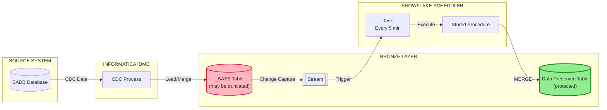
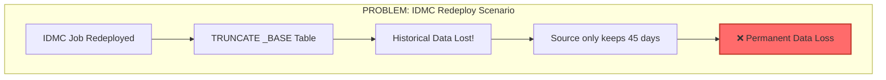
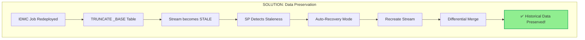
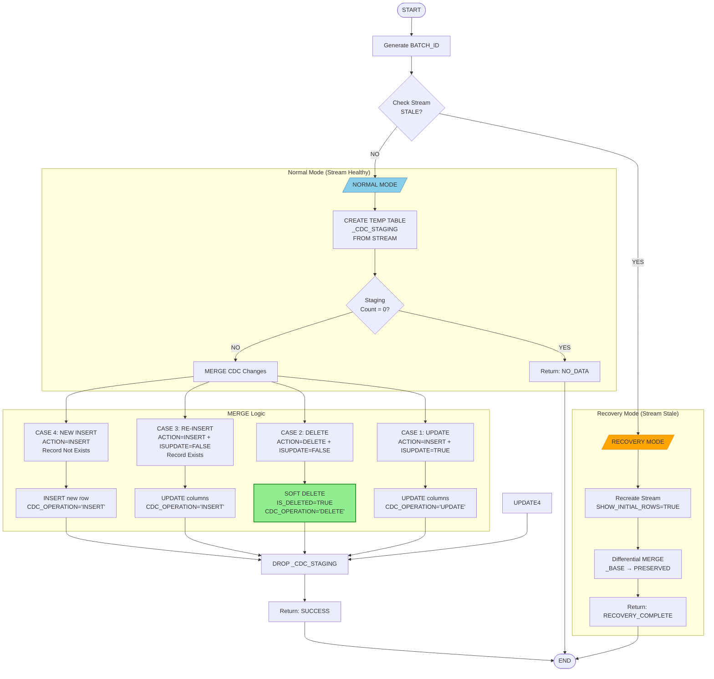
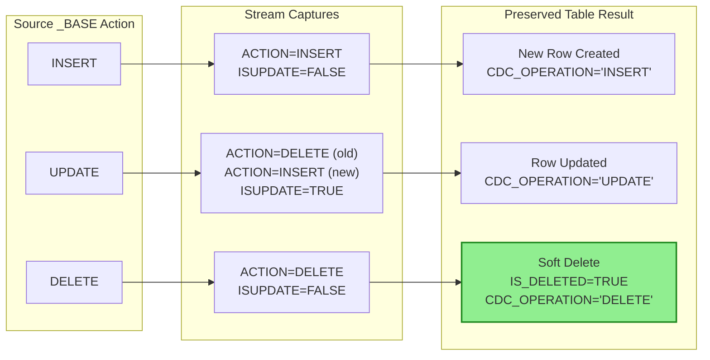
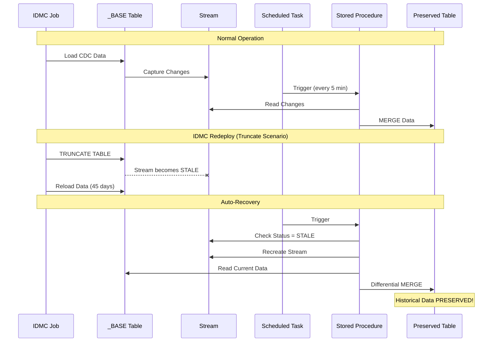
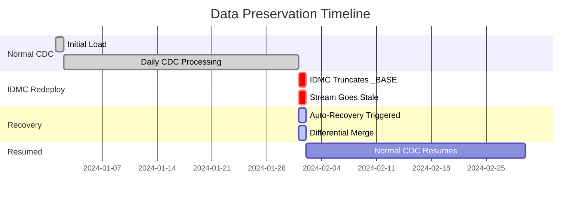

# Data Preservation Architecture for IDMC CDC Tables

## Overview

This document describes the data preservation solution designed to protect historical data from Informatica IDMC job redeployment truncation events.

| Attribute | Value |
|-----------|-------|
| **Source Table** | `D_BRONZE.SADB.OPTRN_LEG_BASE` |
| **Target Table** | `D_BRONZE.SADB.OPTRN_LEG` |
| **Stream** | `D_BRONZE.SADB.OPTRN_LEG_BASE_STREAM` |
| **Stored Procedure** | `D_BRONZE.SADB.SP_PROCESS_OPTRN_LEG_CDC()` |
| **Task** | `D_BRONZE.SADB.TASK_PROCESS_OPTRN_LEG_CDC` |

---

## Architecture Diagram



---

## Problem Statement



---

## Solution: Data Preservation Flow



---

## Stored Procedure Flow: `SP_PROCESS_OPTRN_LEG_CDC()`



---

## CDC Action Mapping



---

## MERGE Cases Explained

| Case | Stream Condition | Record Exists? | Action | Result |
|------|------------------|----------------|--------|--------|
| **1** | `ACTION='INSERT'` + `ISUPDATE=TRUE` | Yes | UPDATE | Update all columns, `CDC_OPERATION='UPDATE'` |
| **2** | `ACTION='DELETE'` + `ISUPDATE=FALSE` | Yes | SOFT DELETE | Set `IS_DELETED=TRUE`, preserve record |
| **3** | `ACTION='INSERT'` + `ISUPDATE=FALSE` | Yes | UPDATE | Overwrite columns, `CDC_OPERATION='INSERT'` |
| **4** | `ACTION='INSERT'` | No | INSERT | Create new row |

---

## IDMC Truncate/Reload Scenario



---

## Data Flow Timeline



---

## Key Components

### 1. Stream Configuration
```sql
CREATE OR REPLACE STREAM D_BRONZE.SADB.OPTRN_LEG_BASE_STREAM
ON TABLE D_BRONZE.SADB.OPTRN_LEG_BASE
SHOW_INITIAL_ROWS = TRUE;  -- Critical for initial load
```

### 2. Task Configuration
```sql
CREATE OR REPLACE TASK D_BRONZE.SADB.TASK_PROCESS_OPTRN_LEG_CDC
    WAREHOUSE = INFA_INGEST_WH
    SCHEDULE = '5 MINUTE'
    ALLOW_OVERLAPPING_EXECUTION = FALSE
WHEN
    SYSTEM$STREAM_HAS_DATA('D_BRONZE.SADB.OPTRN_LEG_BASE_STREAM')
AS
    CALL D_BRONZE.SADB.SP_PROCESS_OPTRN_LEG_CDC();
```

### 3. Preserved Table Structure
```sql
CREATE TABLE D_BRONZE.SADB.OPTRN_LEG (
    -- Business columns
    OPTRN_LEG_ID NUMBER(38,0) PRIMARY KEY,
    ...
    -- CDC Metadata
    CDC_OPERATION VARCHAR(10),      -- INSERT, UPDATE, DELETE, RELOADED
    CDC_TIMESTAMP TIMESTAMP_NTZ,
    IS_DELETED BOOLEAN DEFAULT FALSE,  -- Soft delete flag
    SOURCE_LOAD_BATCH_ID VARCHAR(100)
);
```

---

## Monitoring

### Check Stream Status
```sql
SELECT * FROM D_BRONZE.SADB.VW_OPTRN_LEG_STREAM_STATUS;
```

### View CDC Statistics
```sql
SELECT * FROM D_BRONZE.SADB.VW_OPTRN_LEG_CDC_STATS;
```

### Task Execution History
```sql
SELECT *
FROM TABLE(INFORMATION_SCHEMA.TASK_HISTORY(
    TASK_NAME => 'TASK_PROCESS_OPTRN_LEG_CDC',
    SCHEDULED_TIME_RANGE_START => DATEADD('day', -7, CURRENT_TIMESTAMP())
))
ORDER BY SCHEDULED_TIME DESC;
```

---

## Summary

| Scenario | _BASE Table | Stream | Preserved Table | Data Status |
|----------|-------------|--------|-----------------|-------------|
| Normal CDC | ✅ Active | ✅ Healthy | ✅ Updated | ✅ Protected |
| IDMC Truncate | ❌ Truncated | ⚠️ Stale | ✅ Intact | ✅ Protected |
| IDMC Reload | ✅ Reloaded | ✅ Recreated | ✅ Merged | ✅ Protected |
| DELETE in source | Row removed | Captured | IS_DELETED=TRUE | ✅ Protected |

---

## Contact

For questions or issues, contact the Data Engineering team.

---

*Document Version: 1.0*  
*Last Updated: February 2026*
