# Data Preservation Architecture for IDMC CDC Tables

## Overview

This document describes the data preservation solution designed to protect historical data from Informatica IDMC job redeployment truncation events.

| Attribute | Value |
|-----------|-------|
| **Source Table** | `D_BRONZE.SADB.OPTRN_LEG_BASE` |
| **Target Table** | `D_BRONZE.SADB.OPTRN_LEG` |
| **Stream** | `D_BRONZE.SADB.OPTRN_LEG_BASE_STREAM` |
| **Stored Procedure** | `D_BRONZE.SADB.SP_PROCESS_OPTRN_LEG_CDC()` |
| **Task** | `D_BRONZE.SADB.TASK_PROCESS_OPTRN_LEG_CDC` |

---

## Architecture Diagram

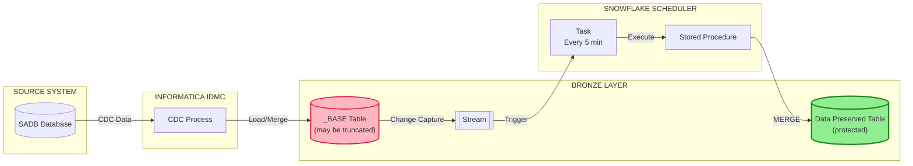

---

## Problem Statement

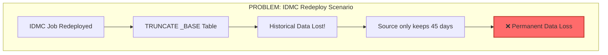

---

## Solution: Data Preservation Flow

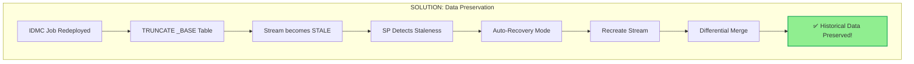

---

## Stored Procedure Flow: `SP_PROCESS_OPTRN_LEG_CDC()`

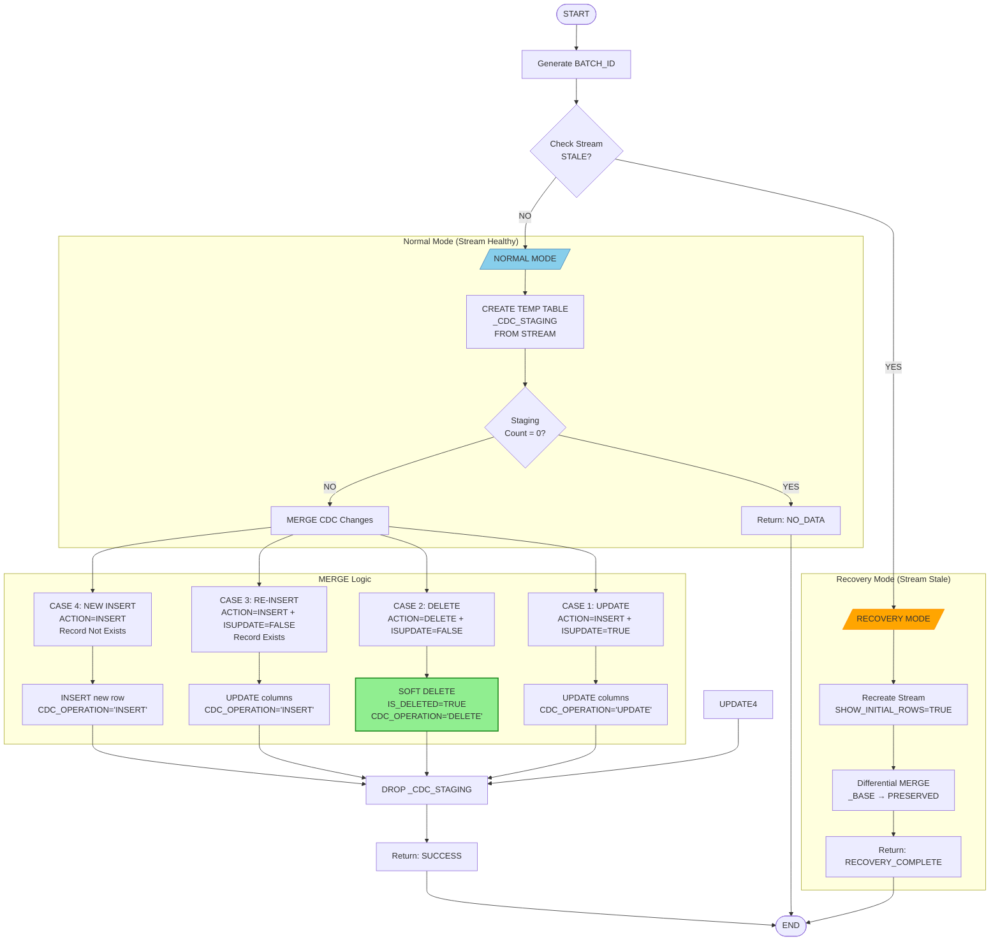

---

## CDC Action Mapping

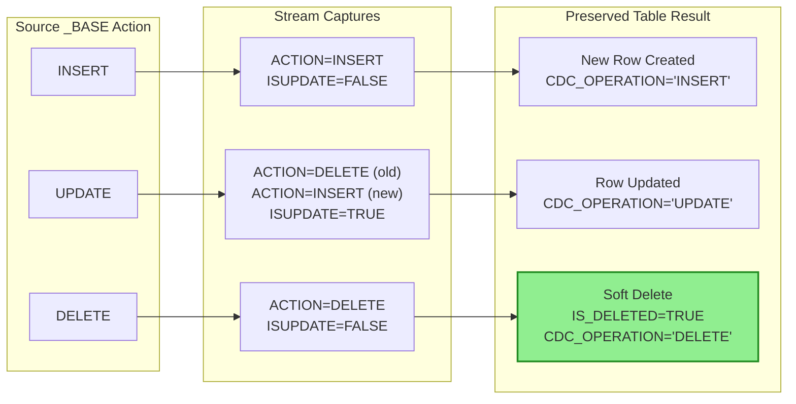

---

## MERGE Cases Explained

| Case | Stream Condition | Record Exists? | Action | Result |
|------|------------------|----------------|--------|--------|
| **1** | `ACTION='INSERT'` + `ISUPDATE=TRUE` | Yes | UPDATE | Update all columns, `CDC_OPERATION='UPDATE'` |
| **2** | `ACTION='DELETE'` + `ISUPDATE=FALSE` | Yes | SOFT DELETE | Set `IS_DELETED=TRUE`, preserve record |
| **3** | `ACTION='INSERT'` + `ISUPDATE=FALSE` | Yes | UPDATE | Overwrite columns, `CDC_OPERATION='INSERT'` |
| **4** | `ACTION='INSERT'` | No | INSERT | Create new row |

---

## IDMC Truncate/Reload Scenario

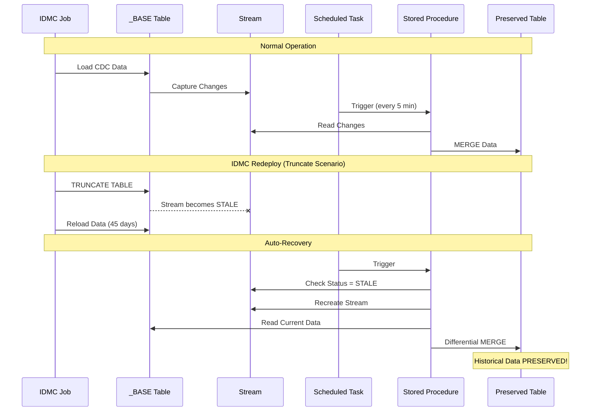

---

## Data Flow Timeline

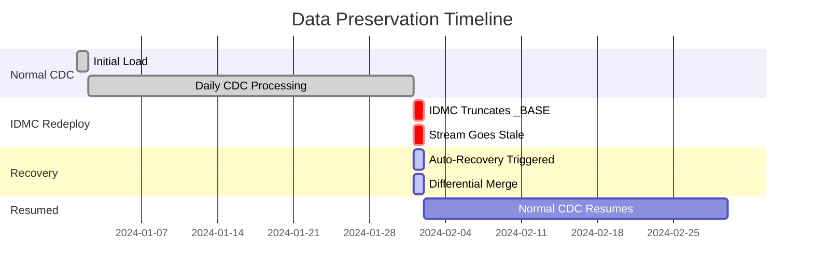

---

## Key Components

### 1. Stream Configuration
```sql
CREATE OR REPLACE STREAM D_BRONZE.SADB.OPTRN_LEG_BASE_STREAM
ON TABLE D_BRONZE.SADB.OPTRN_LEG_BASE
SHOW_INITIAL_ROWS = TRUE;  -- Critical for initial load
```

### 2. Task Configuration
```sql
CREATE OR REPLACE TASK D_BRONZE.SADB.TASK_PROCESS_OPTRN_LEG_CDC
    WAREHOUSE = INFA_INGEST_WH
    SCHEDULE = '5 MINUTE'
    ALLOW_OVERLAPPING_EXECUTION = FALSE
WHEN
    SYSTEM$STREAM_HAS_DATA('D_BRONZE.SADB.OPTRN_LEG_BASE_STREAM')
AS
    CALL D_BRONZE.SADB.SP_PROCESS_OPTRN_LEG_CDC();
```

### 3. Preserved Table Structure
```sql
CREATE TABLE D_BRONZE.SADB.OPTRN_LEG (
    -- Business columns
    OPTRN_LEG_ID NUMBER(38,0) PRIMARY KEY,
    ...
    -- CDC Metadata
    CDC_OPERATION VARCHAR(10),      -- INSERT, UPDATE, DELETE, RELOADED
    CDC_TIMESTAMP TIMESTAMP_NTZ,
    IS_DELETED BOOLEAN DEFAULT FALSE,  -- Soft delete flag
    SOURCE_LOAD_BATCH_ID VARCHAR(100)
);
```

---

## Monitoring

### Check Stream Status
```sql
SELECT * FROM D_BRONZE.SADB.VW_OPTRN_LEG_STREAM_STATUS;
```

### View CDC Statistics
```sql
SELECT * FROM D_BRONZE.SADB.VW_OPTRN_LEG_CDC_STATS;
```

### Task Execution History
```sql
SELECT *
FROM TABLE(INFORMATION_SCHEMA.TASK_HISTORY(
    TASK_NAME => 'TASK_PROCESS_OPTRN_LEG_CDC',
    SCHEDULED_TIME_RANGE_START => DATEADD('day', -7, CURRENT_TIMESTAMP())
))
ORDER BY SCHEDULED_TIME DESC;
```

---

## Summary

| Scenario | _BASE Table | Stream | Preserved Table | Data Status |
|----------|-------------|--------|-----------------|-------------|
| Normal CDC | ✅ Active | ✅ Healthy | ✅ Updated | ✅ Protected |
| IDMC Truncate | ❌ Truncated | ⚠️ Stale | ✅ Intact | ✅ Protected |
| IDMC Reload | ✅ Reloaded | ✅ Recreated | ✅ Merged | ✅ Protected |
| DELETE in source | Row removed | Captured | IS_DELETED=TRUE | ✅ Protected |

---

## Contact

For questions or issues, contact the Data Engineering team.

---

*Document Version: 1.0*  
*Last Updated: February 2026*

---

## Appendix A: Stale Stream Detection - Issue & Resolution

### Problem Identified in Production

During IDMC job redeployment, the stream became stale but the stored procedure **failed to detect it** and did not trigger auto-recovery.

### Root Cause Analysis

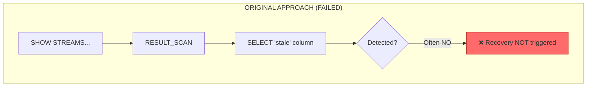

#### Why Original Logic Failed

| Issue | Description |
|-------|-------------|
| **RESULT_SCAN Unreliable** | Inside stored procedures, `LAST_QUERY_ID()` may reference wrong query |
| **Column Case Sensitivity** | SHOW commands return lowercase `"stale"`, but behavior varies |
| **Exception Masking** | If SELECT fails, exception caught but `v_stream_stale` stays `FALSE` |
| **SHOW Doesn't Error** | `SHOW STREAMS` doesn't throw error on stale - just shows status column |

#### Original Code (Problematic)

```sql
-- ❌ UNRELIABLE - Do not use this pattern
BEGIN
    SHOW STREAMS LIKE 'OPTRN_LEG_BASE_STREAM' IN SCHEMA D_BRONZE.SADB;
    
    SELECT "stale"::BOOLEAN INTO v_stream_stale
    FROM TABLE(RESULT_SCAN(LAST_QUERY_ID()))
    WHERE "name" = 'OPTRN_LEG_BASE_STREAM';
    
EXCEPTION
    WHEN OTHER THEN
        v_stream_stale := TRUE;
END;
```

### Solution: Direct Stream Query

Per **Snowflake Documentation**: *"Querying a stale stream throws an error"*

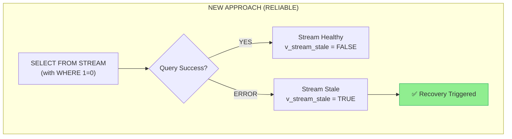

#### Fixed Code (Reliable)

```sql
-- ✅ RELIABLE - Snowflake recommended pattern
BEGIN
    -- Attempt to query stream - stale streams throw error
    SELECT COUNT(*) INTO v_staging_count 
    FROM D_BRONZE.SADB.OPTRN_LEG_BASE_STREAM
    WHERE 1=0;  -- No data retrieval, just validates stream
    
    v_stream_stale := FALSE;
    
EXCEPTION
    WHEN OTHER THEN
        -- Stream is stale - error message: "The stream has become stale..."
        v_stream_stale := TRUE;
        v_error_msg := SQLERRM;  -- Capture error for debugging
END;
```

### Comparison

| Aspect | Original (SHOW STREAMS) | Fixed (Direct Query) |
|--------|------------------------|----------------------|
| **Reliability** | ❌ Inconsistent | ✅ Always works |
| **Error Detection** | Indirect via column | Direct via exception |
| **Snowflake Documented** | No | Yes |
| **SP Compatible** | Issues with RESULT_SCAN | Fully compatible |
| **Error Message Captured** | No | Yes (SQLERRM) |

---

## Appendix B: Task Configuration & Best Practices

### Current Task Parameters Explained

```sql
CREATE OR REPLACE TASK D_BRONZE.SADB.TASK_PROCESS_OPTRN_LEG_CDC
    WAREHOUSE = INFA_INGEST_WH              -- Dedicated compute
    SCHEDULE = '5 MINUTE'                    -- Run frequency
    ALLOW_OVERLAPPING_EXECUTION = FALSE      -- Prevent concurrent runs
    SUSPEND_TASK_AFTER_NUM_FAILURES = 3      -- Auto-suspend on failures
    USER_TASK_TIMEOUT_MS = 3600000           -- 1 hour timeout
    COMMENT = 'CDC processing task'
WHEN
    SYSTEM$STREAM_HAS_DATA('...')            -- Only run when data exists
AS
    CALL D_BRONZE.SADB.SP_PROCESS_OPTRN_LEG_CDC();
```

### Task Parameters Reference

| Parameter | Value | Purpose | Best Practice |
|-----------|-------|---------|---------------|
| `WAREHOUSE` | `INFA_INGEST_WH` | Compute resource for task | ✅ Use dedicated warehouse for isolation |
| `SCHEDULE` | `'5 MINUTE'` | How often task checks to run | ✅ Balance between latency and cost |
| `ALLOW_OVERLAPPING_EXECUTION` | `FALSE` | Prevent concurrent executions | ✅ Always FALSE for CDC to prevent duplicates |
| `SUSPEND_TASK_AFTER_NUM_FAILURES` | `3` | Auto-suspend after N consecutive failures | ✅ Prevents runaway errors, alerts team |
| `USER_TASK_TIMEOUT_MS` | `3600000` | Maximum execution time (ms) | ✅ Prevents hung tasks (1 hour = 3600000) |
| `WHEN` | `SYSTEM$STREAM_HAS_DATA()` | Condition to trigger execution | ✅ Critical - saves compute costs |
| `COMMENT` | Description text | Documentation | ✅ Always document purpose |

### Task Execution Flow

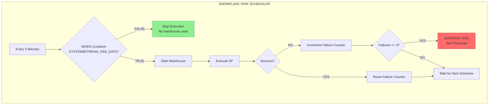

### Schedule Options

| Schedule Type | Syntax | Example | Use Case |
|---------------|--------|---------|----------|
| **Minutes** | `'N MINUTE'` | `'5 MINUTE'` | Near real-time CDC |
| **Hours** | `'N HOUR'` | `'1 HOUR'` | Hourly batch processing |
| **CRON** | `'USING CRON expr TZ'` | `'USING CRON 0 9 * * * UTC'` | Specific times (9 AM daily) |

```sql
-- Examples
SCHEDULE = '5 MINUTE'                           -- Every 5 minutes
SCHEDULE = '1 HOUR'                             -- Every hour
SCHEDULE = 'USING CRON 0 */2 * * * UTC'        -- Every 2 hours
SCHEDULE = 'USING CRON 0 9 * * MON-FRI UTC'    -- Weekdays at 9 AM
```

### WHEN Clause Best Practices

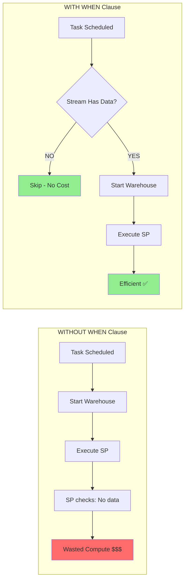

### Cost Optimization

| Configuration | Without WHEN | With WHEN |
|---------------|--------------|-----------|
| Task runs per day | 288 (every 5 min) | Only when data exists |
| Warehouse starts | 288 times | ~10-50 times (varies) |
| Estimated cost savings | - | **70-90%** |

---

## Appendix C: Monitoring & Operations

### Task Execution History Query

```sql
-- View last 50 task executions
SELECT 
    NAME,
    STATE,
    SCHEDULED_TIME,
    COMPLETED_TIME,
    DATEDIFF('second', SCHEDULED_TIME, COMPLETED_TIME) AS DURATION_SEC,
    RETURN_VALUE,
    ERROR_MESSAGE
FROM TABLE(INFORMATION_SCHEMA.TASK_HISTORY(
    TASK_NAME => 'TASK_PROCESS_OPTRN_LEG_CDC',
    SCHEDULED_TIME_RANGE_START => DATEADD('day', -7, CURRENT_TIMESTAMP())
))
ORDER BY SCHEDULED_TIME DESC
LIMIT 50;
```

### Task State Diagram

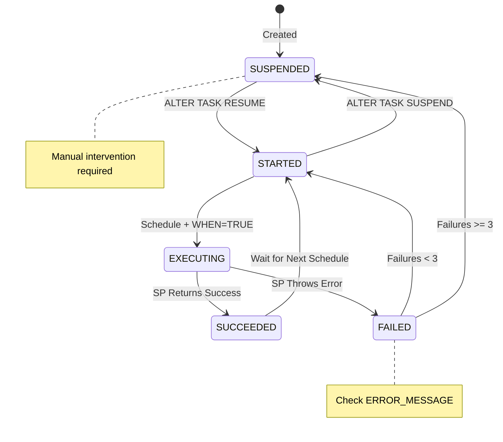

### Common Task States

| State | Description | Action Required |
|-------|-------------|-----------------|
| `STARTED` | Task is active and scheduled | None - normal operation |
| `EXECUTING` | Task currently running | None - in progress |
| `SUCCEEDED` | Last run completed successfully | None |
| `FAILED` | Last run failed | Check error message |
| `SUSPENDED` | Task is paused | `ALTER TASK ... RESUME` |

### Resume Suspended Task

```sql
-- Check if task is suspended
SHOW TASKS LIKE 'TASK_PROCESS_OPTRN_LEG_CDC' IN SCHEMA D_BRONZE.SADB;

-- Resume task after fixing issues
ALTER TASK D_BRONZE.SADB.TASK_PROCESS_OPTRN_LEG_CDC RESUME;
```

### Stream Health Check

```sql
-- Check stream status
SELECT 
    STREAM_NAME,
    STALE,
    STALE_AFTER,
    MODE
FROM TABLE(INFORMATION_SCHEMA.STREAMS(
    STREAM_NAME => 'OPTRN_LEG_BASE_STREAM'
));

-- Or use the monitoring view
SELECT * FROM D_BRONZE.SADB.VW_OPTRN_LEG_STREAM_STATUS;
```

### Failure Investigation Query

```sql
-- Find failed executions with error details
SELECT 
    SCHEDULED_TIME,
    STATE,
    ERROR_CODE,
    ERROR_MESSAGE,
    RETURN_VALUE
FROM TABLE(INFORMATION_SCHEMA.TASK_HISTORY(
    TASK_NAME => 'TASK_PROCESS_OPTRN_LEG_CDC',
    SCHEDULED_TIME_RANGE_START => DATEADD('day', -30, CURRENT_TIMESTAMP())
))
WHERE STATE = 'FAILED'
ORDER BY SCHEDULED_TIME DESC;
```

---

## Appendix D: Troubleshooting Guide

### Issue: Stream Shows Stale

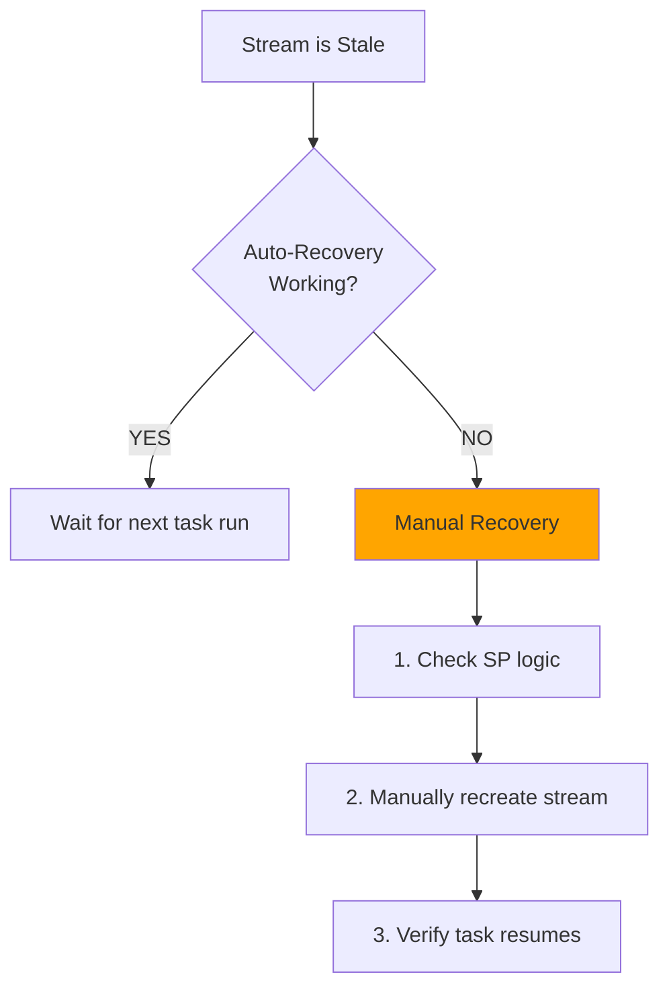

**Manual Recovery Steps:**
```sql
-- 1. Recreate stream
CREATE OR REPLACE STREAM D_BRONZE.SADB.OPTRN_LEG_BASE_STREAM
ON TABLE D_BRONZE.SADB.OPTRN_LEG_BASE
SHOW_INITIAL_ROWS = TRUE;

-- 2. Resume task if suspended
ALTER TASK D_BRONZE.SADB.TASK_PROCESS_OPTRN_LEG_CDC RESUME;

-- 3. Manually trigger if needed
EXECUTE TASK D_BRONZE.SADB.TASK_PROCESS_OPTRN_LEG_CDC;
```

### Issue: Task Not Running

| Symptom | Possible Cause | Resolution |
|---------|---------------|------------|
| Task shows `SUSPENDED` | 3+ consecutive failures | Fix root cause, then `ALTER TASK RESUME` |
| Task shows `STARTED` but no executions | Stream has no data | Normal - WHEN clause prevents unnecessary runs |
| Task shows `STARTED` but WHEN never true | Stream was recreated | Check stream has `SHOW_INITIAL_ROWS = TRUE` |

### Issue: Duplicate Records in Preserved Table

| Cause | Prevention |
|-------|------------|
| Overlapping task executions | `ALLOW_OVERLAPPING_EXECUTION = FALSE` ✅ |
| Stream read multiple times | Stage to temp table first ✅ |
| Manual + automated runs | Avoid `EXECUTE TASK` during active schedule |

---

## Appendix E: Summary Checklist

### Pre-Production Checklist

- [ ] Stream created with `SHOW_INITIAL_ROWS = TRUE`
- [ ] SP uses direct stream query for stale detection (not SHOW STREAMS)
- [ ] SP stages stream data to temp table before processing
- [ ] Task has `WHEN SYSTEM$STREAM_HAS_DATA()` clause
- [ ] Task has `ALLOW_OVERLAPPING_EXECUTION = FALSE`
- [ ] Task has `SUSPEND_TASK_AFTER_NUM_FAILURES` set
- [ ] Monitoring views created
- [ ] Task resumed with `ALTER TASK ... RESUME`

### Operational Checklist (Daily)

- [ ] Check task execution history for failures
- [ ] Verify stream is not stale
- [ ] Review preservation stats view
- [ ] Confirm row counts match expectations
